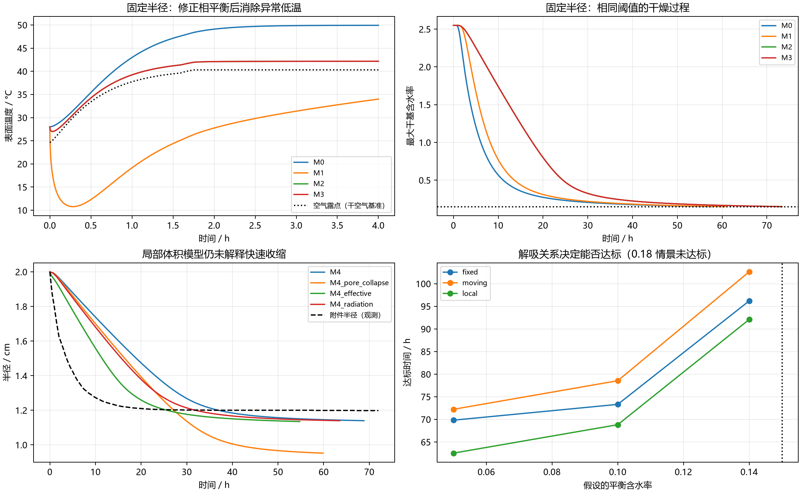

# 相变潜热渐进建模：结果比较与可行性

本轮只在 `surface_latent_heat` 内新增文件。既有潜热对照、正式求解代码和正式结果均保留。

**结论：气侧相平衡边界值得采用；完整焓收支可以实现；局部体积收缩能消除体积矛盾。但现有数据不足以验证唯一的新干燥时长，新的体积模型也未重现实测快速收缩，不能直接替换正式模型。**

公式、变量、来源与各级假设见 [建模方法与假设](建模方法与假设.md)。下述数值是条件情景计算，不是拟合得到的材料参数，也不是对真实误差的估计。

## 1. 逐级比较

主情景：空气数据按 kg 水/kg 干空气解释，标准大气压，传质系数用 Lewis 数为 1 的近似量级；假设解吸曲线使恒温阶段平衡含水率为 0.10。潜热固定 2.4 MJ/kg。

本表采用 240 个径向区间；完整参数扫描采用 120 个区间。固定半径采用附录3物性，收缩采用附录4物性，两列差异不能单独归因于收缩。

| 方案 | 几何与能量处理 | 达标时间 / h | 3 h平均温度 / °C | 最低表面温度 / °C | 最大局部水体积分数 |
|---|---|---:|---:|---:|---:|
| fixed_M0 | 固定；原经验边界、无潜热 | 57.586 | 49.850 | 28.000 | 0.701 |
| fixed_M1 | 固定；原表面潜热 | 60.616 | 31.114 | 10.775 | 0.701 |
| fixed_M2 | 固定；相平衡边界、经验热容量 | 73.367 | 42.150 | 27.017 | 0.701 |
| fixed_M3 | 固定；相平衡与完整焓 | 73.316 | 42.150 | 27.017 | 0.701 |
| moving_M0 | 指定半径；原经验边界、无潜热 | 51.187 | 49.836 | 28.000 | 1.153 |
| moving_M1 | 指定半径；原表面潜热 | 56.589 | 31.771 | 14.317 | 1.346 |
| moving_M2 | 指定半径；相平衡边界 | 78.341 | 42.177 | 26.899 | 1.459 |
| moving_M3 | 指定半径；相平衡与完整焓 | 78.547 | 42.160 | 26.900 | 1.464 |
| local_M4 | 局部含水率决定体积；完整焓 | 68.824 | 42.205 | 26.899 | 0.711 |
| local_M4_pore_collapse | M4；孔隙体积随水分减少 | 59.858 | 42.202 | 26.899 | 0.711 |
| local_M4_radiation | M4；另加壁面辐射 | 63.520 | 42.519 | 26.952 | 0.711 |

“最大局部水体积分数”按水密度 1000 kg/m³、守恒干物质密度计算；大于 1 表示在该物理解释下连水都装不下，不是允许存在的孔隙状态。M0/M1 原本为经验模型，此检查是新增物理解读的兼容性检查。

### M0 → M1：仅扣潜热不能保证合理

M1 再现了既有对照的小时级延长，同时在低于空气露点时持续向外失水。与潜热是否大于瞬时对流供热不同，逆蒸气压梯度蒸发才是这里的关键问题。早期输出加密并定位极小值后，最低温度与旧表的稀疏采样最低值略有不同。

### M1 → M2：相平衡约束有效，但耗时可能更长

M2 使用有符号蒸气压差，同时让蒸发降温反过来抑制失水。没有设置温度下限，没有强行截断为“供热允许的最大通量”。主情景最低温度回到约 27°C；所有已算蒸气压边界情景均未出现逆蒸气压梯度蒸发。

这并不意味着干燥更快：真实气侧交换与后期平衡含水率约束也改变了失水过程。M1 与 M2 的耗时差异混合了边界定义和系数转换，不能全部记为潜热误差。

充分湿润表面 `M2wet` 仅计算前 12 h，固定/收缩的 3 h平均温度都约 41.68°C；它没有后期解吸机制，不作为全程预测模型。

### M2 → M3：累计焓闭合改善，预测变化相对小

固定半径主情景由 73.367 h 变为 73.316 h；指定半径由 78.341 h 变为 78.547 h。
另有 `M3capacity` 只替换质量一致的热容量、暂不补全液态水焓通量，作为拆分对照。它与 M3 耗时接近，但并不严格满足采用的混合物焓守恒。该结果说明当前主情景的首要问题是边界与收缩，而不是遗漏的内部显热输运。

### M3 → M4：修正局部体积，仍未解释观测

指定实测半径并假设均匀收缩，使主情景最大水体积分数约 1.46；即使把半径变化整体放慢两倍，仍超过 1。M4 改用干物质质量坐标，局部体积随含水率变化，干物质密度也随位置变化。它保持质量、焓守恒且满足体积约束。

M4 主情景在 68.824 h 达标，终点半径 1.140 cm。与积分区间内附件半径观测比较的 RMSE 为 0.225 cm；这不是校准误差，而是未拟合预测与观测的失配。
M4 早期收缩明显慢于附件。允许孔隙塌缩虽然缩短干燥时间，却把终点半径压得更小，并未自然解决全过程拟合问题。新增辐射能提高供热，但其辐射率和壁温属于附加假设。

为公平比较，统一采用0—48 h观测窗口时，M4、孔隙塌缩、等效含水率解释、辐射情景的半径 RMSE 分别为 0.267、0.260、0.163、0.226 cm。M4 主情景在3 h的半径为 1.937 cm，而观测为 1.552 cm。

## 2. 缺失假设会造成多大差异

以下均为 120 区间结果。每一行仅改变列出的假设，其余沿用相应主情景。未达标情景积分到 240 h。

| 改变的假设 | 固定 M3 / h | 指定半径 M3 / h | 局部体积 M4 / h |
|---|---:|---:|---:|
| 平衡含水率 0.05 | 69.826 | 72.229 | 62.539 |
| 平衡含水率 0.10（主情景） | 73.315 | 78.547 | 68.824 |
| 平衡含水率 0.14 | 96.183 | 102.621 | 92.078 |
| 平衡含水率 0.18 | 240 h内未达标 | 240 h内未达标 | 240 h内未达标 |
| 气侧系数 × 0.5 | 76.226 | 83.717 | 72.686 |
| 气侧系数 × 2 | 71.845 | 75.944 | 66.901 |
| 附件值解释为材料等效含水率 | 63.069 | 60.846 | 54.758 |
| 附件值解释为湿空气水质量分数 | 78.394 | 86.104 | 75.375 |

平衡含水率 0.18 情景的最大含水率在 240 h时接近 0.18。其长期平衡高于目标，延长计算时间不能使稳态低于 0.15。0.05、0.10、0.14、0.18 是刻意覆盖可达与不可达区间的假设，不是实验测得的药材性质。

即使固定恒温阶段平衡含水率，解吸曲线的中间形状也有影响：M4 的指数 0.7、1、1.5 分别得到 74.117 h、68.824 h、65.556 h。因此一个终点平衡含水率不能唯一决定全过程。

“有效材料含水率”分支只是检验另一种题意解释，并不证明该解释正确。不同分支对应的真实空气湿度不同，不能把低温高低直接用于判断哪个分支更好。

## 3. 早期收缩与供热的条件相容性检查

附件在 3 h给出半径 1.552 cm。取水密度 1000、干物质真密度 1500 kg/m³，即便孔隙全部消失，达到该体积也至少需要失水 1.056 kg/kg干物质。
在“干空气湿度基准、无凝结且表面不低于空气露点、仅有给定对流供热”的情景下，采用初始最大表面积积分供热，并把初始全部显热也用于汽化，可得一个宽松的失水上界：

\[\Delta C_{\max}\leq\frac{\int_0^{3h}\frac{2h}{\rho_{d0}R_0}(T_a-T_{\mathrm{dew}})\,dt+(c_s+c_wC_0)T_0}{L_v}.\]

该上界仅为 0.502 kg/kg干物质，低于上面的最低体积需求。该估计还忽略最终剩余显热和逸出水的显热，已偏向允许更多汽化。
**这否定的是这组假设同时成立，而不是否定附件数据。**可疑之处包括湿度解释、初始密度的体积基准、固定长度、仅汽化失水（是否有液态排水）、遗漏的供热路径，以及半径记录是否对应同一工况。真密度 1500 是假设；露点下界也不能推广到存在凝结或额外制冷的任意过程。

该检查解释了为什么不能仅通过调整扩散系数去追上附件的早期收缩。应先核实物理量定义与实验工况，再进行参数反演。

## 4. 数值检验与物理检验

120 → 240 区间的已核验主方案中，最大达标时间差 8.618 s；最大最低温度差 0.000635°C。
将相对容差从 2×10⁻⁷ 收紧为 2×10⁻⁹，同时最大时间步从 600 s降至300 s，三个主方案最大达标时间差 0.118 s。
验证项还包括均匀平衡态、离散质量/焓守恒、Jacobian 稀疏结构完整性，以及低于露点时凝结释放潜热。新局部体积模型使用全局几何依赖，未错误套用局部三对角依赖。

独立用保存的时间序列做梯形积分，而非仅检查 RHS 的望远镜求和：

| 方案 | 累计质量残差 / kg·kg⁻¹ | 累计焓残差 / J·kg干⁻¹ | 相对总能量交换 |
|---|---:|---:|---:|
| fixed_M3 | 5.494e-07 | 1.780e+00 | 1.452e-07 |
| moving_M3 | 1.192e-06 | 1.551e+00 | 1.267e-07 |
| local_M4 | 7.327e-07 | 1.654e+00 | 1.351e-07 |

累计 ODE 积分器中的守恒残差更小，但独立采样积分保留了额外求积误差。详细值见 `validation.json`。这些是数值误差检验，不是与真实温度、含水率观测之间的预测误差；后两类观测目前缺失。

## 5. 最终可行性判断

| 层面 | 结论 |
|---|---|
| 数值可解性 | M2、M3、M4 均可稳定求解；网格和时间精度检查通过。 |
| 固定几何下的物理一致性 | M3 在所列简化假设下可行，推荐作为下一步校准的最小模型。 |
| 给定半径 + 均匀干物质密度 | 本次物理解释下出现局部水体积超限，不能当作完整真实材料模型。 |
| 可预测的收缩耦合 | M4 结构上可行，但半径预测失配显著，需要更合理的孔隙/变形关系和工况信息。 |
| 直接替换正式时长 | 不可：参数与湿度解释未确认，温度和失水数据不足以验证准确性。 |
| 增加内部汽液两相 | 理论上可行，但目前不优先；不能用更多自由参数掩盖边界与体积不相容。 |

优先补充：空气湿度定义与气压、至少一条失重曲线、表面/中心温度、干物质质量与体积定义、相同工况下的半径及长度变化、材料解吸关系。随后联合校准温度、质量和尺寸，并保留未参与校准的工况进行检验。

如果数据证实内部蒸发不可忽略，再将水拆成液态/结合态与蒸气，引入孔隙率、液相饱和度、蒸气分压和相变速率；热源使用真实相变速率，而不是直接使用总含水率的时间导数。
