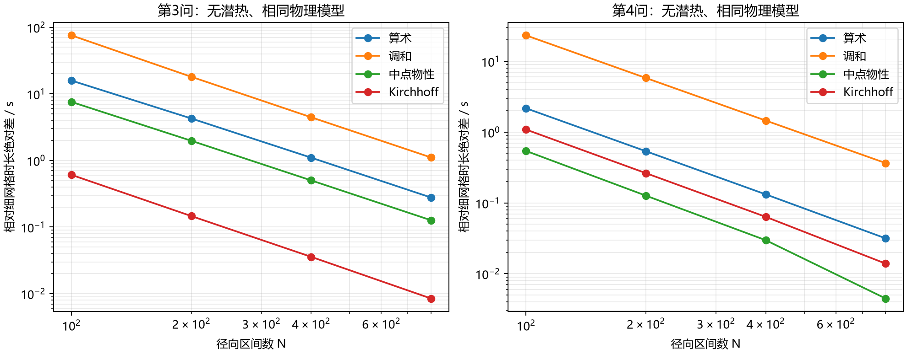

# 无潜热主模型：界面扩散系数平均方法探索

**建议：不统一替换为调和平均。现有算术平均可保留；若在相同较粗网格上提高第三问干燥时长精度，优先考虑冻结界面温度的 Kirchhoff 平均，并在第二、三问共用的扩散离散中一致实现。第四问改善很小，不必为此单独改变正式算法。**

本轮只读取当前 submit/all，没有引入潜热、相平衡边界、完整焓修正或局部体积收缩。只改变内部水分扩散系数的界面平均；热传导系数仍取算术平均，密度、比热、经验水分 Robin 边界与给定半径均保持主模型形式。正式包前后 SHA-256 校验一致。

## 1. 基准与比较设计

- 第一问：附录2，均匀网格，前1800 s独立拉伸指数拟合。
- 第二问：附录3，均匀网格，计算前3 h。
- 第三问：与第二问相同物理模型，表面加密网格，计算全域含水率降至0.15的临界时刻。
- 第四问：附录4、原均匀径向收缩材料坐标，PCHIP 实测半径，表面加密网格。
- 第二至四问使用当前温度/湿度各自独立的分阶段拟合，默认在各自过渡前拟合；没有使用更早潜热探索的共同分界设置。

四种平均各计算 N=100、200、400、800；算术/Kirchhoff另算 N=1600。第三、四问补充现用 N=300 四种方法及 N=1600/3200 加严参照。第一、二问参照为 N1600 算术解；第三、四问参照为 N3200 Kirchhoff解，并用细网格算术结果交叉检查。**参照不是解析真解，文中的误差仅指相对细网格差值。**

第一、二问场变量在题目规定报告时刻、101个统一径向位置比较；第三、四问在0.5 h、3 h及6—48 h每6 h比较，使用相同归一化径向位置。没有将不同方法各自终止时刻的场当作同一时刻比较，也不声称采样差值是连续时空严格最大误差。

## 2. 四种界面系数

设 $D_L=D(C_L,T_L),D_R=D(C_R,T_R)$。本次固定网格及均匀缩放后的界面都在相邻节点中点，采用等权形式。

$$D_A=(D_L+D_R)/2,\qquad D_H=2D_LD_R/(D_L+D_R).$$

$$D_{\rm mid}=D((C_L+C_R)/2,(T_L+T_R)/2).$$

$$D_K=\int_0^1D(C_L+s(C_R-C_L),T_f)\,ds,\quad T_f=(T_L+T_R)/2.$$

算术平均插值系数；调和平均对应两段等长串联阻力；中点物性先插值状态再代入非线性物性；Kirchhoff沿含水率区间积分物性。后两种不是对D做算术平均。Kirchhoff只对局部温度作冻结，不是完整热湿方程的精确全局变换。

Kirchhoff采用8点 Gauss–Legendre 求积，与16点结果进行实际状态抽查。0—1积分避免相邻含水率接近时差商消去。保留原圆柱几何因子，未引入径向对数拟合。背景参考：[FiPy](https://pages.nist.gov/fipy/en/4.0/FAQ.html)、[Kirchhoff变换研究](https://www.mdpi.com/2079-3197/12/11/218)。

## 3. 第三、四问：现用300区间

| 问题 | 方法 | 临界时长 / h | 相对细网格时长差 / s | 相对同网格算术变化 / s |
|---|---|---:|---:|---:|
| Q3 | 算术 | 57.677324000 | -1.940495 | +0.000000 |
| Q3 | 调和 | 57.680069753 | +7.944217 | +9.884711 |
| Q3 | 中点物性 | 57.678109683 | +0.887964 | +2.828458 |
| Q3 | Kirchhoff | 57.677845206 | -0.064155 | +1.876340 |
| Q4 | 算术 | 51.266902383 | -0.238557 | +0.000000 |
| Q4 | 调和 | 51.267686298 | +2.583536 | +2.822094 |
| Q4 | 中点物性 | 51.266953025 | -0.056247 | +0.182310 |
| Q4 | Kirchhoff | 51.266936129 | -0.117074 | +0.121483 |

第三问 Kirchhoff 在现用网格上更接近细网格时长；调和平均产生更大的正偏差。第四问中点物性和Kirchhoff都有改善，但绝对量级很小，不代表整体物理预测更准确。这里比较Cmax=0.15的原始事件时刻，不是为满足严格小于阈值而向上取整的正式四位小数值。

## 4. 网格收敛

| 问题 | N | 算术差 / s | 调和差 / s | 中点物性差 / s | Kirchhoff差 / s |
|---|---:|---:|---:|---:|---:|
| Q3 | 100 | -15.84549 | +75.61524 | +7.57082 | -0.60806 |
| Q3 | 200 | -4.27102 | +18.05382 | +1.97535 | -0.14622 |
| Q3 | 400 | -1.10142 | +4.45235 | +0.50194 | -0.03571 |
| Q3 | 800 | -0.27771 | +1.10941 | +0.12649 | -0.00846 |
| Q4 | 100 | -2.16969 | +23.23794 | -0.54230 | -1.08654 |
| Q4 | 200 | -0.53682 | +5.81210 | -0.12665 | -0.26326 |
| Q4 | 400 | -0.13201 | +1.45544 | -0.02975 | -0.06357 |
| Q4 | 800 | -0.03160 | +0.36534 | -0.00447 | -0.01391 |

各方法随加密趋向同一结果，未出现小时级差异。不同问题中的误差抵消不同，不能把单一指标领先解释为普遍的更高收敛阶。

## 5. 实际相邻系数与短时场误差

| 问题 | N | 算术解抽查最大相邻D比值 |
|---|---:|---:|
| Q1 | 100 | 1.022552 |
| Q1 | 800 | 1.002949 |
| Q2 | 100 | 1.006509 |
| Q2 | 800 | 1.000826 |
| Q3 | 100 | 2.704843 |
| Q3 | 800 | 1.249737 |
| Q4 | 100 | 1.316299 |
| Q4 | 800 | 1.040943 |

在最多401个积分器节点抽查 max(D右/D左,D左/D右)，不是连续时空严格最大值。具体时间、位置与左右温湿状态保存于各结果的 ratio_location。

| 问题 | N | 方法 | 含水率采样最大差 / kg·kg⁻¹ | 温度采样最大差 / °C |
|---|---:|---|---:|---:|
| Q1 | 100 | 算术 | 1.215e-03 | 5.999e-05 |
| Q1 | 100 | 调和 | 1.214e-03 | 5.999e-05 |
| Q1 | 100 | 中点物性 | 1.216e-03 | 5.999e-05 |
| Q1 | 100 | Kirchhoff | 1.216e-03 | 5.999e-05 |
| Q1 | 400 | 算术 | 7.082e-05 | 3.529e-06 |
| Q1 | 400 | 调和 | 7.077e-05 | 3.529e-06 |
| Q1 | 400 | 中点物性 | 7.093e-05 | 3.529e-06 |
| Q1 | 400 | Kirchhoff | 7.089e-05 | 3.529e-06 |
| Q1 | 800 | 算术 | 1.416e-05 | 7.060e-07 |
| Q1 | 800 | 调和 | 1.415e-05 | 7.060e-07 |
| Q1 | 800 | 中点物性 | 1.419e-05 | 7.060e-07 |
| Q1 | 800 | Kirchhoff | 1.418e-05 | 7.060e-07 |
| Q2 | 100 | 算术 | 6.423e-05 | 5.196e-05 |
| Q2 | 100 | 调和 | 6.437e-05 | 5.190e-05 |
| Q2 | 100 | 中点物性 | 6.198e-05 | 5.283e-05 |
| Q2 | 100 | Kirchhoff | 6.265e-05 | 5.257e-05 |
| Q2 | 400 | 算术 | 3.776e-06 | 3.057e-06 |
| Q2 | 400 | 调和 | 3.785e-06 | 3.052e-06 |
| Q2 | 400 | 中点物性 | 3.635e-06 | 3.111e-06 |
| Q2 | 400 | Kirchhoff | 3.677e-06 | 3.094e-06 |
| Q2 | 800 | 算术 | 7.551e-07 | 6.113e-07 |
| Q2 | 800 | 调和 | 7.573e-07 | 6.102e-07 |
| Q2 | 800 | 中点物性 | 7.201e-07 | 6.249e-07 |
| Q2 | 800 | Kirchhoff | 7.306e-07 | 6.208e-07 |

第一问温度与水分解耦，改变D平均不会改变其连续温度方程；不同方法的极小温度差来自数值积分。第二问物性耦合温湿，但平均方式影响很小。第一问正式网格是N6400，本次未在该网格对所有方法重跑，不将N800结果冒充正式网格结果。

## 6. 复现与数值检查

现有正式数据只读比较：

- q1：{"max_T_difference": 1.9845629850578916e-07, "max_C_difference": 4.375047070404037e-06, "note": "q1 N1600 vs formal N6400"}
- q2：{"max_T_difference": 5.057907372929549e-07, "max_C_difference": 2.297160550668309e-08, "note": "q2 matched N400"}
- q3：{"N300_event_difference_s": 0.0024988411723825266}
- q4：{"N300_event_difference_s": 0.013944611890792658}

| 问题 | N3200算术与Kirchhoff差 / s | Kirchhoff N1600→3200差 / s | 算术N1600→3200差 / s |
|---|---:|---:|---:|
| q3 | 0.016889 | 0.001694 | 0.052312 |
| q4 | 0.001070 | 0.003103 | 0.006308 |

共 88 组计算。最大平均含水率累计收支残差 9.770e-15 kg/kg，未出现负含水率；8/16点求积最大相对差 9.536e-16。

常规相对/绝对容差为2e-9/2e-11；第一/二问最大时间步10/30 s，第三/四问300 s。加严情景为2e-11/2e-13，最大时间步减半。时间加严前后差保存在validation_summary.json。本次使用稀疏数值Jacobian，没有将仅适用于算术平均的正式解析Jacobian套用于其他通量。

## 7. 选择建议

1. **不统一改为调和平均。**本题D是随状态连续变化的系数，不是已知的两层常系数材料；调和平均在本次时长指标上反而偏差更大。
2. **现有主模型可保留算术平均并附离散敏感性说明。**本轮是空间离散误差对照，不能与潜热模型形式差异混为一谈。
3. **若升级主模型离散，优先考虑第二、三问共用冻结温度Kirchhoff通量。**主要收益在第三问低含水率表层与有限网格时长精度；第二问变化很小。必须同步更新解析Jacobian，并重新核验正式导出。
4. **第四问不必为了本次秒以下的差值另改算法。**中点物性也表现较好，但可能涉及误差抵消。若重视全模型统一，可选Kirchhoff再复核；若重视简洁和已有验证，继续算术平均合理。
5. **不随之更改热导率平均、边界传质或物理参数。**各方法的守恒性来自共享界面通量，不能声称只有某一种平均才守恒。

本次没有改动主模型与正式结果。若要求四位小数时长，仍须检验所选网格的空间误差；求解器收敛不保证显示末位准确。

## 8. 文件与复现

计算脚本 run_averages.py 从正式代码AST提取物性与第一问拟合函数，不执行正式求解器输出副作用。汇总脚本 analyze_averages.py 生成本报告、收敛图、comparison.json与validation_summary.json。results/q*.json包含逐情景数据；scope_audit.json记录整个submit/all文件的前后哈希。

在本目录依次执行以下命令（不使用旧潜热脚本）：

    python -X utf8 -B run_averages.py --grids 100 200 400 800
    python -X utf8 -B run_averages.py --grids 1600 --methods arithmetic kirchhoff
    python -X utf8 -B run_averages.py --qs 3 4 --grids 300 --tight
    python -X utf8 -B run_averages.py --qs 3 4 --grids 1600 3200 --methods arithmetic kirchhoff --tight
    python -X utf8 -B analyze_averages.py

结果适用于本轮读取的正式代码与输入版本，不应混用不同输入版本生成的结果。