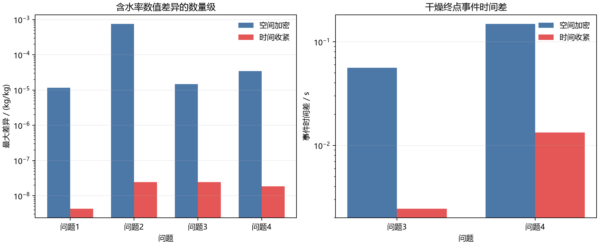
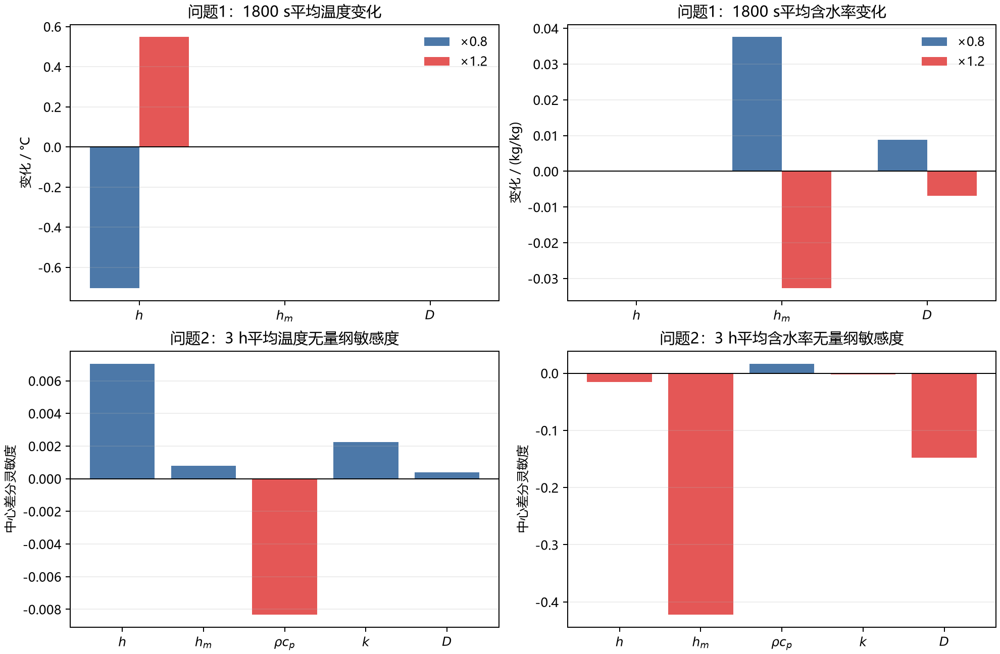
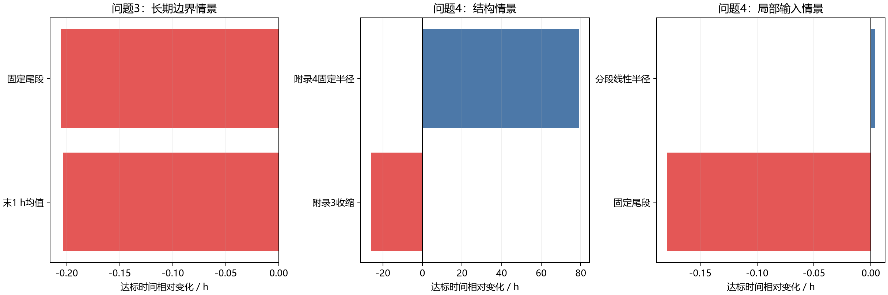

## 6 误差与敏感性分析

### 6.1 误差范围

附件没有内部温度、内部含水率或完整失重的独立观测，因此不能计算实验真值意义下的 RMSE。本节分别检验数值离散误差、程序一致性和参数/边界情景敏感性；潜热、端部效应和非均匀收缩等未建模机制属于模型形式不确定性，不能用守恒残差代替。

### 6.2 数值收敛性

四问采用守恒型有限体积离散和隐式 BDF 积分，正式网格依次为 $N=6400,400,300,300$。空间检验比较相邻网格，时间检验将相对、绝对容差各收紧 10 倍，并将最大步长由 $5$ s 降至 $2$ s（第三、第四问尾段由 $300$ s 降至 $120$ s）。表 9 中的差异均为最大绝对差。

**表 9 四问数值收敛性检验**

| 问题 | 空间比较及最大差异 | 时间收紧及最大差异 |
|---|---|---|
| 第一问 | $N=3200\to6400$：$\Delta T=4.43\times10^{-8}\ ^\circ\mathrm{C}$，$\Delta C=1.17\times10^{-5}\ \mathrm{kg/kg}$ | $\Delta T=1.10\times10^{-8}\ ^\circ\mathrm{C}$，$\Delta C=4.32\times10^{-9}\ \mathrm{kg/kg}$ |
| 第二问 | $N=300\to400$：$\Delta T=2.62\times10^{-6}\ ^\circ\mathrm{C}$，$\Delta C=7.53\times10^{-4}\ \mathrm{kg/kg}$；题目表格点 $\Delta C=1.87\times10^{-6}$ | $\Delta T=5.00\times10^{-7}\ ^\circ\mathrm{C}$，$\Delta C=2.44\times10^{-8}\ \mathrm{kg/kg}$ |
| 第三问 | $N=220\to300$：事件时刻差 $0.0563$ s，60 s 输出 $\Delta C=1.46\times10^{-5}\ \mathrm{kg/kg}$ | 事件时刻差 $0.00245$ s，输出 $\Delta C=2.44\times10^{-8}\ \mathrm{kg/kg}$ |
| 第四问 | $N=200\to300$：事件时刻差 $0.1489$ s，实际位置 $\Delta C=3.46\times10^{-5}\ \mathrm{kg/kg}$ | 事件时刻差 $0.0133$ s，实际位置 $\Delta C=1.84\times10^{-8}\ \mathrm{kg/kg}$ |

第二问的全场含水率差异主要来自 $t=1$ s 表面节点的初始边界梯度，而题目要求表格点的差异仅为 $1.87\times10^{-6}\ \mathrm{kg/kg}$。第三、第四问用连续事件函数定位终点，不受 60 s 输出间隔限制。由此可见，事件时刻和题目要求位置的结果对网格、时间积分均较稳定。

**图 10 四问数值收敛与干燥终点事件时间差**

### 6.3 守恒、Jacobian 与物理检查

以水分收支残差

$$
\varepsilon_C(t)=\bar C(t)-C_0-z(t)
$$

检验有限体积通量、边界项和面积权重的一致性。第二问、第四问的解析 Jacobian 复步长检验最大相对误差分别为 $4.02\times10^{-16}$ 和 $3.02\times10^{-16}$；第四问固定半径极限与第二问方程右端的最大差为 $3.00\times10^{-15}$。四问正式网格的最大水分收支残差依次为

$$
4.79\times10^{-15},\quad 4.88\times10^{-15},\quad
1.20\times10^{-14},\quad 7.99\times10^{-15}\ \mathrm{kg/kg}.
$$

四个工作簿已完成行数、结构和逐单元格数值核对，第四问的半径外空白掩码也一致。所有含水率保持为正且不超过初始值 $2.55\ \mathrm{kg/kg}$，达标前全域最大含水率均位于中心；第三、第四问的最大径向反向增量仅为 $8.88\times10^{-16}\ \mathrm{kg/kg}$，属于浮点舍入量级。这些检查证明程序内部守恒和实现一致，但不代表实验预测误差为零。

### 6.4 参数敏感性

单因素扰动采用

$$
S_{y,p}\approx\frac{y(1.2p)-y(0.8p)}{0.4y(p)}.
$$

第一问参数扰动使用 $N=800$，第二问中心差分使用 $N=200$，主结果仍采用正式网格。第一问在 $t=1800$ s 的主要变化如表 10 所示。

**表 10 第一问参数扰动对平均量的影响**

| 参数 | $\Delta\bar T$ / $^\circ\mathrm{C}$（$0.8,1.2$） | $\Delta\bar C$ / $\mathrm{kg/kg}$（$0.8,1.2$） |
|---|---:|---:|
| $h$ | $-0.7027,\ +0.5480$ | $0,\ 0$ |
| $h_m$ | $0,\ 0$ | $+0.03758,\ -0.03265$ |
| $D$ | $0,\ 0$ | $+0.00884,\ -0.00684$ |

第二问 3 h 平均含水率的灵敏度绝对值排序为

$$
h_m>D>\rho c_p\approx h>k.
$$

因此，当前范围内平均含水率优先受有效传质系数 $h_m$ 和内部扩散系数 $D$ 影响；各参数对 3 h 平均温度的绝对影响均小于 $0.11\ ^\circ\mathrm{C}$。拟合窗口和分段线性边界对第一问平均温度的最大变化分别约为 $0.0203^\circ\mathrm{C}$ 和 $0.0020^\circ\mathrm{C}$，小于换热系数扰动的影响。

**图 11 第一问参数扰动与第二问无量纲灵敏度**

### 6.5 长期边界与模型情景

附件仅记录前 4 h，而第三、第四问达标时间分别约为 $57.68$ h 和 $51.27$ h，因此 4 h 后环境边界是不确定性来源之一。主情景达标时间为第三问 $57.67893$ h、第四问 $51.26822$ h；各情景相对主情景的变化如表 11 所示。

**表 11 长期边界与模型情景对达标时间的影响**

| 问题 | 情景 | $\Delta t$ / h |
|---|---|---:|
| 第三问 | 尾段固定为 $50^\circ\mathrm{C},\ 0.05\ \mathrm{kg/kg}$ | $-0.20548$ |
| 第三问 | 尾段采用附件最后 1 h 均值 | $-0.20378$ |
| 第四问 | 附录 4 物性、固定半径 | $+79.09060$ |
| 第四问 | 附录 3 物性、保持收缩半径 | $-25.95624$ |
| 第四问 | 附录 4 物性、分段线性半径 | $+0.00354$ |
| 第四问 | 尾段固定为 $50^\circ\mathrm{C},\ 0.05\ \mathrm{kg/kg}$ | $-0.17934$ |

固定尾段边界使终点提前约 $0.18$--$0.21$ h，明显大于秒级数值差异；PCHIP 改为分段线性半径仅改变约 $0.00354$ h。固定半径和附录 3 物性对照分别改变几何和物性，不能直接当作真实误差上下界。

**图 12 长期边界、收缩和物性情景敏感性**

综上，当前结果在网格、时间积分、Jacobian、事件定位和水分守恒方面具有稳定的程序一致性；预测不确定性主要来自 $h_m$、$D(T,C)$、4 h 后边界以及潜热和收缩机制。详细数值由 submit/code/p6/run_p6.py 生成，结果保存在 submit/results/p6/，图片保存在 submit/figures/p6/。
