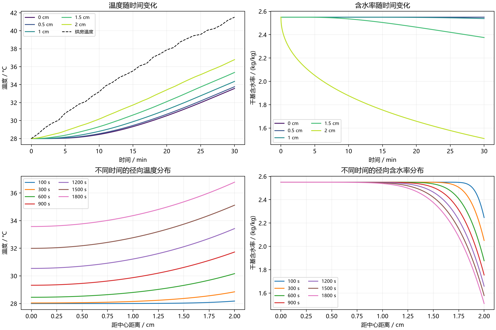

# 第一问：控制方程、数值求解与结果

本问采用一维圆柱径向传热与有效水分扩散模型，已使用附件1的实际数据完成0—1800 s计算。1800 s时，中心温度为 **33.5753°C**、表面温度为 **36.7856°C**；中心干基含水率为 **2.5500 kg/kg**、表面为 **1.5102 kg/kg**。

上述数值对应本文列明的模型假设，尤其是忽略端部和蒸发潜热、采用直接含水率差的有效传质边界。它们不是脱离假设的唯一物理解。

## 1. 文件与输入数据

- 题目来源：[A题.pdf](../A题.pdf)，问题1、附录2。
- 环境数据：[附件1.xlsx](../附件/附件1.xlsx)。表头依次为时间、温度、水分浓度，数据从0到14400 s，每60 s一个记录。本问只使用0—1800 s。
- 完整结果：[result1.xlsx](../outputs/q1/result1.xlsx)。保留“温度”“水分浓度”两个工作表，各有1800行数据，对应1—1800 s；21个径向位置对应0—2 cm、间隔0.1 cm。数值及显示格式均保留四位小数。
- 可复现求解代码：[solve_q1.py](solve_q1.py)。
- 数值验证记录：[validation.json](validation.json)。
- 完整精度数据：[result1_full_precision.npz](result1_full_precision.npz)，额外包含0 s初值，未作四位小数舍入。

原附件和空白结果模板均未覆盖。

## 2. 变量、参数与假设

### 2.1 变量和参数

\[
T=T(r,t),\qquad C=C(r,t),\qquad 0\le r\le R,
\quad 0\le t\le1800.
\]

其中，\(r\)用m，\(t\)用s；本问温度\(T\)可用°C，因为热方程只含温差与温度导数，且第一问的扩散系数不含绝对温度。

\[
C=\frac{\text{水的质量}}{\text{干物质的质量}}
\quad\text{，单位为kg/kg。}
\]

| 符号 | 含义 | 数值 |
|---|---|---:|
| \(R\) | 初始半径，本问固定 | 0.02 m |
| \(L\) | 长度 | 0.25 m |
| \(\rho\) | 密度 | 820 kg/m³ |
| \(c_p\) | 比热容 | 2600 J/(kg·K) |
| \(k\) | 热传导系数 | 0.36 W/(m·K) |
| \(h\) | 对流换热系数 | 25 W/(m²·K) |
| \(h_m\) | 有效对流传质系数 | \(8\times10^{-7}\) m/s |
| \(T_0\) | 初始药材温度 | 28°C |
| \(C_0\) | 初始干基含水率 | 2.55 kg/kg |

水分扩散系数严格使用附录2：

\[
\boxed{D(C)=7\times10^{-9}\exp\left(-\frac{0.89}{C}\right)}
\quad\mathrm{m^2/s}.
\tag{1}
\]

注意指数是\(-0.89/C\)，不是\(-0.89C\)。本问不使用附录3的密度、比热容、导热系数或扩散系数。

### 2.2 本次计算采用的假设

1. 药材可视为均匀、各向同性的圆柱，初始温度和含水率均匀。
2. 周向均匀，忽略轴向传导与端部影响，结果代表圆柱中段截面的径向状态。
3. 第一问尺寸固定，\(\rho,c_p,k,h,h_m\)取题给常数，只有\(D\)随局部含水率改变。
4. 热量传递采用导热加表面对流模型，不额外加入蒸发潜热、内部热源或水分迁移携热项。
5. 干基含水率采用有效扩散方程；将附件1的环境水分浓度作为有效传质边界中的环境参考量，直接构造含水率差驱动力。

第5项需要在论文中说明：空气水分浓度和固体干基含水率未必具有相同的质量基准。题目未提供吸附等温线或相间平衡换算关系，因此这里使用简化的有效边界，并不声称已经建立严格的气固平衡模型。若采用另一种相间平衡关系，数值结果应重新计算。

从干物质守恒出发，在单位体积干物质质量\(\rho_d\)视为常数，且水分通量写成\(\boldsymbol j_w=-\rho_dD\nabla C\)时，有\(\rho_dC_t=-\nabla\cdot\boldsymbol j_w\)，约去\(\rho_d\)可得到本文的含水率扩散方程。这解释了为什么不能把\(C\)直接当作kg/m³，也不应随意在含水率方程右端再除一次题给密度。

## 3. 烘房温度与水分浓度的时间函数

记附件1中的记录为：

\[
(t_j,T_{\infty,j},C_{\infty,j}).
\]

在相邻记录间采用分段线性插值。对\(t_j\le t\le t_{j+1}\)，定义：

\[
\theta=\frac{t-t_j}{t_{j+1}-t_j},
\]

\[
\boxed{T_\infty(t)=(1-\theta)T_{\infty,j}+\theta T_{\infty,j+1}},
\tag{2}
\]

\[
\boxed{C_\infty(t)=(1-\theta)C_{\infty,j}+\theta C_{\infty,j+1}}.
\tag{3}
\]

例如，附件给出：

| 时间 / s | 烘房温度 / °C | 环境水分浓度 / (kg/kg) |
|---:|---:|---:|
| 0 | 28.000 | 0.01963 |
| 600 | 33.202 | 0.02428 |
| 1200 | 37.882 | 0.02891 |
| 1800 | 41.513 | 0.03307 |

本问所有计算时刻都在数据覆盖范围内，不需要时间外推，也不把环境温度直接当作药材表面温度。

## 4. 温度控制方程与条件

### 4.1 控制方程

圆柱径向热传导方程为：

\[
\boxed{
\rho c_p\frac{\partial T}{\partial t}
=\frac1r\frac{\partial}{\partial r}
\left(rk\frac{\partial T}{\partial r}\right)
},\qquad 0<r<R.
\tag{4}
\]

因为第一问的\(k\)为常数，可以写成：

\[
\boxed{
\frac{\partial T}{\partial t}
=\alpha\left(\frac{\partial^2T}{\partial r^2}
+\frac1r\frac{\partial T}{\partial r}\right)
},
\tag{5}
\]

其中热扩散率：

\[
\boxed{
\alpha=\frac{k}{\rho c_p}
=\frac{0.36}{820\times2600}
=1.6885553471\times10^{-7}\ \mathrm{m^2/s}
}.
\tag{6}
\]

### 4.2 初始条件

\[
\boxed{T(r,0)=28},\qquad 0\le r\le R.
\tag{7}
\]

### 4.3 中心对称条件

\[
\boxed{\left.\frac{\partial T}{\partial r}\right|_{r=0}=0}.
\tag{8}
\]

它表示中心没有优先的径向方向，不表示中心温度恒定为28°C。

### 4.4 表面对流换热条件

取沿半径向外为正，表面满足：

\[
\boxed{
-k\left.\frac{\partial T}{\partial r}\right|_{r=R}
=h[T(R,t)-T_\infty(t)]
}.
\tag{9}
\]

代入常数，等价地：

\[
\boxed{
\left.\frac{\partial T}{\partial r}\right|_{r=0.02}
=\frac{25}{0.36}[T_\infty(t)-T(0.02,t)]
}.
\tag{10}
\]

当空气比表面热时，右边为正，温度向表面方向升高，热流向药材内部，符号与物理方向一致。

## 5. 水分控制方程与条件

### 5.1 非线性扩散方程

\[
\boxed{
\frac{\partial C}{\partial t}
=\frac1r\frac{\partial}{\partial r}
\left[rD(C)\frac{\partial C}{\partial r}\right]
},\qquad 0<r<R.
\tag{11}
\]

由于\(D\)随\(C\)变化，展开后是：

\[
\frac{\partial C}{\partial t}
=D(C)\left(\frac{\partial^2 C}{\partial r^2}
+\frac1r\frac{\partial C}{\partial r}\right)
+D'(C)\left(\frac{\partial C}{\partial r}\right)^2,
\tag{12}
\]

\[
D'(C)=\frac{0.89}{C^2}D(C).
\tag{13}
\]

因此，直接写成\(C_t=D(C)(C_{rr}+C_r/r)\)会漏掉一项。本次采用式(11)的通量形式离散，自动保留变系数效应。

### 5.2 初始条件与中心条件

\[
\boxed{C(r,0)=2.55},
\tag{14}
\]

\[
\boxed{\left.\frac{\partial C}{\partial r}\right|_{r=0}=0}.
\tag{15}
\]

### 5.3 有效表面传质条件

\[
\boxed{
-D(C(R,t))\left.\frac{\partial C}{\partial r}\right|_{r=R}
=h_m[C(R,t)-C_\infty(t)]
}.
\tag{16}
\]

此处\(h_m=8\times10^{-7}\ \mathrm{m/s}\)，表面扩散系数用表面当前含水率计算。当药材表面比环境参考状态湿时，\(C_r(R,t)<0\)，水分向外迁移。

均匀初值给出\(C_r(r,0)=0\)，但初始表面与环境存在含水差，因此初值与表面边界在\((R,0)\)处不满足经典光滑相容条件。这是启动扩散中的初始边界层现象：保持题目初值，在\(t>0\)施加传质边界，并通过细网格解析早期快速变化。不能为消除这一现象，擅自把表面初值改成环境含水率。

### 5.4 第一问的两类方程是否需要耦合求解

在本文假设下，温度方程的系数全为常数，水分扩散系数只依赖\(C\)，不依赖\(T\)。所以第一问的温度和含水率可以分别求解。它们共同使用附件1的环境时间轴，但没有通过物性系数形成第二问那样的双向耦合。

## 6. 数值求解方法

时变边界与非线性扩散使直接写出简单闭式解不现实。本次采用**径向有限体积空间离散 + 隐式BDF时间积分**。

### 6.1 网格与控制体积

将半径均分为\(N\)个区间：

\[
r_i=i\Delta r,\quad i=0,1,\ldots,N,
\qquad\Delta r=R/N.
\]

每个节点对应一个环状控制体积。定义：

\[
a_i=\max(0,r_i-\Delta r/2),\qquad
b_i=\min(R,r_i+\Delta r/2),
\]

\[
w_i=\int_{a_i}^{b_i}r\,\mathrm dr
=\frac{b_i^2-a_i^2}{2}.
\tag{17}
\]

完整体积为\(2\pi Lw_i\)，公共因子\(2\pi L\)在方程两边约去。中心和表面采用截断控制体积，不需要在\(r=0\)直接除以零。

### 6.2 统一通量形式

分别取：

\[
(u,a,\beta,u_\infty)=
\begin{cases}
(T,\alpha,h/(\rho c_p),T_\infty),&\text{温度},\\
(C,D(C),h_m,C_\infty),&\text{含水率}.
\end{cases}
\]

相邻节点间定义扩散通量变量：

\[
F_{i+1/2}=r_{i+1/2}a_{i+1/2}
\frac{u_{i+1}-u_i}{\Delta r},
\quad r_{i+1/2}=\frac{r_i+r_{i+1}}2.
\tag{18}
\]

温度使用\(a_{i+1/2}=\alpha\)，含水率使用：

\[
a_{i+1/2}=\frac{D(C_i)+D(C_{i+1})}{2}.
\tag{19}
\]

中心边界与表面边界分别为：

\[
F_{-1/2}=0,\qquad
F_{N+1/2}=R\beta[u_\infty(t)-u_N].
\tag{20}
\]

最终半离散方程统一写成：

\[
\boxed{
\frac{\mathrm du_i}{\mathrm dt}
=\frac{F_{i+1/2}-F_{i-1/2}}{w_i}
},\quad i=0,\ldots,N.
\tag{21}
\]

这里\(F\)按正梯度定义，是扩散方程散度内的通量变量；向外的物理扩散通量带负号。它与式(9)、(16)的方向约定一致。

特别地，中心节点自动给出：

\[
\frac{\mathrm du_0}{\mathrm dt}
=\frac{4a_{1/2}}{\Delta r^2}(u_1-u_0),
\tag{22}
\]

避免了用平板模型的中心系数代替圆柱模型。

### 6.3 时间推进与输出

将式(21)组成常微分方程组，用SciPy的隐式BDF方法求解，并提供解析稀疏Jacobian。每个环境数据节点处分段重启积分，避免跨越线性插值的斜率变化点。

本次最终设置：

- \(N=6400\)，即6401个径向计算节点。
- \(\Delta r=3.125\times10^{-6}\ \mathrm m=0.0003125\ \mathrm{cm}\)。
- 相对容差\(2\times10^{-10}\)，绝对容差\(2\times10^{-12}\)。
- 自适应内部步长，最大步长5 s。
- 用求解器连续插值输出每个整数秒的值。
- 规定的0.1 cm输出间隔恰好等于320个计算区间，因此径向输出直接抽取网格节点，无需空间插值。

为什么计算网格远比输出网格细：初始表面存在较薄的含水率梯度层。若直接用0.1 cm作为求解网格，可能显著低估早期表面变化的数值精度。输出间隔规定的是结果采样，不是求解器必须采用的网格。

## 7. 第一问要求的结果表

### 表1：温度 / °C

| 时间 / s | 0 cm | 0.5 cm | 1 cm | 1.5 cm | 2 cm |
|---:|---:|---:|---:|---:|---:|
| 100 | 28.0001 | 28.0003 | 28.0040 | 28.0327 | 28.1801 |
| 300 | 28.0408 | 28.0635 | 28.1514 | 28.3681 | 28.8489 |
| 600 | 28.4533 | 28.5360 | 28.8039 | 29.3159 | 30.1652 |
| 900 | 29.3243 | 29.4583 | 29.8755 | 30.6161 | 31.7304 |
| 1200 | 30.5427 | 30.7098 | 31.2223 | 32.1126 | 33.4276 |
| 1500 | 31.9957 | 32.1867 | 32.7660 | 33.7463 | 35.1203 |
| 1800 | 33.5753 | 33.7720 | 34.3642 | 35.3621 | 36.7856 |

### 表2：干基含水率 / (kg/kg)

| 时间 / s | 0 cm | 0.5 cm | 1 cm | 1.5 cm | 2 cm |
|---:|---:|---:|---:|---:|---:|
| 100 | 2.5500 | 2.5500 | 2.5500 | 2.5500 | 2.2470 |
| 300 | 2.5500 | 2.5500 | 2.5500 | 2.5492 | 2.0508 |
| 600 | 2.5500 | 2.5500 | 2.5500 | 2.5353 | 1.8770 |
| 900 | 2.5500 | 2.5500 | 2.5497 | 2.5045 | 1.7547 |
| 1200 | 2.5500 | 2.5500 | 2.5482 | 2.4646 | 1.6586 |
| 1500 | 2.5500 | 2.5499 | 2.5445 | 2.4206 | 1.5787 |
| 1800 | 2.5500 | 2.5497 | 2.5383 | 2.3755 | 1.5102 |

## 8. 结果解释



### 8.1 药材温度低于烘房温度，表层比中心热

1800 s时：

\[
T_\infty=41.5130^\circ\mathrm C,
\quad T(R)=36.7856^\circ\mathrm C,
\quad T(0)=33.5753^\circ\mathrm C.
\]

有限表面换热速率导致空气与表面有温差，有限内部导热速率又导致表面与中心有温差。在本文模型下，这些温差无需借助额外的蒸发耗热假设就会出现。

### 8.2 中心水分变化慢，不能误判为程序没有更新

初始水分扩散系数为：

\[
D(2.55)=4.9376550942\times10^{-9}\ \mathrm{m^2/s}.
\]

热扩散率约为它的34.2倍。用\(R^2/a\)作内部扩散时间尺度估计：

\[
\frac{R^2}{\alpha}\approx2369\ \mathrm s,
\qquad
\frac{R^2}{D(2.55)}\approx8.10\times10^4\ \mathrm s.
\]

后者约22.5 h，仅是初始扩散系数下的数量级估计，不是预测的最终烘干时间。这解释了前30 min中心已经明显升温、含水率却几乎不变的现象。

1800 s中心未舍入的含水率约为2.5499924，保留四位小数显示为2.5500，并非绝对没有变化。

### 8.3 径向平均值必须采用圆柱体积权重

\[
\overline C(t)=\frac{2}{R^2}\int_0^R C(r,t)r\,\mathrm dr,
\qquad
\overline T(t)=\frac{2}{R^2}\int_0^R T(r,t)r\,\mathrm dr.
\tag{23}
\]

本次得到1800 s时：

\[
\overline T=35.1679^\circ\mathrm C,
\qquad\overline C=2.2936\ \mathrm{kg/kg}.
\]

不能将21个等半径间隔位置简单算术平均后称为体积平均。

## 9. 数值验证与精度边界

### 9.1 空间网格加密

以下差异均在相同的1 s、0.1 cm输出网格上比较未舍入结果，不是将四位小数结果相减。

| 网格比较 | 全输出温度最大差 / °C | 全输出含水率最大差 / (kg/kg) | 表2指定位置与时刻含水率最大差 |
|---|---:|---:|---:|
| 800→1600区间 | \(9.21\times10^{-7}\) | \(1.90\times10^{-4}\) | \(1.39\times10^{-5}\) |
| 1600→3200区间 | \(2.33\times10^{-7}\) | \(4.69\times10^{-5}\) | \(3.48\times10^{-6}\) |
| 3200→6400区间 | \(5.89\times10^{-8}\) | \(1.17\times10^{-5}\) | \(8.71\times10^{-7}\) |

含水率差异随网格加密约缩小为原来的四分之一，呈现二阶空间收敛特征。最早几秒的表面结果比论文表格的最早100 s更敏感，因此必须检查完整输出，不能只检查表2。

### 9.2 时间积分精度

在6400区间网格下，将相对、绝对容差再收紧10倍，并把最大步长从5 s减到2 s，与主计算比较得到：

- 温度最大差约\(3.89\times10^{-8}\)°C。
- 含水率最大差约\(8.19\times10^{-9}\) kg/kg。

说明本次输出的时间离散误差相对空间离散误差较小。

### 9.3 整体收支核验

对式(21)乘以\(w_i\)并求和，内部通量相互抵消，得到：

\[
\frac{\mathrm d}{\mathrm dt}\sum_iw_i u_i
=R\beta(u_\infty-u_N).
\tag{24}
\]

程序另设状态变量积分表面交换总量，并与域内加权平均变化核对。6400区间主计算的最大平均值收支残差：温度约\(2.22\times10^{-14}\)°C，含水率约\(2.27\times10^{-15}\) kg/kg。

这一检查验证离散方程的收支一致性，不代表实际药材的所有物理过程都已纳入模型。另已检查含水率保持正值、不超过初值，温度不越出初值与当前数据最高环境温度的范围，以及所给环境下温度向外升高、含水率向外降低的径向分布。

### 9.4 四位小数的含义

最终文件按题意保留四位小数。网格和时间检查支持数值解已经收敛，但不能把显示位数理解成实验预测具有相同精度。端部、潜热、有效传质边界和环境插值带来的模型误差，未包含在上述离散误差比较中。

## 10. 复现方法

在项目目录执行：

```powershell
python 第一问/solve_q1.py --check-time
```

默认完成800、1600、3200、6400区间的网格比较，使用6400区间结果生成全精度数据、四位小数数据、结果表和图片。依赖NumPy、SciPy、openpyxl和Matplotlib；openpyxl只用于读取原始环境数据。

Excel填表脚本为[build_workbook.mjs](build_workbook.mjs)，读取数值求解输出并扩展原模板，在配置了`@oai/artifact-tool`的环境中运行：

```powershell
node 第一问/build_workbook.mjs
```

本次已实际生成并重新读取核对工作簿：两张表共75600个温度/含水率数值与求解器的四位小数输出一致；另核对1800个时间行及21个距离列，并检查了两张表的渲染预览。
