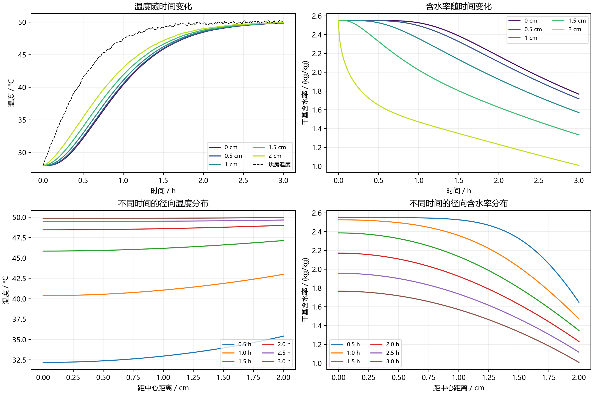

# 第二问：全过程热湿耦合模型与前3小时数值结果

本问沿用第一问的一维圆柱径向框架，**从初始时刻开始统一使用附录3的物性关系，联立求解温度与含水率**。预热和恒温阶段通过附件1的环境变化体现，药材内部状态连续衔接，不把第一问的计算结果直接拼接进第二问。

本文结果已按附件1实际数据计算。它们对应本文列出的有效传质边界、忽略端部和潜热等假设。

## 1. 交付文件与数据范围

- 题目及参数：[A题.pdf](../A题.pdf)，问题2、附录3。
- 环境输入：[附件1.xlsx](../附件/附件1.xlsx)，0—14400 s，每60 s记录一次。
- 完整结果：[result2.xlsx](../outputs/q2/result2.xlsx)，保留模板的“温度”“水分浓度”工作表。
- 求解程序：[solve_q2.py](solve_q2.py)。
- 精度与参数记录：[validation.json](validation.json)。
- 未舍入结果：[result2_full_precision.npz](result2_full_precision.npz)。

结果工作簿填写1—10800 s，共10800个时间点；径向位置0—2 cm、间隔0.1 cm，共21个位置。两张表合计453600个温度或含水率数值，均保留四位小数。未舍入数据还包含0 s初始状态。

原题要求建立整个烘干过程模型，并在论文中展示前3 h。本文给出可延长积分的全过程模型，result2.xlsx输出与表3、表4对应的前3 h；计算最终达标时长属于问题3。

## 2. 两阶段如何处理

### 2.1 分阶段不等于分段使用附录2、附录3

题目同时说明“预热平衡与恒温干燥阶段的参数有所不同”以及“相关经验公式统一采用附录3”。据此采用：

| 内容 | 预热平衡阶段 | 恒温干燥阶段 |
|---|---|---|
| 密度、比热容、导热系数、扩散系数 | 附录3 | 同样采用附录3 |
| 外部温湿状态 | 按附件中升温过程输入 | 按附件中接近平台、仍有波动的过程输入 |
| 内部温度和含水率 | 随时间计算 | 连续继承前一阶段状态 |
| 换热、传质系数 | 沿用第一问常数 | 沿用第一问常数；未自行编造新数值 |

后续附录未另给表面交换系数，因此沿用\(h=25\ \mathrm{W/(m^2\cdot K)}\)、\(h_m=8\times10^{-7}\ \mathrm{m/s}\)，作为明确的模型假设。

若记物理阶段交界为\(t_s\)，则：

\[
T(r,t_s^-)=T(r,t_s^+),\qquad C(r,t_s^-)=C(r,t_s^+).
\tag{1}
\]

内部方程的形式和物性关系在两阶段相同，因此无需人为指定\(t_s\)才能求解：环境随时间的变化已在边界中体现了工况过渡。尤其不能仅因为问题1输出1800 s，就认定1800 s是阶段切换点。

### 2.2 数据覆盖范围内保留原始变化

设环境记录为\((t_j,T_{a,j},C_{a,j})\)，对\(t_j\le t\le t_{j+1}\)定义：

\[
\theta=\frac{t-t_j}{t_{j+1}-t_j},
\]

\[
\boxed{T_a(t)=(1-\theta)T_{a,j}+\theta T_{a,j+1}},
\qquad
\boxed{C_a(t)=(1-\theta)C_{a,j}+\theta C_{a,j+1}}.
\tag{2}
\]

附件中1800 s温度为41.513°C，3600 s为47.485°C，7200 s为49.852°C，10800 s为50.195°C。这是逐步接近约50°C并伴随波动的过程，不宜未经说明地在某一时刻把所有后续数据替换为精确的50°C。

### 2.3 全过程模型的数据外延假设

附件仅覆盖4 h，而整个烘干过程可能持续数天。为使模型可以继续积分，程序提供显式的末值保持延拓：

\[
T_a(t)=\begin{cases}
\text{附件数据的分段线性插值},&0\le t\le14400,\\
50.165,&t>14400,
\end{cases}
\]

\[
C_a(t)=\begin{cases}
\text{附件数据的分段线性插值},&0\le t\le14400,\\
0.04986,&t>14400.
\end{cases}
\tag{3}
\]

14400 s是数据覆盖的终点，**不是据此认定的物理阶段切换时刻**。末值保持是长期计算的基准假设，不能当成题目提供的后续实测数据。本次只算到10800 s，所以表3、表4及result2.xlsx完全不受这一外延假设影响。问题3计算达标时间时，需要评估长期边界假设的影响。

## 3. 参数、变量与假设

采用径向坐标\(r\)，计算区域为：

\[
0\le r\le R=0.02\ \mathrm m.
\]

未知量为\(T(r,t)\)和\(C(r,t)\)。程序中的\(T\)以°C存储，\(C\)是kg/kg单位的干基含水率。计算扩散系数时必须先换算：

\[
T_K=T+273.15.
\tag{4}
\]

模型假设：

1. 药材为均匀、各向同性圆柱，忽略周向和轴向变化，代表圆柱中段径向状态。
2. 第二问尺寸保持不变，收缩留待第四问处理。
3. 附录3关系按各位置的局部状态计算，不用全体平均含水率代替。
4. 采用有效导热—扩散模型，不另加蒸发潜热、内部热源或水分迁移携热项。
5. 采用与第一问相同的有效表面传质边界：将环境水分数据直接用于含水率差驱动力。

第5项不是严格的气固相平衡关系。空气的kg/kg与药材干基含水率的kg/kg可能具有不同质量基准；若采用吸附平衡换算，需要额外模型和参数。本文计算是在与第一问一致的有效边界假设下开展的。

## 4. 附录3的物性关系

\[
\boxed{\rho(C)=650+128C}
\quad\mathrm{kg/m^3},
\tag{5}
\]

\[
\boxed{c_p(C)=1450+2736\frac{C}{C+1}}
\quad\mathrm{J/(kg\cdot K)},
\tag{6}
\]

\[
\boxed{k(C)=0.21+0.38\frac{C}{C+1}}
\quad\mathrm{W/(m\cdot K)},
\tag{7}
\]

\[
\boxed{D(T,C)=2.4\times10^{-3}
\exp\left(-\frac{0.45}{C}\right)
\exp\left(-\frac{3850}{T+273.15}\right)}
\quad\mathrm{m^2/s}.
\tag{8}
\]

初始状态\(T=28^\circ\mathrm C,C=2.55\)下：

\[
\rho_0=976.4\ \mathrm{kg/m^3},\quad
c_{p,0}=3415.2958\ \mathrm{J/(kg\cdot K)},
\]

\[
k_0=0.4830\ \mathrm{W/(m\cdot K)},\quad
D_0=5.6416803730\times10^{-9}\ \mathrm{m^2/s}.
\]

这些值与第一问常数不完全相同，因此第二问必须从初值重新求解。两问前30 min结果不同是模型参数体系改变的正常结果。

## 5. 控制方程、初始条件和边界条件

### 5.1 温度方程

\[
\boxed{
\rho(C)c_p(C)\frac{\partial T}{\partial t}
=\frac1r\frac{\partial}{\partial r}
\left[rk(C)\frac{\partial T}{\partial r}\right]
},\qquad 0<r<R.
\tag{9}
\]

与第一问不同，\(k\)随局部含水率、进而随空间位置改变。展开为：

\[
\rho c_p T_t=k\left(T_{rr}+\frac{T_r}{r}\right)+k'(C)C_rT_r,
\qquad k'(C)=\frac{0.38}{(C+1)^2}.
\tag{10}
\]

所以不能直接把第一问的常数热扩散率替换成\(k/(\rho c_p)\)后，仍只保留\(T_{rr}+T_r/r\)，否则会遗漏导热系数梯度项。

这里采用的是有效热容量形式\(\rho c_p T_t\)，不将其误写为\(\partial_t(\rho c_p T)\)。两者在物性随含水率变化时并不相同。若追求包含变组分能量、相变和水分携热的严格总能量模型，需要进一步定义并一致处理相应通量，不能只随意改动时间导数一侧。

### 5.2 水分方程

\[
\boxed{
\frac{\partial C}{\partial t}
=\frac1r\frac{\partial}{\partial r}
\left[rD(T,C)\frac{\partial C}{\partial r}\right]
}.
\tag{11}
\]

其展开式为：

\[
C_t=D\left(C_{rr}+\frac{C_r}{r}\right)
+D_C(C_r)^2+D_TT_rC_r,
\tag{12}
\]

其中：

\[
D_C=\frac{0.45}{C^2}D,
\qquad D_T=\frac{3850}{(T+273.15)^2}D.
\tag{13}
\]

本文直接离散式(11)的通量形式，保留这些变系数效应。此处仍采用干基含水率的有效扩散模型，不把\(C\)误作单位体积水质量，也不在右端额外除以经验密度。

### 5.3 初始条件

\[
\boxed{T(r,0)=28,\qquad C(r,0)=2.55},
\qquad0\le r\le R.
\tag{14}
\]

### 5.4 中心对称条件

\[
\boxed{T_r(0,t)=0,\qquad C_r(0,t)=0}.
\tag{15}
\]

### 5.5 表面交换条件

\[
\boxed{-k(C_s)T_r(R,t)=h[T_s-T_a(t)]},
\tag{16}
\]

\[
\boxed{-D(T_s,C_s)C_r(R,t)=h_m[C_s-C_a(t)]},
\tag{17}
\]

其中\(T_s=T(R,t),C_s=C(R,t)\)，\(h=25\)、\(h_m=8\times10^{-7}\)，单位同前。

表面导热系数和扩散系数均使用表面当前状态。表面温度不直接等于空气温度，表面含水率也不直接等于环境水分浓度。

## 6. 为什么需要联立求解

物性关系形成双向影响：

- \(C\)改变\(\rho,c_p,k\)，从而改变温度响应。
- \(T\)改变\(D\)，从而改变水分扩散。
- \(C\)还会直接改变\(D\)。

因此，不能先把整个温度过程独立算完，再一次性计算水分；除非明确采用并验证额外的弱耦合近似。本文将所有温度、含水率节点组成一个状态向量，每次隐式迭代同时更新两类状态及其物性。

## 7. 有限体积离散与时间积分

### 7.1 径向网格

\[
r_i=i\Delta r,\quad i=0,\ldots,N,\qquad\Delta r=R/N.
\]

以节点为中心构造截断环状控制体积，令：

\[
a_i=\max(0,r_i-\Delta r/2),\quad
b_i=\min(R,r_i+\Delta r/2),\quad
w_i=\frac{b_i^2-a_i^2}{2}.
\tag{18}
\]

完整体积是\(2\pi Lw_i\)，公共因子约去。中心用截断控制体积处理，不直接计算\(1/0\)。

### 7.2 内部通量

令\(B_i=\rho(C_i)c_p(C_i)\)，并取相邻节点物性的算术平均：

\[
k_{i+1/2}=\frac{k(C_i)+k(C_{i+1})}{2},\qquad
D_{i+1/2}=\frac{D(T_i,C_i)+D(T_{i+1},C_{i+1})}{2}.
\]

\[
F^T_{i+1/2}=r_{i+1/2}k_{i+1/2}\frac{T_{i+1}-T_i}{\Delta r},
\]

\[
F^C_{i+1/2}=r_{i+1/2}D_{i+1/2}\frac{C_{i+1}-C_i}{\Delta r}.
\tag{19}
\]

这些\(F\)是扩散散度中的通量变量，向外的物理传导或扩散通量取其负号。

### 7.3 边界通量

\[
F^T_{-1/2}=F^C_{-1/2}=0,
\]

\[
F^T_{N+1/2}=Rh(T_a-T_N),\qquad
F^C_{N+1/2}=Rh_m(C_a-C_N).
\tag{20}
\]

### 7.4 半离散联立方程

\[
\boxed{\frac{\mathrm dT_i}{\mathrm dt}
=\frac{F^T_{i+1/2}-F^T_{i-1/2}}{w_iB_i}},
\]

\[
\boxed{\frac{\mathrm dC_i}{\mathrm dt}
=\frac{F^C_{i+1/2}-F^C_{i-1/2}}{w_i}}.
\tag{21}
\]

式(21)通过界面通量的相互抵消保证离散收支一致，并保留空间变系数效应。

时间方向使用隐式BDF方法，提供包含温度—水分交叉导数的解析稀疏Jacobian。环境数据每60 s有一个插值节点，程序在这些节点处分段积分，下一段继承上一段最终状态。这是数值积分分段，不是每60 s改变一次物理模型。

最终采用6400个径向区间、6401个节点，两类物理未知量共12802个；另有一个状态积分表面水分交换量，用于收支核验。最大内部步长5 s，相对容差\(2\times10^{-10}\)，绝对容差\(2\times10^{-12}\)。

计算网格间隔为\(3.125\times10^{-6}\) m；每320个区间对应题目要求的0.1 cm，输出直接抽取相应节点。每个整数秒的数据由时间积分器的连续插值获得，输出步长不等于内部计算步长。

## 8. 题目要求的结果

### 表3：温度 / °C

| 时间 / h | 0 cm | 0.5 cm | 1 cm | 1.5 cm | 2 cm |
|---:|---:|---:|---:|---:|---:|
| 0.5 | 32.1892 | 32.3821 | 32.9659 | 33.9608 | 35.4130 |
| 1.0 | 40.3816 | 40.5536 | 41.0605 | 41.8782 | 42.9976 |
| 1.5 | 45.8468 | 45.9348 | 46.1930 | 46.6051 | 47.1400 |
| 2.0 | 48.4502 | 48.4881 | 48.5984 | 48.7736 | 49.0033 |
| 2.5 | 49.4670 | 49.4792 | 49.5136 | 49.5653 | 49.6609 |
| 3.0 | 49.8495 | 49.8553 | 49.8746 | 49.9101 | 49.9664 |

### 表4：干基含水率 / (kg/kg)

| 时间 / h | 0 cm | 0.5 cm | 1 cm | 1.5 cm | 2 cm |
|---:|---:|---:|---:|---:|---:|
| 0.5 | 2.5499 | 2.5489 | 2.5256 | 2.3257 | 1.6486 |
| 1.0 | 2.5257 | 2.4948 | 2.3578 | 2.0230 | 1.4711 |
| 1.5 | 2.3861 | 2.3256 | 2.1344 | 1.8020 | 1.3476 |
| 2.0 | 2.1709 | 2.1084 | 1.9236 | 1.6259 | 1.2311 |
| 2.5 | 1.9566 | 1.9006 | 1.7360 | 1.4720 | 1.1166 |
| 3.0 | 1.7662 | 1.7165 | 1.5702 | 1.3333 | 1.0081 |



## 9. 结果解释与第一问对比

3 h时，烘房温度为50.1950°C，药材中心温度为49.8495°C，表面为49.9664°C，中心与表面温差仅约0.1169°C。但中心与表面的含水率分别为1.7662和1.0081 kg/kg，仍有明显梯度。

按圆柱体积权重计算，3 h的平均温度为49.9043°C、平均干基含水率为1.3825 kg/kg。径向等距节点不能简单算术平均后称为体积平均。

两问在1800 s的对比：

| 指标 | 第一问 | 第二问 |
|---|---:|---:|
| 中心温度 / °C | 33.5753 | 32.1892 |
| 表面温度 / °C | 36.7856 | 35.4130 |
| 中心含水率 / (kg/kg) | 2.5500 | 2.5499 |
| 表面含水率 / (kg/kg) | 1.5102 | 1.6486 |
| 平均含水率 / (kg/kg) | 2.2936 | 2.2826 |

第二问初始体积热容量约为\(3.3347\times10^6\ \mathrm{J/(m^3\cdot K)}\)，高于第一问的\(2.1320\times10^6\)，且初始热扩散率也有所降低，因此前30 min升温较慢。

值得注意的是，第二问的表面含水率较高，但平均含水率反而略低。这并不矛盾：内部扩散改变了向表面补充水分的能力，不能只根据表面一个位置的含水率判断整体失水量。

后段空气温度有小幅波动，因此药材局部温度及梯度可能短时改变方向。温度不必在所有时刻、所有位置都严格单调上升。这与“恒温阶段”作为接近稳定设定温度的工况描述并不矛盾。

3 h时温度已经接近均匀，并不意味着水分也已均匀或达标。必须继续计算全域最大含水率是否低于0.15 kg/kg，才能回答问题3；不能仅凭接近烘房温度判断烘干结束。

## 10. 数值验证

### 10.1 网格加密

以下均比较未舍入数值，覆盖1—10800 s和全部21个输出位置。

| 网格比较 | 全输出温度最大差 / °C | 全输出含水率最大差 / (kg/kg) | 表4指定时刻和位置的含水率最大差 |
|---|---:|---:|---:|
| 800→1600区间 | \(7.94\times10^{-7}\) | \(1.55\times10^{-4}\) | \(4.66\times10^{-7}\) |
| 1600→3200区间 | \(1.98\times10^{-7}\) | \(3.83\times10^{-5}\) | \(1.16\times10^{-7}\) |
| 3200→6400区间 | \(5.07\times10^{-8}\) | \(9.55\times10^{-6}\) | \(2.91\times10^{-8}\) |

含水率的最大网格差随加密约缩小为四分之一，符合二阶空间收敛特征。

完整输出的最大含水率网格差出现在第1秒的表面。原因是初始均匀含水率与表面传质驱动力不相容，启动后形成薄的水分梯度层；论文最早展示的是1800 s，因此只检查表4会漏掉这一敏感区间。

### 10.2 时间积分与Jacobian核验

将6400区间计算的相对、绝对容差各收紧10倍，最大步长从5 s降至2 s，得到全输出最大差：

- 温度：\(9.30\times10^{-8}\)°C。
- 含水率：\(6.29\times10^{-9}\) kg/kg。

解析Jacobian还通过三个独立方向的复步长微分核验，最大相对差约\(4.02\times10^{-16}\)。这项检查验证了实现中的热湿交叉导数与控制方程右端一致。

### 10.3 收支检查

含水率体积平均定义为：

\[
\overline C=\frac{2}{R^2}\sum_iw_iC_i.
\]

程序独立积分平均含水率的表面交换率：

\[
\dot z=\frac{2h_m}{R}(C_a-C_N),\qquad z(0)=0,
\]

并检查\(\overline C-C_0-z\)的残差。

温度方程按瞬时热收支检查：

\[
\sum_iw_iB_i\dot T_i=Rh(T_a-T_N).
\tag{22}
\]

由于\(B_i\)随时间改变，不能把左侧直接写成\(\frac{\mathrm d}{\mathrm dt}\sum_iw_iB_iT_i\)。这也是第二问不能机械照搬常热容量能量检查的原因。

6400区间主计算中，平均含水率累计收支最大残差约为\(1.47\times10^{-14}\) kg/kg；在每个环境记录节点核验的热方程瞬时收支残差最大约为\(1.11\times10^{-16}\)，该热收支已约去几何公共因子\(2\pi L\)。这些是离散模型的代数/积分一致性检查，不是独立实测验证。

另已检查结果有限、含水率为正且不超过初值、温度位于初始温度与数据最高环境温度构成的区间内，以及当前环境下含水率向表面方向降低。原始附件未修改。

以上核验针对本文模型的数值求解。它不能证明端部、蒸发潜热或相间平衡简化带来的模型误差同样很小；四位小数是输出格式，不是实验预测精度的承诺。

## 11. 复现方法

在项目目录运行：

```powershell
python 第二问/solve_q2.py --check-time
```

程序默认依次使用800、1600、3200、6400个区间检查空间收敛，再收紧时间容差检查时间精度，保存6400区间主计算结果、表3—4和图像。依赖NumPy、SciPy、openpyxl、Matplotlib、threadpoolctl；openpyxl仅用于读取原始环境表。

在已配置`@oai/artifact-tool`的环境中生成结果工作簿：

```powershell
node 第二问/build_workbook.mjs
```

工作簿导出后，另用独立读取程序核对全部数值、时间轴、距离轴和四位小数显示格式，并检查两张表的渲染预览。
