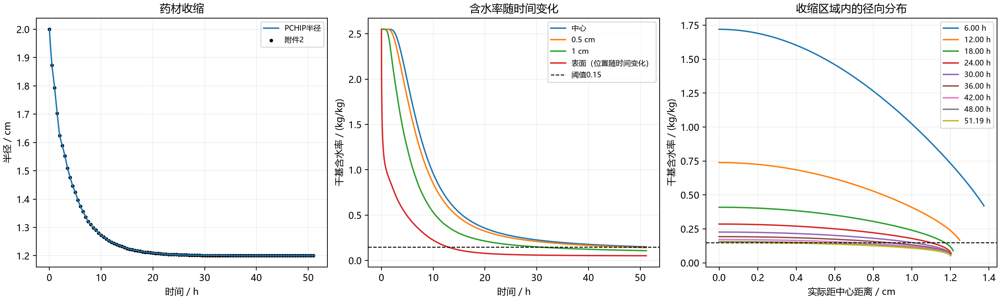

# 第四问：收缩药材的移动边界模型与求解

采用径向均匀收缩、长度不变、附录4物性及第二问阶段边界，计算得到烘干时长：

\[
\boxed{t_{\mathrm{结束}}=51.1867\ \mathrm h}
\]

结束时半径为 **1.2000 cm**，最湿位置是中心，未舍入含水率为 **0.149999876864 kg/kg**，严格低于0.15。结果对应本文明确列出的收缩、阶段边界和有效传质假设。

## 1. 文件与输入

- [result4.xlsx](../outputs/q4/result4.xlsx)：保留Sheet1，每60 s、每0.1 cm输出含水率，末列为实际表面值，末行追加结束时刻。
- [solve_q4.py](solve_q4.py)：热湿联立求解、移动半径、事件检测、精度检查及对照。
- [结果表.md](结果表.md)：表6与各时刻的实际表面位置。
- [validation.json](validation.json)：数值验证和敏感性记录。
- [result4_full_precision.npz](result4_full_precision.npz)：未舍入含水率、温度、半径及用于绘图的径向分布。
- [verify_result4.py](verify_result4.py)：重新读取工作簿并核对数值和越界空白。

输入为[A题.pdf](../A题.pdf)问题4、附录4，以及附件1的环境数据和附件2的半径数据。附件2覆盖0—259200 s（72 h），每1800 s记录一次，半径从2 cm单调降至1.198 cm。本次结束时间在72 h以内，**未使用半径外推**。达到干燥标准时半径为1.2000 cm，无须等它取到附件最后的1.198 cm。

## 2. 物性和假设

假设药材轴对称，忽略端部及轴向变化，长度保持0.25 m；内部材料沿径向均匀收缩，相对径向位置保持不变。干物质随材料守恒，不显式计入潜热、水分迁移携热和变形做功。

附录4关系按局部状态更新：

\[
\rho(C)=760+90C,\qquad
c_p(C)=1850+2150\frac{C}{C+1},
\]
\[
k(C)=0.12+0.20\frac{C}{C+1},
\]
\[
\boxed{D(T,C)=4.2\times10^{-4}
\exp\left(-\frac{0.30}{C}\right)
\exp\left(-\frac{3850}{T+273.15}\right)}.
\tag{1}
\]

温度在程序中以°C存储，扩散系数使用K。沿用：
\[
h=25\ \mathrm{W/(m^2\cdot K)},\qquad h_m=8\times10^{-7}\ \mathrm{m/s}.
\]

表面传质仍采用有效含水率差边界。空气水分数据与药材干基含水率的kg/kg可能具有不同质量基准，不能把此简化模型宣称为严格气固相平衡模型。

**密度的使用范围：**附录4的经验密度用于有效热容量\(\rho c_p\)。干物质守恒中的体积密度另记为\(\rho_d(t)\)，不能将二者混同后，同时强制由经验密度反推半径和由附件2指定半径。若要求严格多相真实密度一致性，还需非均匀变形、孔隙及组分模型；本文不声称满足那组额外约束。

## 3. 半径与环境函数

对附件2采用保形分段三次插值PCHIP：
\[
R=R(t),
\tag{2}
\]
计算中把cm统一换成m。插值保留单调收缩趋势。程序提供72 h之后的半径末值保持，但主结果未用到。

半径插值方法用留一段交叉验证、单调性和越界检查进行比较。平滑样条虽然交叉验证误差较小，但会产生局部增大或端点越界；因此主情景选择无越界、无反向收缩的PCHIP。诊断明细见 [radius_method_comparison.csv](../../../output/A题深化分析/radius_method_comparison.csv) 及 [图3](../../../output/A题深化分析/figures/03_radius_methods.png)。

| 插值方法 | 交叉验证 RMSE / cm | 违反单调段数 | 最大越界 / cm | 选择 |
|---|---:|---:|---:|---|
| linear | 0.004505 | 0 | 0.000000 | 否 |
| pchip | 0.003829 | 0 | 0.000000 | 是 |
| akima | 0.003987 | 41 | 0.000000 | 否 |
| cubic_spline | 0.003942 | 687 | 0.000114 | 否 |
| smooth_spline | 0.003455 | 870 | 0.000105 | 否 |

环境在0—14400 s使用附件1拟合得到的平滑输入，并沿用第二问的稳定阶段分段：
\[
(T_a,C_a)=(49.934221^\circ\mathrm C,\ 0.04971557\ \mathrm{kg/kg})\quad(t>6330\ \mathrm s).
\tag{3}
\]
共同阶段点为6030 s，600 s过渡结束后采用上述尾段均值；阶段点不是题面直接给出的常数，敏感性见第9节。

## 4. 移动边界的控制方程

### 4.1 材料运动与实际空间方程

区域为\(0\le r\le R(t)\)。均匀径向收缩的材料速度：
\[
\boxed{v(r,t)=\frac{\dot R(t)}{R(t)}r}.
\tag{4}
\]

采用有效材料导数形式：
\[
\rho c_p(T_t+vT_r)=\frac1r\frac{\partial}{\partial r}(rkT_r),
\]
\[
C_t+vC_r=\frac1r\frac{\partial}{\partial r}(rDC_r).
\tag{5}
\]

这里已包含材料运动，不能从静止介质方程只替换半径而不检查运动项。

### 4.2 映射至固定材料坐标

设
\[
\xi=\frac r{R(t)},\quad
\Theta(\xi,t)=T(\xi R(t),t),\quad
U(\xi,t)=C(\xi R(t),t),\quad 0\le\xi\le1.
\]

链式法则：
\[
\left.C_t\right|_r=U_t-\frac{\xi\dot R}{R}U_\xi,
\qquad
vC_r=\frac{\xi\dot R}{R}U_\xi.
\]

两项抵消，得到：
\[
\boxed{\rho(U)c_p(U)\Theta_t
=\frac1{R(t)^2\xi}\frac{\partial}{\partial\xi}
\left[\xi k(U)\Theta_\xi\right]},
\]
\[
\boxed{U_t
=\frac1{R(t)^2\xi}\frac{\partial}{\partial\xi}
\left[\xi D(\Theta,U)U_\xi\right]}.
\tag{6}
\]

最终没有显式\(\dot R\)项，是因为坐标跟随均匀收缩材料，不是忽略了收缩速度。非均匀变形时一般不能这样抵消。

### 4.3 初始与边界条件

\[
\Theta(\xi,0)=28,\qquad U(\xi,0)=2.55,
\]
\[
\Theta_\xi(0,t)=U_\xi(0,t)=0.
\tag{7}
\]

表面\(\xi=1\)：
\[
\boxed{-\frac{k(U_s)}R\Theta_\xi(1,t)
=h(\Theta_s-T_a)},
\]
\[
\boxed{-\frac{D(\Theta_s,U_s)}R U_\xi(1,t)
=h_m(U_s-C_a)}.
\tag{8}
\]

内部方程的\(1/R^2\)和边界的\(1/R\)必须一起处理。

## 5. 干基含水率与移动区域守恒

含水率是水质量与干物质质量之比，纯粹缩小体积不会自动把它乘上压缩倍数。

均匀径向收缩、长度固定时：
\[
\rho_d(t)=\rho_{d0}\frac{R_0^2}{R(t)^2}.
\]

在有效水通量\(\boldsymbol j_w=-\rho_dD\nabla C\)下，结合干物质连续方程可得到式(5)。因为\(\rho_d\)空间均匀，它可从空间扩散算子中约去。

总干物质质量\(M_d=\pi L\rho_{d0}R_0^2\)恒定，总水质量为
\[
M_w=M_d\overline U,\qquad
\overline U=2\int_0^1 U(\xi,t)\xi\,\mathrm d\xi.
\]

表面交换给出：
\[
\boxed{\frac{\mathrm d\overline U}{\mathrm dt}
=\frac{2h_m}{R(t)}(C_a-U_s)}.
\tag{9}
\]

程序另设变量积分右端，与域内干基平均含水率变化核对。不能直接把\(\int C\,\mathrm dV\)当成总水质量，因为\(C\)不是单位体积水质量。

## 6. 离散方法和实际距离输出

采用固定、表面加密的计算网格：
\[
\xi_i=\frac{1-\exp(-4i/N)}{1-\exp(-4)},\qquad i=0,\ldots,N.
\]

控制体积界面位于相邻节点中点，权重\(w_i=(b_i^2-a_i^2)/2\)。内部通量：
\[
F^T_{i+1/2}=\xi_{i+1/2}\frac{k_i+k_{i+1}}2
\frac{\Theta_{i+1}-\Theta_i}{\xi_{i+1}-\xi_i},
\]
\[
F^C_{i+1/2}=\xi_{i+1/2}\frac{D_i+D_{i+1}}2
\frac{U_{i+1}-U_i}{\xi_{i+1}-\xi_i}.
\]

中心通量为0，表面取\(F_s^T=Rh(T_a-\Theta_s)\)、\(F_s^C=Rh_m(C_a-U_s)\)。半离散方程：
\[
\dot\Theta_i=\frac{F^T_{i+1/2}-F^T_{i-1/2}}{R^2w_i\rho_i c_{p,i}},
\qquad
\dot U_i=\frac{F^C_{i+1/2}-F^C_{i-1/2}}{R^2w_i}.
\tag{10}
\]

用隐式BDF联立推进，提供热湿交叉导数的稀疏Jacobian。论文主结果采用300区间，相对/绝对容差分别为\(2\times10^{-10}\)、\(2\times10^{-12}\)，前4 h最大内部步长5 s，之后300 s。在环境与半径记录节点处分段，连续继承末态。

对于固定实际位置\(r_j\)，使用\(\xi_j=r_j/R(t)\)做PCHIP输出。只有\(r_j\le R(t)\)才输出，越界位置留空，不填0、不外推。

工作簿列：
- A：时间/s；
- B—U：实际距离0、0.1、…、1.9 cm；
- V：“药材表面”，始终为\(U(1,t)\)。

文件从60 s开始，此时半径已小于2 cm，所以没有单独的固定2 cm列。结束时固定1.2 cm列与表面列对应同一位置，数值相同；1.3—1.9 cm列为空。各时刻实际半径同时保存在JSON和NPZ中。

## 7. 达标时间、表6和结果图

事件函数检查全部计算节点：
\[
g(t)=\max_iU_i(t)-0.15.
\]

向下穿越时刻：
\[
t_*=184271.879660\ \mathrm s=51.1866332388\ \mathrm h.
\]

对小时数向上取整到四位小数，并继续积分至：
\[
t_{\mathrm{结束}}=184272.1200\ \mathrm s=51.1867\ \mathrm h.
\]

此时最大含水率0.149999876864 kg/kg，平均含水率0.11839127 kg/kg。中心四位小数显示0.1500，但严格判定采用未舍入值。

### 表6：收缩药材烘干过程的水分浓度

| 时间 / h | 0 cm | 0.5 cm | 1 cm | 药材表面 |
|---:|---:|---:|---:|---:|
| 6 | 1.7200 | 1.5380 | 1.0225 | 0.4198 |
| 12 | 0.7386 | 0.6554 | 0.4086 | 0.1666 |
| 18 | 0.4094 | 0.3692 | 0.2400 | 0.0889 |
| 24 | 0.2856 | 0.2615 | 0.1792 | 0.0671 |
| 30 | 0.2267 | 0.2097 | 0.1494 | 0.0592 |
| 36 | 0.1931 | 0.1799 | 0.1318 | 0.0557 |
| 42 | 0.1715 | 0.1606 | 0.1201 | 0.0538 |
| 48 | 0.1563 | 0.1470 | 0.1117 | 0.0527 |
| 51.1867 | 0.1500 | 0.1413 | 0.1081 | 0.0523 |

表面列对应的实际位置：

| 时间 / h | 半径 / cm |
|---:|---:|
| 6 | 1.3740 |
| 12 | 1.2480 |
| 18 | 1.2140 |
| 24 | 1.2040 |
| 30 | 1.2010 |
| 36 | 1.2000 |
| 42 | 1.2000 |
| 48 | 1.2000 |
| 51.1867 | 1.2000 |




## 8. 数值验证

### 网格加密

| 区间数 | 阈值时间 / h | 与上一网格相差 / s | 有效含水率最大差 |
|---:|---:|---:|---:|
| 200 | 51.186549228 | — | — |
| 300 | 51.186633239 | 0.302440 | 3.459e-05 |

最后两级网格结束时间相差0.302440 s。比较时核对相同分钟时刻、相同实际位置及越界空白掩码。

### 时间精度与方程检查

收紧容差10倍、后4 h最大步长减为120 s，阈值时间差0.013232 s，共同有效含水率最大差1.748e-08 kg/kg。

- 解析Jacobian复步长检查最大相对差：3.018e-16。
- 固定半径并换回附录3，与第二问方程右端最大差：2.998e-15。
- 无外部驱动力时，均匀温度与含水率在收缩过程中导数为0。
- 式(9)累计收支残差：7.994e-15 kg/kg。
- 全部接受状态的含水率为正、不超过初值，径向向外不增加，最湿位置为中心。

这些检查验证所选模型和离散方法，不代替实测验证。

## 9. 对照与敏感性

第四问51.1867 h比第三问57.5866 h短6.3999 h，但两问同时改变几何和物性，不能把差异全部归因于收缩。

同一800区间网格下，各格均为阈值时间：

| 物性关系 | 固定半径2 cm | 附件2收缩半径 |
|---|---:|---:|
| 附录3 | 57.586600 h | 25.278897 h |
| 附录4 | 130.131907 h | 51.186633 h |

附录3固定半径一格复用第三问同网格结果，其余对照实际重新计算。这组对照分别展示固定物性下的收缩影响和固定几何条件下的物性影响。

另两项敏感性对照：
- 半径使用分段线性插值：51.190199 h，相对同网格PCHIP变化+0.003566 h。
- 4 h后环境用50°C、0.05：51.087504 h，相对同网格基准变化-0.099130 h。

长期边界和变形假设的影响与数值离散误差不同。四位小数是题目要求的输出格式，不代表实际工艺精确到0.36秒。

## 10. 复现与工作簿验证

在A题目录运行：

```powershell
python 第四问/solve_q4.py --boundary-mode staged --radius-method pchip --grids 200 300 --check-time --comparisons
```

依赖NumPy、SciPy、openpyxl、Matplotlib和threadpoolctl。第二问代码仅用于固定半径退化检验和附录3对照，主求解使用本文件内的附录4关系。

若未安装可选的 @oai/artifact-tool，可在A题目录运行 python sync_workbooks_openpyxl.py，用同一份 JSON 数值替换四个附件模板并执行逐单元格验证。

配置了 @oai/artifact-tool 后运行：

```powershell
node 第四问/build_workbook.mjs
```

工作簿共3072个时间行，越界空白20143个，表面列全程有值。导出后重新读取，逐项核对数值、半径约束、空白位置和四位小数格式，检查两张附件未改动。
