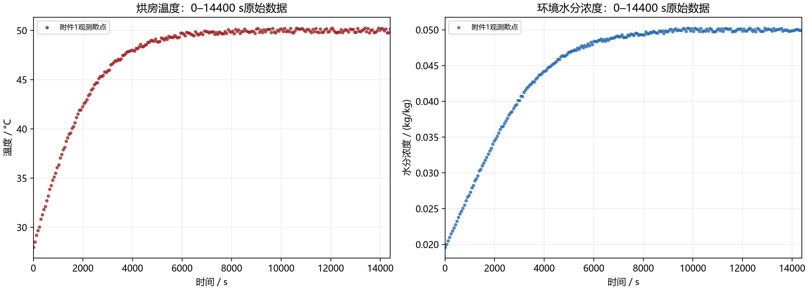
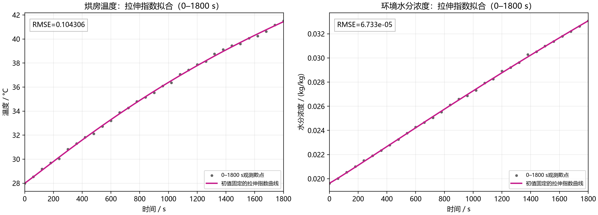
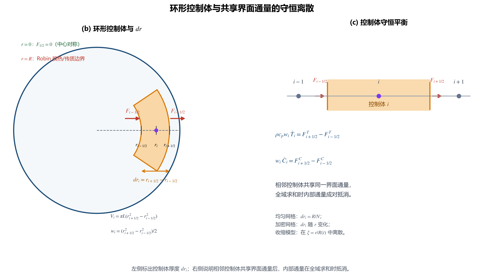
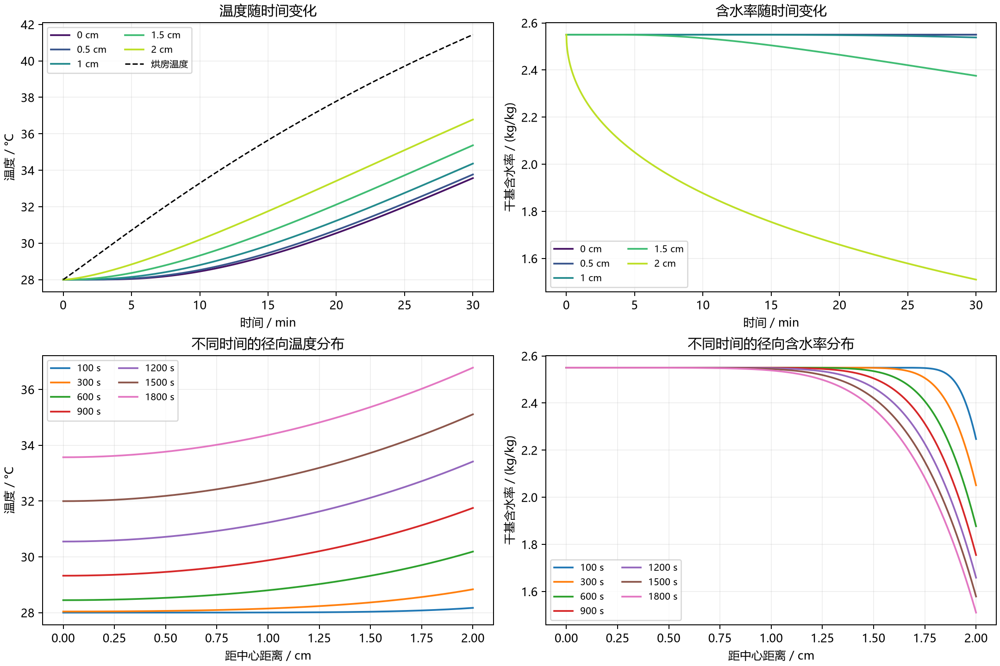
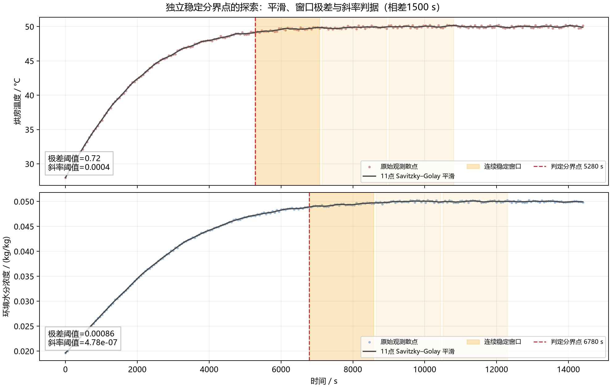
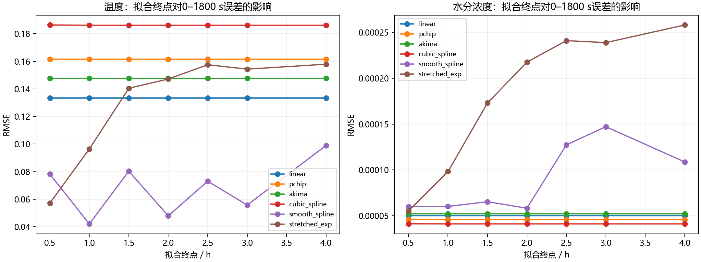
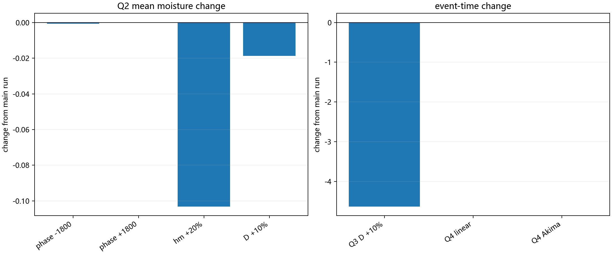
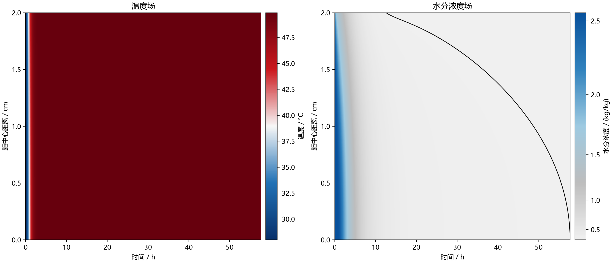
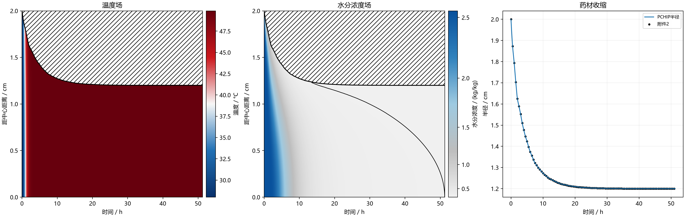
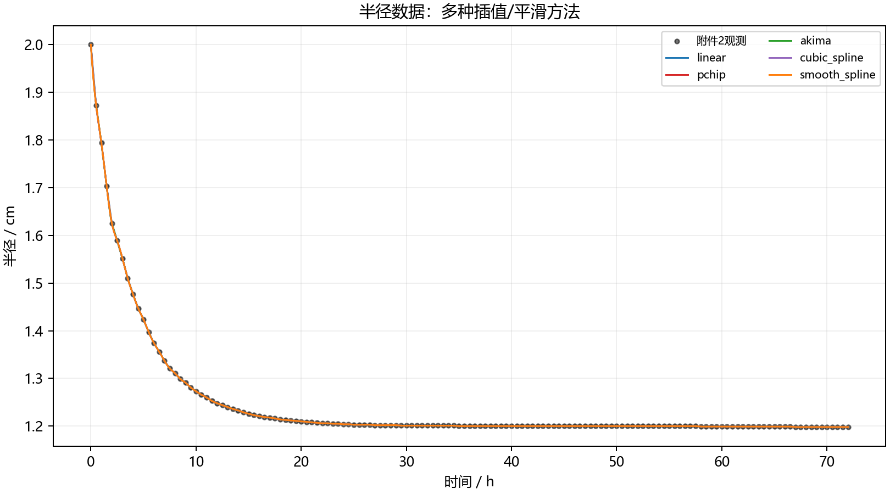

# 药材烘干过程的径向热湿传递、干燥终点与收缩模型

## 摘要

针对圆柱形药材在热风烘箱中的预热、恒温干燥、干燥终点判定和收缩过程，本文将四问整理为一条连续的建模链。首先对附件1的烘房温度和环境水分参考量进行清洗、比较和连续化重构，在分段线性、PCHIP、Akima、自然三次样条、平滑样条与初值固定的拉伸指数模型之间，以按时间顺序的时间块留出验证（time-ordered blocked hold-out）误差、平滑性、数据区间外的外推行为和同一函数形式对两类边界的统一表示为标准选择拉伸指数模型（stretched_exp）。其次将药材视为轴对称圆柱，建立径向热传导和含水率扩散方程；空间上采用守恒型有限体积法，时间上采用隐式 BDF 方法，并在变物性情形下联立更新局部物性。

第一问采用常物性模型，并仅用附件1前 1800 s 数据拟合拉伸指数边界，求得 0--1800 s 的预热场；第二问从初始状态重新计算，使用附录3物性，先用附件1完整 0--14400 s 记录识别温度和环境水分浓度各自的稳定阶段，再分别用各自过渡点1之前的数据拟合边界，并在 600 s 过渡区接入尾段均值，展示前3 h结果；第三问在第二问模型上延长积分，以全域最大含水率首次低于 0.15 kg/kg 定义干燥结束；第四问进一步采用附录4物性和附件2半径记录，通过材料坐标处理移动区域，并比较多种半径插值方法。

主结果为：第一问 1800 s 时体积平均温度 35.169887 °C、平均干基含水率 2.293557 kg/kg；第二问 3 h 时平均温度 49.8107 °C、平均含水率 1.3821 kg/kg；第三问固定半径模型的全域达标时间为 57.6774 h；第四问采用附录4和 PCHIP 半径后，达标时间为 51.2669 h。网格、时间积分、Jacobian、含水率物理范围和水分收支检查表明数值误差已收敛，但长期边界延拓、有效传质系数、物性经验式和均匀收缩假设带来的不确定性仍明显大于离散误差。因此，文中时间均解释为给定输入和假设下的模型预测，而非精确到秒的实验结论。

关键词：药材烘干；径向热湿耦合；有限体积法；隐式 BDF；干燥终点；移动边界；PCHIP

## 1、问题背景与重述

药材初始可近似为长度 \(L=0.25\ \mathrm m\)（25 cm）、半径 \(R_0=0.02\ \mathrm m\)（2 cm）的圆柱，初始温度为 \(28\,^\circ\mathrm C\)，初始干基含水率为 \(C_0=2.55\ \mathrm{kg/kg}\)。干基含水率定义为水的质量与干物质质量之比。热风先与药材表面进行换热和传质，热量向中心传导，内部水分沿含水率梯度向表面扩散并逸出。因而表面通常比中心更早升温和失水，后期干燥时间由中心附近的慢过程控制。

题目给出了附件1的烘房温度与环境水分记录、附件2的半径变化记录，以及附录3、附录4的经验物性关系。四问的任务可以统一重述为：

1. 在固定半径、常物性条件下，构造连续环境边界并求解 0--1800 s 的径向温度和含水率；
2. 在固定半径、附录3变物性条件下，构造可延拓至 14400 s 的环境边界，求解前3 h全过程输出；
3. 延续第二问模型，确定药材全域干基含水率严格低于 0.15 kg/kg 的时间，并输出全过程分布；
4. 根据半径记录和附录4物性，重新建立收缩药材的热湿模型，求得移动区域中的干燥终点和实际距离分布。

每一问均从统一初始状态重新积分；后一问不是把前一问的末状态机械拼接，而是在题目要求的物性、几何或时间范围下重新定义模型。

## 2、问题分析

### 2.1 环境输入与模型输入的关系

附件1以 60 s 为间隔给出有限长度记录，不能直接代表记录点之间的连续空气状态，也不能直接支持第三问、第四问的数十小时积分。因此先对温度 \(T_a(t)\) 和环境水分参考量 \(C_a(t)\) 进行连续化。对于第二问之后，还需要识别温度和水分分别进入稳定阶段的时间，并用平滑过渡接入尾段均值。该处理把观测数据、拟合误差和长期外推假设分开，便于后续敏感性分析。

### 2.2 热湿过程的因果结构

空气与表面之间的换热由 \(h\) 控制，内部导热由 \(k\) 控制；表面传质由 \(h_m\) 控制，内部水分扩散由 \(D\) 控制，其中 \(h_m\) 将气相侧传质阻力等效为一个边界交换系数。本文所称物性，是描述材料储热、导热和水分迁移能力的 \(\rho,c_p,k,D\) 等参数。第一问把物性视为常数，温度和含水率只共享几何与边界；第二问、第三问使用附录3给出的经验物性关系，使 \(\rho\)、\(c_p\)、\(k\) 随 \(C\) 改变，\(D\) 同时随 \(T,C\) 改变，温度场和含水率场必须在同一隐式时间步中联立求解。第四问还要同时更新半径 \(R(t)\)，因此计算区域不再是固定的 \(0\le r\le R_0\)。

### 2.3 四问的统一数值路线

    附件数据检查
       ↓
    拉伸指数模型拟合、RMSE 比较与稳定阶段识别
       ↓
    固定域或材料坐标下的径向热湿守恒方程
       ↓
    有限体积空间离散 + 隐式 BDF 时间积分
       ↓
    全域事件定位、实际位置插值、Excel 导出
       ↓
    网格/时间/收支/物理性/参数敏感性检查

这里的有限体积法是把守恒方程在每个环形控制体上积分，直接用控制体边界通量计算状态变化；隐式 BDF 是后向差分时间积分方法，适合处理扩散方程带来的刚性，所谓刚性是指系统同时存在快、慢时间尺度而显式方法会被最快尺度限制步长；Jacobian 指离散残差对状态向量的一阶导数矩阵，其中状态向量由各径向节点的温度、含水率以及必要的累计量组成。Robin 边界是把边界通量与边界内外状态差联系起来的有限速率边界条件。核心策略是：方程始终保留守恒通量形式，内部界面使用共享通量，边界使用 Robin 交换；这样内部通量在全域求和时自动抵消，水分收支可以独立核验。

## 3、模型假设

1. 药材均匀、各向同性且轴对称。各向同性表示物性不随方向改变，轴对称表示 \(T,C\) 只依赖径向坐标和时间；忽略周向变化、轴向传递以及圆柱两端的端部换热/传质效应，结果代表远离端部的中部截面。
2. 第一至第三问半径固定为 \(R_0=0.02\ \mathrm m\)；第四问假设长度不变且发生均匀径向收缩，即所有材料点保持相同的相对坐标。与之相对的非均匀收缩是收缩比例随径向位置变化。
3. \(C=m_w/m_d\) 为干基含水率，其中 \(m_w\) 是水的质量、\(m_d\) 是干物质质量；水分收支以干物质质量为基准，不能把 \(C\) 直接当作单位体积水质量。
4. 环境水分 \(C_a(t)\) 是题目数据下的有效边界参考量，直接进入 Robin 传质驱动力，不额外引入气固吸附平衡关系。若建立该关系，则需用空气状态（如相对湿度和温度）转换为固体平衡含水率；本文没有这类附加数据，因此不作转换。
5. 不显式加入蒸发潜热（液态水汽化所需的能量）、水分迁移携热（随水分流动携带的能量）、内部热源和端部散热；这些物理简化属于模型形式误差，即由省略实际物理过程造成的误差。
6. 第一问使用常物性和题面给出的 D(C)；第二、三问全程使用附录3局部物性；第四问全程使用附录4局部物性。
7. 半径数据在主方案覆盖至事件时刻，因此第四问不使用主计算所需的半径外推；若超出附件2末端，程序才保持最后半径值。

## 4、符号约定

| 符号 | 含义 | 单位 |
|---|---|---|
| \(t\) | 时间 | s |
| \(L\) | 药材轴向长度 | m |
| \(R_0\) | 初始半径；第一至第三问中 \(R(t)=R_0\) | m |
| \(r\) | 实际径向坐标 | m |
| \(R(t)\) | 时刻 \(t\) 的实际半径 | m |
| \(\xi=r/R(t)\) | 第四问材料坐标 | 1 |
| \(T,C\) | 药材温度、干基含水率 | °C、kg/kg |
| \(T_a,C_a\) | 烘房温度、环境水分参考量 | °C、kg/kg |
| \(\Theta,U\) | 材料坐标 \(\xi\) 下的温度、含水率 | °C、kg/kg |
| \(T_s,C_s,\Theta_s,U_s\) | 实际或材料坐标表面的状态值 | °C、kg/kg |
| \(\rho,c_p,k\) | 密度、比热容、导热系数 | kg/m³、J/(kg·K)、W/(m·K) |
| \(D\) | 有效水分扩散系数 | m²/s |
| \(h,h_m\) | 换热系数、有效传质系数 | W/(m²·K)、m/s |
| \(v,\dot R\) | 材料径向速度、半径变化率 | m/s |
| \(N\) | 径向控制体数量或网格区间数 | 1 |
| \(a_i,b_i\) | 第 \(i\) 个控制体的内、外半径 | m |
| \(w_i=(b_i^2-a_i^2)/2\) | 去掉公共因子 \(2\pi L\) 后的控制体几何权重 | m² |
| \(F^T\) | 去掉公共因子 \(2\pi L\) 后的热量界面通量 | W/m |
| \(F^C\) | 去掉公共因子 \(2\pi L\) 后的含水率界面通量 | m²/s |
| \(M(t)\) | 全域最大含水率 | kg/kg |
| \(\overline T,\overline C\) | 体积加权平均温度、含水率 | °C、kg/kg |
| \(z,\varepsilon_C\) | 累计表面交换量、水分收支残差 | kg/kg |

## 5、模型建立与求解

### 5.1 第一题

#### 5.1.1 环境边界的数据处理

附件 1 每隔 60 s 给出烘房温度和环境水分浓度，记录范围为 0--14400 s。图 1 只绘制原始观测散点，不叠加任何拟合曲线，先用于判断数据形态：温度和环境水分浓度均在早期快速上升，随后逐步进入平台区；因此第一问需要在 0--1800 s 内构造连续边界，第二至第四问则需要利用完整观测区间识别各自稳定阶段，再将分界前拟合、过渡区和稳定尾段延伸到后续计算时域。

**图 1（原始环境边界散点，已生成）：** figures/q1/01_raw_environment_scatter.png。左图为烘房温度，右图为环境水分浓度；横轴覆盖完整的 0--14400 s，图中没有人为添加的曲线。

为避免先验指定某一种函数，本文先比较六类候选表示：分段线性、PCHIP、Akima、自然三次样条、平滑样条和初值固定的拉伸指数模型。六者的求解机制并不相同：前四者是由观测节点直接确定的插值方法，不需要非线性参数优化；平滑样条通过“残差平方和 + 曲率惩罚”确定平滑函数，属于正则化最小二乘；只有拉伸指数模型需要对幅值、时间尺度和形状参数进行非线性最小二乘估计。因此，表中的指标是对不同类型的连续化方法进行统一验证，并不意味着六种方法都由非线性最小二乘得到。

具体地，分段线性在相邻观测点之间连接直线；PCHIP 使用保持数据形状的分段三次 Hermite 多项式；Akima 根据邻近区间斜率加权构造局部插值；自然三次样条要求两端二阶导数为零；平滑样条在贴合观测和抑制曲率之间折中。这样既保留了插值方法对局部数据的响应，也给出了具有全局参数的平滑候选。

验证采用按时间顺序的时间块留出（time-ordered blocked hold-out），不随机打乱记录，而是在 0--1800 s 的 31 个观测点中每隔 5 个点留出 1 个点，得到 25 个训练点和 6 个验证点。所谓“阻塞验证 RMSE”，就是只在这 6 个未参与拟合的时间点上计算的均方根误差。若验证样本为 \((t_i,y_i)\)，预测值为 \(\widehat y_i\)，则

$$
\mathrm{RMSE}
=\sqrt{\frac{1}{n}\sum_{i=1}^{n}\left(y_i-\widehat y_i\right)^2}.
\tag{1}
$$

其中 \(n\) 为验证样本数。为比较曲线的局部弯折程度，再在验证区间取 721 个等间距点，定义平均绝对二阶差分粗糙度

$$
\mathcal R(\widehat y)
=\frac{1}{N_d-2}\sum_{j=1}^{N_d-2}
\left|
\frac{\widehat y_{j+1}-2\widehat y_j+\widehat y_{j-1}}{\Delta t^2}
\right|,
\qquad N_d=721.
\tag{2}
$$

粗糙度越小，表示曲线的局部二阶弯折越弱；温度和环境水分浓度量纲不同，只在同一序列内比较。六种方法在 0--1800 s 数据上的结果为：

| 方法 | 温度 RMSE / °C | 环境水分浓度 RMSE / (kg/kg) | 温度粗糙度 / (°C·s\(^{-2}\)) | 环境水分浓度粗糙度 / ((kg/kg)·s\(^{-2}\)) |
|---|---:|---:|---:|---:|
| 分段线性 | 0.133411 | 5.01×10^-5 | \(3.62\times10^{-5}\) | \(3.48\times10^{-8}\) |
| PCHIP | 0.161469 | 4.57×10^-5 | \(5.10\times10^{-5}\) | \(5.06\times10^{-8}\) |
| Akima | 0.147783 | 5.22×10^-5 | \(5.17\times10^{-5}\) | \(5.05\times10^{-8}\) |
| 自然三次样条 | 0.186352 | 4.13×10^-5 | \(5.16\times10^{-5}\) | \(5.07\times10^{-8}\) |
| 平滑样条 | 0.078165 | 6.00×10^-5 | \(2.12\times10^{-6}\) | \(6.93\times10^{-10}\) |
| 初值固定的拉伸指数模型（stretched_exp） | 0.057243 | 5.54×10^-5 | \(2.20\times10^{-6}\) | \(7.30\times10^{-10}\) |

温度序列中拉伸指数模型的阻塞验证 RMSE 最低（0.057243 °C）。环境水分浓度序列中自然三次样条的 RMSE 略低，为 \(4.13\times10^{-5}\ \mathrm{kg/kg}\)，但其粗糙度约为拉伸指数模型的 69.5 倍；平滑样条的粗糙度虽更小，误差却略高于拉伸指数模型。综合考虑验证误差、局部平滑性，以及希望用同一函数族表示两类环境边界的可解释性，第一问选择初值固定的拉伸指数模型。对该模型，令 \(y_0\) 为 \(t=0\) 的观测初值、\(A\) 为幅值、\(\tau\) 为时间尺度、\(p\) 为无量纲形状参数；仅这四参数模型通过非线性最小二乘（最小化观测值与模型值残差平方和）估计：

$$
y_f(t)=y_0+A\left[1-\exp\left(-\left(\frac{t}{\tau}\right)^p\right)\right].
\tag{3}
$$

其中 \(t\) 和 \(\tau\) 均以秒计。拟合参数为

$$
\begin{aligned}
T_a(t)&=28+27.3279502\left[1-\exp\left(-\left(\frac{t}{2617.1875}\right)^{1.0429163}\right)\right],\\
C_a(t)&=0.01963+0.06247822\left[1-\exp\left(-\left(\frac{t}{6927.1507}\right)^{1.0519591}\right)\right].
\end{aligned}
$$

第一问只使用附件 1 的 0--1800 s 观测数据估计式 (3) 的参数；在全部 0--1800 s 观测点上计算的主拟合 RMSE 分别为 0.104306 °C 和 \(6.73349\times10^{-5}\ \mathrm{kg/kg}\)。求解时在同一 0--1800 s 区间内调用该连续边界。为衡量窗口选择的不确定性，另计算 3600 s 和 7200 s 扩展窗口情景，但它们不替代第一问的主方案。不同终点的比较见 results/q1/boundary_endpoint_comparison.csv。

**图 2（拉伸指数最终拟合，已生成）：** figures/q1/02_selected_stretched_exp_fit.png。图中仅保留 0--1800 s 原始观测散点和最终选定的拉伸指数曲线，不再叠加其他候选方法；这张图用于核对式 (3) 的实际拟合形态。

#### 5.1.2 物理模型

第一问采用常物性 \(R=0.02\ \mathrm m\)、\(\rho=820\ \mathrm{kg/m^3}\)、\(c_p=2600\ \mathrm{J/(kg\cdot K)}\)、\(k=0.36\ \mathrm{W/(m\cdot K)}\)、\(h=25\ \mathrm{W/(m^2\cdot K)}\)、\(h_m=8\times10^{-7}\ \mathrm{m/s}\)，以及题面给出的

$$
D(C)=7\times10^{-9}\exp\left(-\frac{0.89}{C}\right).
$$

这里 \(D\) 的单位为 \(\mathrm{m^2/s}\)，经验系数按 \(C\) 用 kg/kg 的数值标定。

圆柱径向热传导方程和水分守恒方程分别为

$$
\rho c_p\frac{\partial T}{\partial t}
=\frac1r\frac{\partial}{\partial r}
\left(rk\frac{\partial T}{\partial r}\right),
\tag{4}
$$

$$
\frac{\partial C}{\partial t}
=\frac1r\frac{\partial}{\partial r}
\left(rD(C)\frac{\partial C}{\partial r}\right).
\tag{5}
$$

下标 \(t,r\) 分别表示对时间和径向坐标的偏导，例如 \(T_t=\partial T/\partial t\)、\(T_r=\partial T/\partial r\)；\(D(C)\) 是随含水率变化的有效扩散系数，\(D'(C)=\mathrm dD/\mathrm dC\)。保留式(5)的散度形式，避免把 \(D(C)\) 移出微分算子而遗漏与 \(D'(C)\) 相关的梯度平方项。

#### 5.1.3 初始条件、边界条件与数值求解

初始条件和中心轴对称条件为

$$
T(r,0)=28,\quad C(r,0)=2.55;\qquad
T_r(0,t)=0,\quad C_r(0,t)=0 .
\tag{6}
$$

在表面 \(r=R\) 使用有限速率 Robin 条件

$$
-kT_r(R,t)=h\,[T(R,t)-T_a(t)],\qquad
-D(C)C_r(R,t)=h_m\,[C(R,t)-C_a(t)] .
\tag{7}
$$

将径向区域分成 \(N\) 个环状控制体。第 \(i\) 个控制体的内、外界面记为 \(a_i=r_{i-1/2}\)、\(b_i=r_{i+1/2}\)，节点值记为 \(T_i,C_i\)，径向厚度为 \(dr_i=b_i-a_i\)，并取 \(w_i=(b_i^2-a_i^2)/2\)。\(F^T_{i+1/2}\) 和 \(F^C_{i+1/2}\) 分别表示去掉公共因子 \(2\pi L\) 后、沿径向正方向定义的热量和含水率界面通量；内部界面用相邻节点的系数算术平均和节点差分近似梯度，相邻控制体共享同一个界面通量。中心界面为零通量，最外界面直接代入式(7)。得到的典型半离散形式为

$$
\rho c_p w_i\dot T_i
=F^T_{i+1/2}-F^T_{i-1/2},\qquad
w_i\dot C_i
=F^C_{i+1/2}-F^C_{i-1/2}.
\tag{8}
$$

主计算采用 \(N=6400\) 个径向区间（即 6401 个节点）、相对容差 \(2\times10^{-10}\)、绝对容差 \(2\times10^{-12}\)、最大步长 5 s 的隐式 BDF。这里 \(\dot T_i=\mathrm dT_i/\mathrm dt\)、\(\dot C_i=\mathrm dC_i/\mathrm dt\)，相对容差和绝对容差分别限制按状态量尺度归一化后的局部误差和未归一化的绝对误差；结果按每 1 s、距中心每 0.1 cm 输出。内部通量共享使热量和水分收支具有可检查的守恒结构。

**径向有限体积离散示意图（已生成，分为两张）：** 第一张 `figures/圆柱体与dr示意图.png` 展示圆柱体、顶部径向层及层厚 \(dr\)；第二张 `figures/有限体积离散示意图.png` 将环形控制体与共享界面通量的守恒平衡合并展示。中间图标出 \(r_{i-1/2}\)、\(r_i\)、\(r_{i+1/2}\) 和 \(dr_i\)；右侧图说明相邻控制体共享界面通量后内部通量在全域求和时抵消。第一至第三问在固定半径上离散径向坐标，第四问则在 \(\xi=r/R(t)\) 材料坐标中使用同样的守恒结构。

#### 5.1.4 计算结果与分析

**表1 第一问预热阶段温度（°C）**

| 时间 / s | 0 cm | 0.5 cm | 1 cm | 1.5 cm | 2 cm |
|---:|---:|---:|---:|---:|---:|
| 100 | 28.0001 | 28.0003 | 28.0039 | 28.0318 | 28.1698 |
| 300 | 28.0386 | 28.0604 | 28.1466 | 28.3645 | 28.8353 |
| 600 | 28.4463 | 28.5292 | 28.7997 | 29.3204 | 30.1872 |
| 900 | 29.3232 | 29.4570 | 29.8737 | 30.6169 | 31.7512 |
| 1200 | 30.5480 | 30.7160 | 31.2299 | 32.1166 | 33.4151 |
| 1500 | 31.9960 | 32.1846 | 32.7557 | 33.7237 | 35.1079 |
| 1800 | 33.5689 | 33.7676 | 34.3658 | 35.3685 | 36.7806 |

**表2 第一问预热阶段干基含水率（kg/kg）**

| 时间 / s | 0 cm | 0.5 cm | 1 cm | 1.5 cm | 2 cm |
|---:|---:|---:|---:|---:|---:|
| 100 | 2.5500 | 2.5500 | 2.5500 | 2.5500 | 2.2470 |
| 300 | 2.5500 | 2.5500 | 2.5500 | 2.5492 | 2.0508 |
| 600 | 2.5500 | 2.5500 | 2.5500 | 2.5353 | 1.8770 |
| 900 | 2.5500 | 2.5500 | 2.5497 | 2.5045 | 1.7547 |
| 1200 | 2.5500 | 2.5500 | 2.5482 | 2.4646 | 1.6586 |
| 1500 | 2.5500 | 2.5499 | 2.5445 | 2.4206 | 1.5787 |
| 1800 | 2.5500 | 2.5497 | 2.5383 | 2.3755 | 1.5102 |

1800 s 时中心温度 33.568930 °C、表面温度 36.780592 °C，体积平均温度 35.169887 °C；中心含水率 2.549992、表面含水率 1.510237 kg/kg，体积平均含水率 2.293557 kg/kg。表面先升温、先失水，中心仍接近初始状态，说明预热阶段不能用表面值或径向算术平均代表药材整体。

**图3（第一问径向场，已生成）：** figures/q1/第一问结果图.png。左右两个面板分别以颜色表示温度场和水分浓度场，横轴为时间、纵轴为距中心距离；径向绘图采样加密到 0.01 cm（工作簿仍按题意输出 0.1 cm），温度采用低温深蓝—高温深红配色，水分浓度采用低值灰—高值蓝配色，并用单调幂变换增强低值区域的可辨识度，色条仍标注原始数值。图中可直接看到温度由表面向内部传播，以及水分浓度首先在表面降低并逐步向中心扩展。

### 5.2 第二题

#### 5.2.1 环境边界的数据处理

图 1 的原始散点表明，烘房温度和环境水分浓度都经历了“快速增长—逐渐趋稳”的过程。因此第二题的边界处理不能直接把最后一个观测值延长到全时域，而要先回答两个连续的问题：一是如何从带噪声的观测中确定稳定分界点；二是分界点确定后，如何把分界点前的拟合、过渡区和分界点后的稳定均值拼接成连续函数。第二题及其后的第三、第四题沿用第一问定义的 RMSE（式 (1)）、粗糙度（式 (2)）和六类候选方法，并使用其中选定的拉伸指数函数（式 (3)）。完整 0--14400 s 记录只用于稳定分界点探索和尾段均值估计；拉伸指数分别拟合到温度过渡点1 \(4980\ \mathrm s\) 和环境水分过渡点1 \(6480\ \mathrm s\)，以避免稳定平台反过来改变增长阶段参数。

**问题一：稳定分界点的识别。** 对温度和环境水分浓度分别执行以下步骤，不能将两个序列先取平均：

1. 对原始 60 s 序列施加 11 点、二阶的 Savitzky--Golay 平滑，得到 \(\widetilde y(t)\)。它在滑动局部窗口内拟合低阶多项式，用于压制测量抖动，同时保留增长趋势。
2. 从 \(t=1800\ \mathrm s\) 开始，以 \(W=1800\ \mathrm s\) 为窗口，在每个观测节点上计算平滑序列极差
   \(R_y(s)=\max_{s\le t\le s+W}\widetilde y(t)-\min_{s\le t\le s+W}\widetilde y(t)\)，并对窗口内平滑序列做最小二乘直线拟合，得到斜率 \(b_y(s)\)。极差反映窗口内的波动幅度，斜率反映仍在持续增长的趋势。
3. 从末段 \(t\ge0.75t_{\max}\) 的平滑残差 \(e_i=y_i-\widetilde y_i\) 估计稳健噪声尺度 \(\sigma_y=1.4826\,\mathrm{median}|e_i-\mathrm{median}(e)|\)，并以原始相邻差分的中位数 \(d_y=\mathrm{median}|y_i-y_{i-1}|\) 表示记录分辨率。设置
   \(\varepsilon_{R,y}=\max(2\sigma_y,4d_y)\)、\(\varepsilon_{b,y}=\varepsilon_{R,y}/W\)，避免把一次偶然的低波动误认为稳定。
4. 若某个起点开始的窗口满足 \(R_y(s)\le\varepsilon_{R,y}\) 且 \(|b_y(s)|\le\varepsilon_{b,y}\)，并且随后连续三个窗口都满足同样条件，则把第一个窗口起点定义为该序列的稳定分界点 \(t_{s,y}\)。扫描按原始时间顺序进行，不使用未来数据随机打乱后的交叉验证。

识别结果如下。表中的“连续窗口起点”同时给出判据真正通过的三个窗口，便于复核分界点不是由单个观测点决定的。

| 序列 | \(\sigma_y\) | \(\varepsilon_{R,y}\) | \(\varepsilon_{b,y}\) | 连续窗口起点 / s | 稳定分界点 \(t_{s,y}\) / s | 尾段均值 |
|---|---:|---:|---:|---|---:|---:|
| 烘房温度 | 0.180853 °C | 0.720000 °C | \(4.00\times10^{-4}\) °C/s | 5280, 7140, 9000 | 5280 | 49.885797 °C |
| 环境水分浓度 | \(1.70067\times10^{-4}\) kg/kg | \(8.60\times10^{-4}\) kg/kg | \(4.78\times10^{-7}\) (kg/kg)/s | 6780, 8640, 10500 | 6780 | 0.04982109 kg/kg |

由此，温度和环境水分浓度的稳定分界点相差 \(1500\ \mathrm s\)，不能用一个共同分界点或两个序列的均值代替。分界点探索的具体过程见图 4：散点是原始记录，黑线是 11 点平滑曲线，浅色窗口表示连续通过判据的候选窗口，红色虚线是最终选定的起点。

**图 4（独立稳定分界点的探索，已生成）：** figures/q2/边界独立分界图.png。

**问题二：分界点后的连续边界。** 先用第一问选定的拉伸指数函数。完整观测已用于上一步的稳定判定，但参数只使用相应序列过渡点1之前的数据估计：温度拟合窗口为 \(0\)--\(4980\ \mathrm s\)，环境水分拟合窗口为 \(0\)--\(6480\ \mathrm s\)。因此下面的 RMSE 是各自分界前拟合窗口内的残差 RMSE，不是第一问的时间留出 RMSE。得到的分界前拟合为

$$
\begin{aligned}
T_a(t)&=28+22.3076707\left[1-\exp\left(-\left(\frac{t}{1930.6195}\right)^{1.1286536}\right)\right],\\
C_a(t)&=0.01963+0.03103857\left[1-\exp\left(-\left(\frac{t}{2790.9224}\right)^{1.2376837}\right)\right].
\end{aligned}
\tag{9}
$$

分界前拟合 RMSE 分别为 \(0.12769797\,^\circ\mathrm C\)（温度，0--4980 s）和 \(1.80280\times10^{-4}\ \mathrm{kg/kg}\)（环境水分，0--6480 s）。由稳定分界点向两侧各取 300 s，建立 600 s 平滑过渡区。记过渡区左、右端点为“过渡点 1”和“过渡点 2”，则

$$
\begin{aligned}
t_{s,T}&=5280\ \mathrm{s},&[t_{-,T},t_{+,T}]&=[4980,5580]\ \mathrm{s},\\
t_{s,C}&=6780\ \mathrm{s},&[t_{-,C},t_{+,C}]&=[6480,7080]\ \mathrm{s},\\
\Delta t_s&=t_{s,C}-t_{s,T}=1500\ \mathrm{s}.
\end{aligned}
\tag{10}
$$

在过渡点 1 以前使用相应序列分界前数据拟合的拉伸指数曲线；过渡点 1 到过渡点 2 之间使用
\(\lambda_y(t)=(t-t_{-,y})/600\) 做线性平滑连接；过渡点 2 以后使用相应稳定段观测的算术均值。具体地，温度边界的过渡区为 [4980,5580] s，环境水分边界的过渡区为 [6480,7080] s，尾段均值分别为 \(T_{a,*}=49.88579739\,^\circ\mathrm C\) 和 \(C_{a,*}=0.04982109\ \mathrm{kg/kg}\)。这一处理保证函数值连续，且不重置药材内部状态。

因此，完成“分界前拟合—独立稳定点识别—局部平滑过渡—尾段保持”后的两个环境边界可完整写成（时间 \(t\) 以 s 计）：

$$
T_a(t)=
\begin{cases}
28+22.3076707\left[1-\exp\left(-\left(\dfrac{t}{1930.6195}\right)^{1.1286536}\right)\right], & 0\le t\le 4980,\\[4pt]
\left(1-\dfrac{t-4980}{600}\right)\!\left\{28+22.3076707\left[1-\exp\left(-\left(\dfrac{t}{1930.6195}\right)^{1.1286536}\right)\right]\right\}+\dfrac{t-4980}{600}\,49.88579739, & 4980<t<5580,\\[4pt]
49.88579739, & t\ge 5580,
\end{cases}
$$

$$
C_a(t)=
\begin{cases}
0.01963+0.03103857\left[1-\exp\left(-\left(\dfrac{t}{2790.9224}\right)^{1.2376837}\right)\right], & 0\le t\le 6480,\\[4pt]
\left(1-\dfrac{t-6480}{600}\right)\!\left\{0.01963+0.03103857\left[1-\exp\left(-\left(\dfrac{t}{2790.9224}\right)^{1.2376837}\right)\right]\right\}+\dfrac{t-6480}{600}\,0.04982109, & 6480<t<7080,\\[4pt]
0.04982109, & t\ge 7080.
\end{cases}
$$

其中 \(T_a\) 的单位为 °C，\(C_a\) 的单位为 kg/kg。两式在各自过渡区的左右端点连续；由于两个过渡区不重合，温度和环境水分在 5580--6480 s 间分别保持各自的已完成阶段状态，避免把两个不同步的稳定过程强行合并。

**图 5（原始散点与最终分段边界，已生成）：** figures/q2/分段边界整体拟合图.png。图中蓝色段为过渡点 1 以前的分界前数据拉伸指数拟合，橙色段为 600 s 线性平滑连接，绿色段为过渡点 2 以后的稳定尾段均值；散点为附件 1 原始观测。

不同拟合终点和参数扰动的辅助诊断仍保留如下：

#### 5.2.2 变物性热湿模型

第二问从统一初始状态重新计算，所有局部物性按附录3更新：

$$
\begin{aligned}
\rho(C)&=650+128C,\\
c_p(C)&=1450+2736\frac{C}{C+1},\\
k(C)&=0.21+0.38\frac{C}{C+1},\\
D(T,C)&=2.4\times10^{-3}
\exp\left(-\frac{0.45}{C}\right)
\exp\left[-\frac{3850}{T+273.15}\right].
\end{aligned}
\tag{11}
$$

其中温度以摄氏度存储。令 \(T_K=T+273.15\) 表示绝对温度（K），指数温度因子按 Arrhenius 形式计算，即用 \(1/T_K\) 的指数项表示温度对扩散系数的影响；式中经验系数按 \(C\) 用 kg/kg、\(T_K\) 用 K 的数值标定，使指数项无量纲。控制方程采用统一的守恒通量形式

$$
\rho(C)c_p(C)\frac{\partial T}{\partial t}
=\frac1r\frac{\partial}{\partial r}
\left(rk(C)\frac{\partial T}{\partial r}\right),\qquad
\frac{\partial C}{\partial t}
=\frac1r\frac{\partial}{\partial r}
\left(rD(T,C)\frac{\partial C}{\partial r}\right).
\tag{12}
$$

#### 5.2.3 初始条件、边界条件、有限体积与时间积分

初始条件仍为 \(T(r,0)=28\)、\(C(r,0)=2.55\)，中心为 \(T_r=C_r=0\)。令 \(T_s=T(R,t)\)、\(C_s=C(R,t)\) 表示表面温度和表面含水率，表面边界为

$$
-k(C_s)T_r=h(T_s-T_a),\qquad
-D(T_s,C_s)C_r=h_m(C_s-C_a).
\tag{13}
$$

有限体积离散沿用式(8)，但每个隐式时间步、每次非线性迭代都使用当前节点的 \(\rho\)、\(c_p\)、\(k\)、\(D\)，并在离散方程的 Jacobian 中保留 \(T\)--\(C\) 交叉导数，即温度方程对 \(C\) 以及含水率方程对 \(T\) 的偏导项。主结果采用 \(N=400\) 个固定半径区间、401 个节点，BDF 相对/绝对容差 \(2\times10^{-10}\)、\(2\times10^{-12}\)，边界变化阶段最大步长 5 s；在每秒输出点处得到 21 个径向位置的结果，其他误差控制定义与第一问相同。体积平均量按面积权重计算：

$$
\overline C=\frac{\sum_i w_iC_i}{R^2/2},\qquad
\overline T=\frac{\sum_i w_iT_i}{R^2/2}.
\tag{14}
$$

#### 5.2.4 计算结果与分析

**表3 第二问温度（°C）**

| 时间 / h | 0 cm | 0.5 cm | 1 cm | 1.5 cm | 2 cm |
|---:|---:|---:|---:|---:|---:|
| 0.5 | 32.1729 | 32.3697 | 32.9655 | 33.9756 | 35.4300 |
| 1.0 | 40.3793 | 40.5498 | 41.0545 | 41.8741 | 42.9830 |
| 1.5 | 45.8386 | 45.9328 | 46.2122 | 46.6683 | 47.2902 |
| 2.0 | 48.6367 | 48.6713 | 48.7722 | 48.9307 | 49.1350 |
| 2.5 | 49.5295 | 49.5394 | 49.5685 | 49.6143 | 49.6733 |
| 3.0 | 49.7891 | 49.7919 | 49.7998 | 49.8124 | 49.8287 |

**表4 第二问干基含水率（kg/kg）**

| 时间 / h | 0 cm | 0.5 cm | 1 cm | 1.5 cm | 2 cm |
|---:|---:|---:|---:|---:|---:|
| 0.5 | 2.5499 | 2.5489 | 2.5256 | 2.3258 | 1.6488 |
| 1.0 | 2.5257 | 2.4948 | 2.3578 | 2.0230 | 1.4711 |
| 1.5 | 2.3862 | 2.3258 | 2.1345 | 1.8020 | 1.3480 |
| 2.0 | 2.1697 | 2.1072 | 1.9226 | 1.6258 | 1.2328 |
| 2.5 | 1.9548 | 1.8990 | 1.7350 | 1.4720 | 1.1174 |
| 3.0 | 1.7652 | 1.7157 | 1.5698 | 1.3332 | 1.0075 |

3 h 时中心与表面温差约 0.0390 °C，说明传热已接近均匀；含水率仍由中心 1.7650 递减至表面 1.0075 kg/kg，水分扩散明显慢于升温。3 h 体积平均温度为 49.8107036 °C，平均含水率为 1.3821320 kg/kg，此时远未达到全域 0.15 的干燥要求。

**图6（第二问结果图，已生成）：** figures/q2/第二问结果图.png。左右两个面板分别给出温度场和水分浓度场，横轴为时间、纵轴为距中心距离，沿用图3的温度深蓝—深红和水分浓度灰—蓝配色；径向绘图采样为 0.01 cm，突出“温度先均匀、水分后均匀”的时间尺度差异。

### 5.3 第三题

#### 5.3.1 边界、主体模型与求解

第三问沿用第二问的独立边界处理和附录3物性：温度在 4980--5580 s 内由分界前拟合值过渡到 49.88579739 °C，环境水分在 6480--7080 s 内由分界前拟合值过渡到 0.04982109 kg/kg；两种边界分别在自己的稳定点后保持尾段均值。后者是一项长期外推假设，后文单独给出敏感性。固定半径为 \(R=0.02\ \mathrm m\)，初始条件和 Robin 边界仍为式(6)、式(13)，有限体积通量和面积权重仍为式(8)、式(14)。

为解析后期表面附近的陡峭含水率梯度，第三问把径向网格加密到表面：

$$
r_i=R\frac{1-\exp(-4i/N)}{1-\exp(-4)},\qquad
i=0,\ldots,N,\quad N=300.
\tag{15}
$$

时间上仍采用隐式 BDF；环境变化阶段最大步长 5 s，稳定尾段最大步长 300 s，结果按每 60 s 输出至报告终点。每一时间步都检查含水率正性（所有节点 \(C_i\ge 0\)）、径向单调性（从中心到表面的离散增量 \(C_{i+1}-C_i\) 不出现可见的正值）和累计表面交换量（将边界传质通量按干物质基准累计的含水率变化量）；这些检查用于诊断，不对状态量作人工截断。

#### 5.3.2 干燥结束事件的定义

题目要求的是药材各处都低于阈值，而不是表面或平均值低于阈值。因此定义

$$
M(t)=\max_{0\le r\le R}C(r,t),\qquad
t_*=\inf\{t:M(t)<0.15\}.
\tag{16}
$$

数值上使用 \(g(t)=M(t)-0.15\) 的首次向下穿越定位事件，即寻找 \(g\) 从非负变为负的第一个时刻；实现中 \(M(t)\) 取所有径向节点含水率的最大值，并通过事件函数在相邻时间步间定位穿越时刻。事件状态通常恰好满足 \(M(t_*)=0.15\)，但题目要求“低于”而不是“小于等于”，所以将小时数向上保留四位小数，再从事件状态继续积分到报告时刻，以保证未舍入的最终最大含水率严格小于 0.15。

#### 5.3.3 计算结果与分析

主网格的未舍入事件时刻为

$$
t_*=207638.3639\ {\rm s}=57.67732331\ {\rm h}.
$$

报告烘干时间为 **57.6774 h**。报告时刻对应 207638.6400 s，最大未舍入含水率为 0.1499999199 kg/kg，位于中心；体积加权平均含水率为 0.12430407 kg/kg。

**表5 第三问固定半径全过程干基含水率（kg/kg）**

| 时间 / h | 0 cm | 0.5 cm | 1 cm | 1.5 cm | 2 cm |
|---:|---:|---:|---:|---:|---:|
| 6 | 1.0180 | 0.9891 | 0.9022 | 0.7552 | 0.5321 |
| 12 | 0.4570 | 0.4440 | 0.4038 | 0.3302 | 0.1640 |
| 18 | 0.2994 | 0.2921 | 0.2692 | 0.2257 | 0.0844 |
| 24 | 0.2383 | 0.2332 | 0.2171 | 0.1858 | 0.0663 |
| 30 | 0.2062 | 0.2022 | 0.1895 | 0.1643 | 0.0597 |
| 36 | 0.1862 | 0.1828 | 0.1721 | 0.1506 | 0.0565 |
| 42 | 0.1723 | 0.1694 | 0.1599 | 0.1409 | 0.0547 |
| 48 | 0.1621 | 0.1594 | 0.1509 | 0.1336 | 0.0536 |
| 54 | 0.1541 | 0.1517 | 0.1438 | 0.1279 | 0.0528 |
| 57.6774 | 0.1500 | 0.1477 | 0.1402 | 0.1249 | 0.0525 |

6 h 时中心含水率约为 1.0180、表面为 0.5321；54 h 时表面仅 0.0528，而中心仍为 0.1541。因此以表面或平均含水率代替全域判据会提前结束，中心是最后达标位置。

**图7（第三问结果图，已生成）：** figures/q3/第三问结果图.png。左右两个面板分别给出温度场和水分浓度场，沿用图3配色，径向绘图采样为 0.01 cm；水分浓度场叠加 0.15 阈值等值线和报告结束时刻，说明全域事件由中心控制。

### 5.4 第四题

#### 5.4.1 半径数据和物性变化

第四问使用附件2的 145 个半径记录，时间范围 0--259200 s，采样间隔 1800 s，半径从 2.000 cm 逐渐降至约 1.198 cm；环境边界沿用第二、三问的分界前拟合和独立稳定尾段处理（温度 4980--5580 s、水分 6480--7080 s）。比较分段线性、PCHIP、Akima、自然三次样条和平滑样条，结果为：

| 方法 | CV RMSE / cm | 半径增大段数 | 最大越界 / cm | 结论 |
|---|---:|---:|---:|---|
| 分段线性 | 0.004505 | 0 | 0 | 可用但曲率不连续 |
| PCHIP | 0.003829 | 0 | 0 | 主方案 |
| Akima | 0.003987 | 41 | 0 | 出现局部半径增大 |
| 自然三次样条 | 0.003942 | 687 | 0.000114 | 出现局部增大和越界 |
| 平滑样条 | 0.003455 | 870 | 0.000105 | 误差低但不满足单调物理 |

表中的 CV RMSE（交叉验证均方根误差）使用与第一问相同的按时间顺序留出方式；“半径增大段数”是在加密时间网格上满足 \(R_{j+1}>R_j\) 的区间数，“最大越界”是插值曲线超出观测半径最小值--最大值范围的最大幅度。PCHIP 在本数据上既不产生局部半径增大，也不越过观测范围，因此采用 PCHIP 作为主方案。附录4物性为

令 \(T_K=T+273.15\) 为绝对温度（K），则附录4中的温度指数项按 \(T_K\) 计算；经验系数按题面给定的 \(C\) 和温度单位标定，使指数项无量纲：

$$
\begin{aligned}
\rho(C)&=760+90C,\\
c_p(C)&=1850+2150\frac{C}{C+1},\\
k(C)&=0.12+0.20\frac{C}{C+1},\\
D(T,C)&=4.2\times10^{-4}
\exp\left(-\frac{0.30}{C}\right)
\exp\left[-\frac{3850}{T+273.15}\right].
\end{aligned}
\tag{17}
$$

#### 5.4.2 移动区域中的热湿控制方程

假设所有材料点均匀径向收缩，材料速度为 \(v(r,t)=(\dot R(t)/R(t))r\)，其中 \(\dot R=dR/dt\)。令 \(\xi=r/R(t)\)，并定义 \(\Theta(\xi,t)=T(r,t)\)、\(U(\xi,t)=C(r,t)\)。实际坐标中的有效守恒方程为

$$
\rho(C)c_p(C)\left(T_t+vT_r\right)
=\frac1r\frac{\partial}{\partial r}\left(rk(C)T_r\right),\qquad
C_t+vC_r
=\frac1r\frac{\partial}{\partial r}\left(rD(T,C)C_r\right).
$$

链式法则使材料运动项与坐标运动项抵消，固定区间 0≤ξ≤1 上得到

$$
\rho(U)c_p(U)\Theta_t
=\frac{1}{R(t)^2\xi}\frac{\partial}{\partial\xi}
\left(\xi k(U)\Theta_\xi\right),\qquad
U_t
=\frac{1}{R(t)^2\xi}\frac{\partial}{\partial\xi}
\left(\xi D(\Theta,U)U_\xi\right).
\tag{18}
$$

这说明没有显式 Ṙ 项并不是忽略收缩速度，而是均匀收缩下两类运动项严格抵消。

初始条件为 \(\Theta(\xi,0)=28\)、\(U(\xi,0)=2.55\)，中心为 \(\Theta_\xi=U_\xi=0\)。令 \(\Theta_s=\Theta(1,t)\)、\(U_s=U(1,t)\) 表示表面状态，表面 Robin 条件变为

$$
-\frac{k(U_s)}{R(t)}\Theta_\xi(1,t)
=h\,[\Theta_s-T_a(t)],\qquad
-\frac{D(\Theta_s,U_s)}{R(t)}U_\xi(1,t)
=h_m\,[U_s-C_a(t)].
\tag{19}
$$

半径同时影响内部扩散项的 \(1/R(t)^2\) 和表面边界的 \(1/R(t)\)，两项必须同步更新。含水率守恒以干物质为基准，材料坐标下

$$
\overline U(t)=2\int_0^1U(\xi,t)\xi\,d\xi,\qquad
\frac{d\overline U}{dt}
=\frac{2h_m}{R(t)}\,[C_a(t)-U_s(t)].
\tag{20}
$$

其中 \(\overline U\) 是材料坐标下的面积加权平均含水率。

#### 5.4.3 有限体积、时间积分与实际位置输出

在材料坐标上使用表面加密网格

$$
\xi_i=\frac{1-\exp(-4i/N)}{1-\exp(-4)},\qquad
i=0,\ldots,N,\quad N=300.
\tag{21}
$$

以相邻节点中点构造控制体，内部通量形式与式(8)相同。积分后的蓄积项分别含有 \(R(t)^2w_i\rho_i c_{p,i}\) 和 \(R(t)^2w_i\)，其中 \(\rho_i,c_{p,i}\) 由第 \(i\) 个节点的 \(U_i\) 代入附录4物性得到；表面热、湿交换项分别含有 \(R(t)h(T_a-\Theta_N)\) 和 \(R(t)h_m(C_a-U_N)\)。因此半径对内部扩散和边界交换的影响会同时进入离散方程。时间上使用隐式 BDF，环境记录点、半径记录点和每 6 h 检查点作为分段点；环境变化阶段最大步长 5 s，稳定阶段最大步长 300 s。

题目要求固定实际位置 \(r_j=0,0.1,\ldots,1.9\ \mathrm{cm}\)。每个输出时刻先计算 \(\xi_j=r_j/R(t)\)：若 \(\xi_j>1\)，该位置已位于药材外部，输出空白；否则在 \(\xi\) 网格上用 PCHIP 插值得到 \(U(\xi_j,t)\)，并另设“药材表面”列。

#### 5.4.4 计算结果与分析

使用全域事件 \(M(t)=\max_i U_i(t)\) 和式(16)的严格阈值，得到未舍入事件时刻 \(184560.834636\ \mathrm s=51.26689851\ \mathrm h\)。向上保留四位小数并继续积分后，报告烘干时间为 **51.2669 h**；报告时刻半径 1.2000 cm，全域最大含水率 0.1499999973 kg/kg，平均含水率 0.1183956901 kg/kg。

**表6 第四问收缩药材干基含水率（kg/kg）**

| 时间 / h | 0 cm | 0.5 cm | 1 cm | 药材表面 |
|---:|---:|---:|---:|---:|
| 6 | 1.7207 | 1.5387 | 1.0227 | 0.4196 |
| 12 | 0.7396 | 0.6563 | 0.4090 | 0.1668 |
| 18 | 0.4101 | 0.3698 | 0.2403 | 0.0891 |
| 24 | 0.2860 | 0.2618 | 0.1794 | 0.0672 |
| 30 | 0.2270 | 0.2099 | 0.1496 | 0.0593 |
| 36 | 0.1933 | 0.1801 | 0.1319 | 0.0558 |
| 42 | 0.1716 | 0.1607 | 0.1202 | 0.0539 |
| 48 | 0.1565 | 0.1471 | 0.1118 | 0.0528 |
| 51.2669 | 0.1500 | 0.1413 | 0.1081 | 0.0524 |

对应表面半径从 6 h 的 1.3740 cm 降至 24 h 的 1.2040 cm，并在 36 h 后稳定在约 1.2000 cm。30 h 时表面已经为 0.0593，但中心仍为 0.2270，故中心仍控制全域达标。

**图8（第四问收缩与径向分布，已生成）：** figures/q4/第四问结果图.png。左、中两个面板分别给出沿用图3配色的温度场和水分浓度场，按 0.01 cm 的实际距离采样；黑色实线表示当前药材表面，表面至 2.0 cm 的收缩外部区域以均匀斜线遮罩，避免将药材外部误读为低水分。右图保留半径观测值与 PCHIP 插值曲线。

**图9（半径插值比较，已生成）：** figures/q4/03_radius_methods.png。图中同时呈现观测点、线性、PCHIP、Akima 和三次样条，突出高阶平滑方法虽可能 RMSE 较小，却产生了物理上不允许的局部增大。

## 6、模型检验与误差分析

### 6.1 数值离散与时间积分

四问均使用有限体积共享通量和隐式 BDF。“时间收紧”指在相同空间网格上将相对、绝对容差各缩小 10 倍，并将常规最大步长由 5 s 降至 2 s；第三、第四问稳定尾段的最大步长则由 300 s 降至 120 s。主要检验结果如下：

| 检验 | 结果 | 含义 |
|---|---:|---|
| 第一问 N=3200→6400 温度全场差 | 4.39×10^-8 °C | 网格已收敛 |
| 第一问 N=3200→6400 含水率全场差 | 1.17×10^-5 kg/kg | 表面梯度是主要网格误差来源 |
| 第一问时间收紧后温度/含水率差 | 1.10×10^-8 °C、4.32×10^-9 kg/kg | BDF 时间误差很小 |
| 第二问 N=300→400 表格含水率最大差 | 1.9350×10^-6 kg/kg | 题目展示位置稳定 |
| 第二问时间收紧后全场温度/含水率差 | 5.0492×10^-7 °C、1.8774×10^-8 kg/kg | 时间离散稳定 |
| 第三问网格加密事件时间差 | 1.612 s | 事件定位稳定，远小于小时级输出 |
| 第三问时间收紧事件时间差 | 0.002461 s | BDF 时间离散稳定 |
| 第四问 N=200→300 事件时间差 | 0.300271 s | 收缩模型网格误差远小于小时级输出 |
| 第四问时间收紧事件时间差 | 0.013305 s | 后期 BDF 步长控制充分 |

手工推导的稀疏 Jacobian 的复步长（complex-step）检查最大相对误差约为 \(10^{-16}\)。复步长检查是在状态变量中加入极小虚部并用复数运算计算导数，可避免有限差分的消减误差，用于核验 Jacobian 实现。各主计算的含水率均保持正值且不超过初始值，径向含水率未出现可见的非物理反向增量。

### 6.2 守恒和导出检查

对固定半径模型以及第四问的材料坐标模型，均使用累计表面交换量 \(z(t)\) 检查。这里的 \(z(t)\) 将表面传质通量按干物质基准累计为含水率变化量，正负号与式(7)的边界通量约定一致。定义水分收支残差

$$
\varepsilon_C(t)=\overline C(t)-C_0-z(t).
$$

并考察其绝对值的最大值：第一问、第二问分别约为 \(5.3\times10^{-15}\) 和 \(4.8850\times10^{-15}\ \mathrm{kg/kg}\)；第三问为 \(8.216\times10^{-15}\ \mathrm{kg/kg}\)；第四问为 \(1.199\times10^{-14}\ \mathrm{kg/kg}\)。第四问的收支使用材料坐标和干物质基准，不能把 \(\int C\,\mathrm dV\) 直接当作水质量。这些结果验证了代码中界面通量、边界项和面积权重的一致性，但不等价于真实实验验证。

提交包中的工作簿构建脚本从未舍入的结构化数值记录重建四个题目工作簿，统一核验脚本检查输入文件指纹（SHA-256 摘要）、输出行数、工作表结构、半径外空白掩码和结果文件存在性。第四问主计算没有使用半径外推；越过当前表面的实际位置在 result4.xlsx 中保留空白。

### 6.3 参数、边界和物性不确定性

第一问在 1800 s 平均量上的单因素分析（每次只改变一个参数、其余参数保持主方案不变）表明：换热系数改变 20% 会使平均温度变化约 -0.7027 或 +0.5480 °C，传质系数改变 20% 会使平均含水率变化约 +0.0376 或 -0.0327 kg/kg；将拟合窗口从主方案的 1800 s 扩展到 3600 s、7200 s，平均温度分别变化约 +0.0113 °C、+0.0203 °C，说明窗口选择影响小于换热系数扰动。第二问 3 h 平均含水率对 \(h_m\) 最敏感，对 \(h\) 和导热系数 \(k\) 较不敏感。

第三问长期边界敏感性大于 BDF 时间误差：将温度和水分分别改为固定 50 °C、0.05 kg/kg 或采用最后一小时均值，会使达标时间分别缩短约 0.2055 h 和 0.2038 h；因此 57.6774 h 是独立阶段边界假设下的预测。第四问中，附录4固定半径对照得到约 130.3563 h，而主方案为 51.2669 h；附录3收缩半径对照得到 25.3114 h，说明物性关系比单独的半径插值更能改变时间尺度。线性半径插值相对 PCHIP 只改变约 0.003569 h，将稳定尾段改为 50 °C、0.05 kg/kg 则改变约 -0.179303 h。

因此应区分三种“误差”：

1. **数值误差：** 网格、时间步长、Jacobian 和收支残差，当前已达到远小于小时级结果的量级；
2. **输入不确定性：** 附件1尾段延拓、附件2插值、测量噪声和拟合窗口；
3. **模型形式误差：** 忽略潜热、气固平衡、端部效应、非均匀收缩和孔隙结构变化。当前结果只能对第一类误差给出严格数值证据，对后两类应通过实测数据和参数标定进一步约束。

## 7、模型评价与展望

### 7.1 模型优点

1. **问题链条连续：** 四问共享环境边界处理、守恒有限体积和事件判定接口，后问只在题目要求的位置替换物性、时间范围或几何。
2. **边界可解释：** 初值固定的拉伸指数模型（stretched_exp）由初值、幅值、时间尺度和形状参数组成；稳定阶段检测和 600 s 过渡避免长期输入跳变。
3. **守恒且可验证：** 内部通量成对抵消，水分收支、Jacobian、网格和时间误差均有独立记录。
4. **终点定义严格：** 使用全域最大含水率而不是表面或平均值，并在报告时间继续积分以保证严格低于阈值。
5. **收缩处理清晰：** 材料坐标把移动区域变为固定区间，实际位置输出区分药材内部和外部空白。
6. **结果可复现：** submit/all 内含附件、模板、代码、结构化数值记录、Excel、图像和一键运行入口，不依赖原 questions/A题 或分散的 p1--p4 文件。

### 7.2 模型局限

1. 环境水分参考量没有通过相对湿度、温度和吸附等温线转换为严格平衡含水率；吸附等温线是给定温度下平衡含水率与环境相对湿度之间的经验关系；
2. 未显式考虑蒸发潜热（水分相变所需的能量）、水分迁移携热、孔隙率变化、开裂和端部效应；
3. 第四问只观测到外半径，均匀径向收缩和长度不变不能识别内部非均匀变形；
4. 附件1只覆盖前4 h，第三、第四问的长期边界属于外推；
5. 题目给出的经验物性和 \(h,h_m\) 未经过完整干燥周期的独立实验标定。

### 7.3 后续工作

后续可采集完整干燥周期的空气温度、相对湿度、质量、表面温度和半径数据，同时标定 \(h_m\)、\(D(T,C)\) 与吸附平衡关系；在模型中加入蒸发潜热、温度相关换热/传质、端部效应和非均匀移动边界。无论如何扩展，仍应保留本文的全域事件定义、守恒有限体积结构、拟合方法比较和网格/时间收敛检验。

## 附：提交与复现文件

| 路径 | 内容 |
|---|---|
| paper.md | 本四问合并论文初稿 |
| run_all.py | 完整或快速复现入口 |
| data/附件1.xlsx、data/附件2.xlsx | 题目输入附件 |
| data/result*_template.xlsx | 四个结果工作簿模板 |
| code/q1--q4 | 各问求解器、边界工具和导出工具 |
| code/build_workbooks.py | 从结构化数值记录重建四个工作簿 |
| code/verify_all.py | 统一结构与结果核验 |
| results/q1--q4 | 当前已核验的结构化数值记录、数组文件、Excel、表格和验证记录 |
| figures/q1--q4 及根目录示意图 | 正文引用的拟合、敏感性、径向分布、半径插值和有限体积示意图 |

完整重现命令为：

    conda run --no-capture-output -n 2026modeling python run_all.py

快速检查命令为：

    conda run --no-capture-output -n 2026modeling python run_all.py --quick
