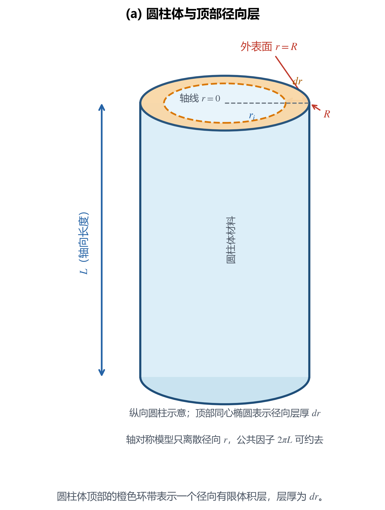
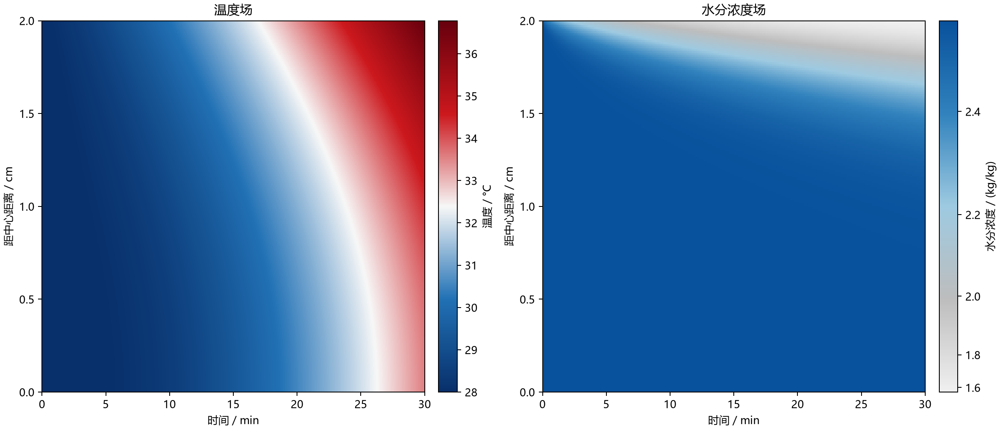
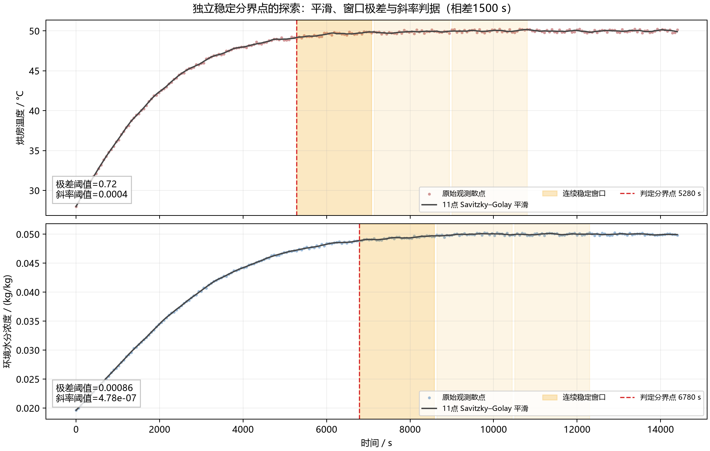
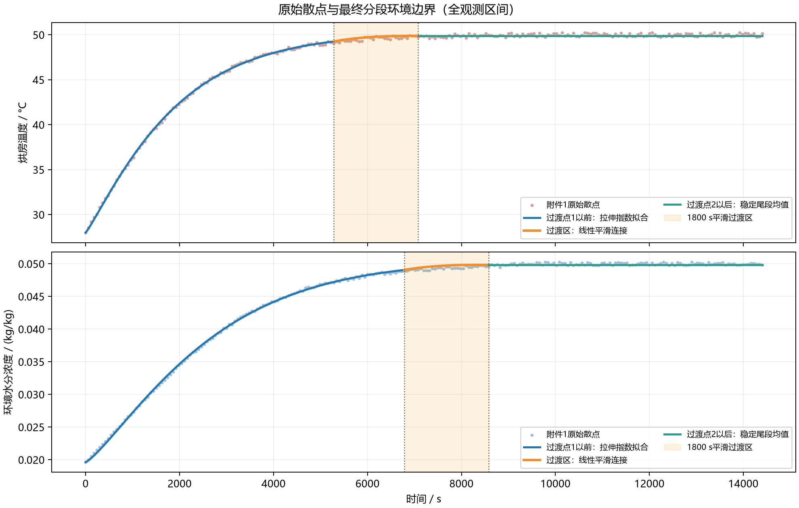
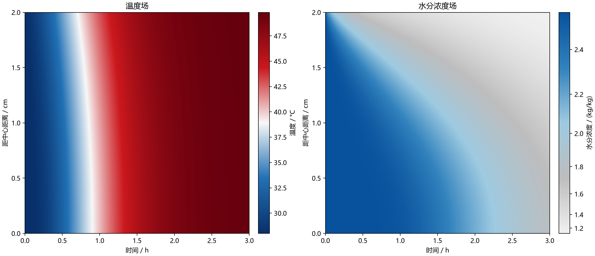
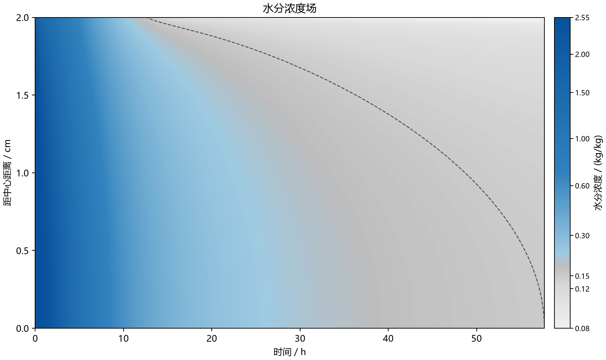
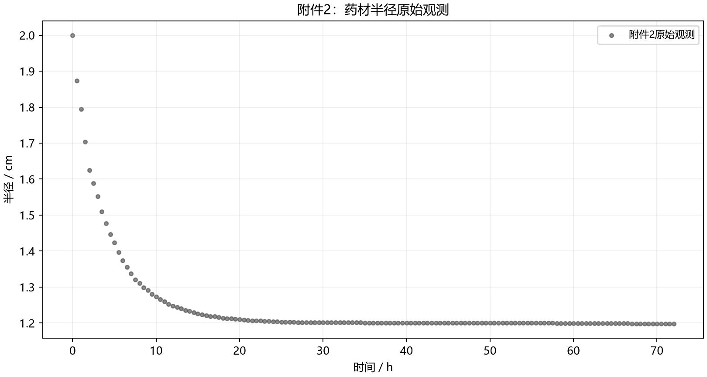
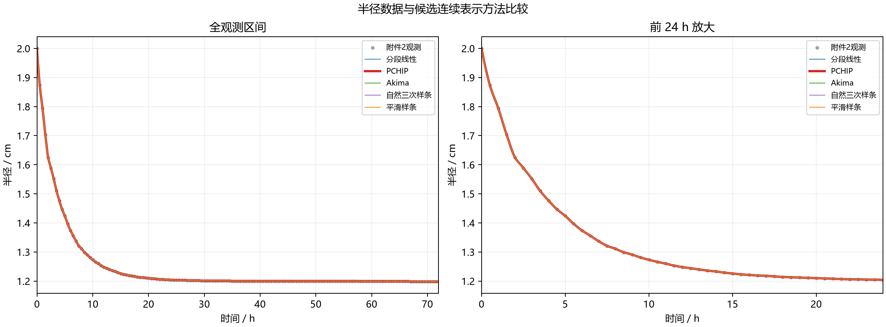
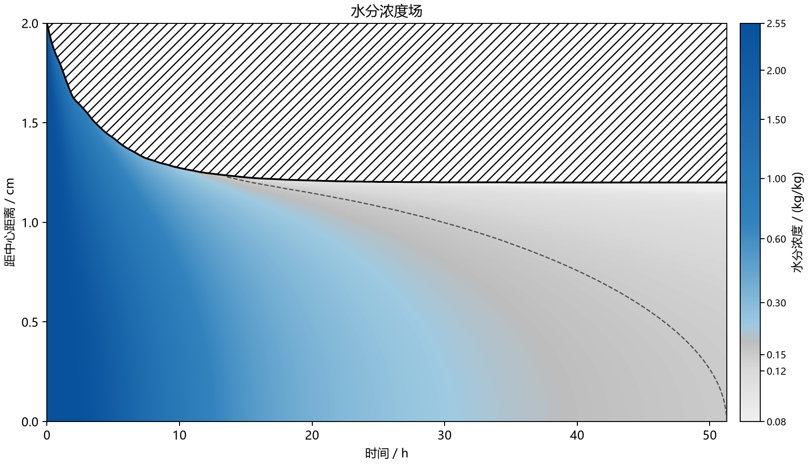

# 药材烘干过程的径向热湿传递、干燥终点与收缩模型

## 摘要

针对圆柱形药材在热风烘箱中的预热、恒温干燥、干燥终点判定和收缩过程，本文将四问整理为一条连续的建模链。首先对附件1的烘房温度和环境水分参考量进行清洗、比较和连续化重构，在分段线性、PCHIP、Akima、自然三次样条、平滑样条与初值固定的拉伸指数模型之间，以按时间顺序的时间块留出验证（time-ordered blocked hold-out）误差、平滑性、数据区间外的外推行为和同一函数形式对两类边界的统一表示为标准选择拉伸指数模型（stretched_exp）。其次将药材视为轴对称圆柱，建立径向热传导和含水率扩散方程；空间上采用守恒型有限体积法，时间上采用隐式 BDF 方法，并在变物性情形下联立更新局部物性。

第一问采用常物性模型，并仅用附件1前 1800 s 数据拟合拉伸指数边界，求得 0--1800 s 的预热场；第二问从初始状态重新计算，使用附录3物性，先用附件1完整 0--14400 s 记录识别温度和环境水分浓度各自的稳定阶段，再分别拟合到稳定分界点，并从分界点开始用一个 1800 s 采样步长平滑接入尾段均值，展示前3 h结果；第三问在第二问模型上延长积分，以全域最大含水率首次低于 0.15 kg/kg 定义干燥结束；第四问进一步采用附录4物性和附件2半径记录，通过材料坐标处理移动区域，并比较多种半径插值方法。

主结果为：第一问 1800 s 时体积平均温度 35.169887 °C、平均干基含水率 2.293557 kg/kg；第二问 3 h 时平均温度 49.8046 °C、平均含水率 1.3824 kg/kg；第三问固定半径模型的全域达标时间为 57.6785 h；第四问采用附录4和 PCHIP 半径后，达标时间为 51.2682 h。网格、时间积分、Jacobian、含水率物理范围和水分收支检查表明数值误差已收敛，但长期边界延拓、有效传质系数、物性经验式和均匀收缩假设带来的不确定性仍明显大于离散误差。因此，文中时间均解释为给定输入和假设下的模型预测，而非精确到秒的实验结论。

关键词：药材烘干；径向热湿耦合；有限体积法；隐式 BDF；干燥终点；移动边界；PCHIP

## 1、问题背景与重述

### 1.1 问题背景

药材烘干的目标不仅是降低整体含水率，还要使药材内部各处达到规定的干燥状态。对题设圆柱形药材而言，热风首先作用于外表面：空气与表面交换热量和水分，热量再向中心传导，内部水分则沿含水率梯度向表面迁移并逸出。由于传热和传质都需要一定时间，药材内部通常会形成随时间演化的温度场和含水率场，表面、内部和中心的响应并不同步。若只用一个平均温度或平均含水率描述全过程，可能掩盖中心区域的滞后，因而不能直接判断药材是否已经“各处达标”。

本题研究的药材初始可近似为长度 \(L=0.25\ \mathrm m\)（25 cm）、半径 \(R_0=0.02\ \mathrm m\)（2 cm）的圆柱，初始温度为 \(28\,^\circ\mathrm C\)，初始干基含水率为 \(C_0=2.55\ \mathrm{kg/kg}\)。其中，干基含水率是水的质量与干物质质量之比，而不是湿基质量百分比。除外部热风条件和药材内部状态随时间变化外，后续问题还进一步考虑了药材半径收缩带来的传递距离和计算区域变化。

题目给出附件1中的烘房温度和环境水分记录、附件2中的半径变化记录，以及不同问题所要求的经验物性关系。这些输入均以离散记录或经验公式给出，因此需要先把观测数据转化为连续的环境边界和半径函数，再建立径向热湿传递模型，最后由数值解得到空间分布和干燥终点。四问由固定几何、常物性逐步推进到变物性、长期干燥和收缩几何，构成一条由简入繁的建模链。

### 1.2 问题重述

#### 1.2.1 总述

令 \(T(r,t)\) 表示距药材中心 \(r\) 处、时刻 \(t\) 的温度，\(C(r,t)\) 表示相应的干基含水率。四问共同要解决的是：在给定初始状态、外部环境和材料物性关系的条件下，建立药材内部温度与水分迁移的数学模型，求出随时间和径向位置变化的状态，并据此判断干燥过程何时满足题目要求。

第一至第三问把计算区域视为固定圆柱 \(0\le r\le R_0\)；第四问把半径写成随时间变化的 \(R(t)\)，并在收缩区域内计算。四问虽然在模型上逐步增加条件，但每一问均从同一初始状态重新积分：后一问是在题目指定的物性、几何或时间范围下重新求解，而不是把前一问的末状态机械拼接为后一问的初始状态。

#### 1.2.2 第一问

在半径固定、密度、比热容和导热系数取常数的条件下，利用附件1在 \(0\)--\(1800\ \mathrm s\) 内的环境记录构造连续边界，并结合题目给出的含水率相关扩散系数，建立药材的径向温度传导和水分扩散模型。求解预热阶段各时刻、各径向位置的温度和干基含水率，并比较中心、表面及整体平均状态。

#### 1.2.3 第二问

在半径仍固定的条件下，采用附录3给出的变物性关系，利用附件1的完整记录识别烘房温度和环境水分状态分别进入稳定阶段的时间，构造包含平滑过渡和稳定尾段的连续环境边界。由此建立温度场与含水率场相互影响的非线性热湿耦合模型，求出烘干前 3 h 内各径向位置的全过程状态。

#### 1.2.4 第三问

延续第二问的变物性热湿模型和环境边界处理，将计算时间延长至满足干燥要求。以药材内部所有位置的干基含水率均低于 \(0.15\ \mathrm{kg/kg}\) 为达标条件，确定首次达到该条件的烘干时间，并给出从开始烘干到干燥结束的含水率分布。这里的判据是全域最湿位置达标，而不是表面含水率或体积平均含水率达标。

#### 1.2.5 第四问

根据附件2的半径变化记录，引入随时间变化的药材半径，并采用附录4的变物性关系重新建立收缩药材的热湿传递模型。在假定长度不变、径向均匀收缩的条件下，将移动区域转换到材料坐标中，确定收缩情况下的全域干燥时间，并按实际距离输出各位置的含水率；当某一固定实际位置已经位于药材外部时，不再把该位置误作药材内部状态。

## 2、问题分析

### 2.1 总体思路

四问围绕同一传热传质机制逐步增加物性、时间和几何条件。先将离散环境记录和半径记录连续化，再在固定空间或材料坐标中建立径向守恒方程，最后采用守恒型有限体积法和隐式 BDF 求解。表面用 Robin 边界描述有限速率交换，内部使用共享界面通量，以便同时保留径向梯度和水分收支检查。

### 2.2 第一问分析

问题一要求研究固定半径药材在预热平衡阶段的温度与水分浓度变化的数学模型。药材为圆柱形，半径固定，长度远大于半径，可忽略轴向效应，简化为沿半径方向的一维问题。附件1以 60 s 为间隔给出一段时间内的烘房环境记录，而模型求解需要 \(0\)--\(1800\ \mathrm s\) 内连续可求的边界输入。因此首先需要先对烘房温度和水分浓度数据进行连续化拟合，并得到 \(T_a(t)\) 和 \(C_a(t)\)。

其次，根据能量守恒和水分质量守恒分别建立温度和水分浓度的径向守恒方程。方程为圆柱坐标下的非稳态偏微分方程，没有解析解，应采用有限体积法和隐式 BDF 进行求解。由于温度场和水分浓度场的物性参数与边界条件相对独立，可分别求解，再通过表面边界相互关联。

最后需要对数值解的网格收敛性和时间精度进行验证。

### 2.3 第二问分析

问题二要求在固定半径条件下研究药材从预热平衡到恒温干燥阶段的温度和水分浓度变化。附件1只给出了有限时间内的环境记录，不能直接将最后一个记录值延长到整个干燥过程，因此需要分别识别烘房温度和环境水分浓度的稳定分界点，对分界点前的数据进行连续化拟合，并通过平滑过渡接入稳定阶段的尾段均值，得到可延拓的 \(T_a(t)\) 和 \(C_a(t)\)。

其次，采用附录3给出的变物性关系建立热湿耦合模型，使 \(\rho\)、\(c_p\)、\(k\) 随局部含水率变化，\(D\) 同时随局部温度和含水率变化。此时温度场和水分浓度场相互影响，不能再分别求解，应在有限体积离散后使用隐式 BDF 联立求解，并对前 3 h 的计算结果进行网格和时间精度验证。

### 2.4 第三问分析

问题三在问题二模型的基础上，将计算时间延长至药材完全达到干燥要求的时刻。由于附件1的记录时间有限，稳定阶段环境边界的延拓会影响长期计算，因此需要明确尾段边界的构造方式，并通过敏感性分析考察其对干燥时间的影响。

题目要求药材各处的水分浓度均低于 \(0.15\ \mathrm{kg/kg}\)，因此以全域最大含水率 \(M(t)=\max_{0\le r\le R_0}C(r,t)\) 的首次低于阈值作为干燥终点，采用事件定位方法求得对应时间。最后还需验证全域判据、网格收敛性和时间精度，避免用表面或平均含水率提前判断干燥完成。

### 2.5 第四问分析

问题四进一步考虑药材在烘干过程中的半径收缩，并采用附录4给出的变物性关系。附件2中的半径数据是离散记录，不能直接作为连续的移动边界，因此需要先进行半径插值，并比较不同方法的拟合误差、单调性和越界情况，得到符合物理变化规律的 \(R(t)\)。

其次，在假设长度不变且药材径向均匀收缩的条件下，引入材料坐标 \(\xi=r/R(t)\)，将移动区域变换为固定区域进行求解。半径变化会同时影响内部传递项和表面边界条件，数值求解后还需将材料坐标结果转换为实际距离，对药材外部位置留空，并用全域最大含水率确定收缩状态下的干燥终点。

## 3、模型假设

1. 药材均匀、各向同性且轴对称。各向同性表示物性不随方向改变，轴对称表示 \(T,C\) 只依赖径向坐标和时间；忽略周向变化、轴向传递以及圆柱两端的端部换热/传质效应，结果代表远离端部的中部截面。
2. 第一至第三问半径固定为 \(R_0=0.02\ \mathrm m\)；第四问假设长度不变且发生均匀径向收缩，即所有材料点保持相同的相对坐标。与之相对的非均匀收缩是收缩比例随径向位置变化。
3. \(C=m_w/m_d\) 为干基含水率，其中 \(m_w\) 是水的质量、\(m_d\) 是干物质质量；水分收支以干物质质量为基准，不能把 \(C\) 直接当作单位体积水质量。
4. 环境水分 \(C_a(t)\) 是题目数据下的有效边界参考量，直接进入 Robin 传质驱动力，不额外引入气固吸附平衡关系。若建立该关系，则需用空气状态（如相对湿度和温度）转换为固体平衡含水率；本文没有这类附加数据，因此不作转换。
5. 不显式加入蒸发潜热（液态水汽化所需的能量）、水分迁移携热（随水分流动携带的能量）、内部热源和端部散热；这些物理简化属于模型形式误差，即由省略实际物理过程造成的误差。
6. 第一问使用常物性和题面给出的 D(C)；第二、三问全程使用附录3局部物性；第四问全程使用附录4局部物性。
7. 半径数据在主方案覆盖至事件时刻，因此第四问不使用主计算所需的半径外推；若超出附件2末端，程序才保持最后半径值。

## 4、符号约定

**表1 主要符号及其物理含义**

| 符号 | 含义 | 单位 |
|---|---|---|
| \(t\) | 时间 | s |
| \(L\) | 药材轴向长度 | m |
| \(R_0\) | 初始半径；第一至第三问中 \(R(t)=R_0\) | m |
| \(r\) | 实际径向坐标 | m |
| \(R(t)\) | 时刻 \(t\) 的实际半径 | m |
| \(\xi=r/R(t)\) | 第四问材料坐标 | 1 |
| \(T,C\) | 药材温度、干基含水率 | °C、kg/kg |
| \(T_a,C_a\) | 烘房温度、环境水分参考量 | °C、kg/kg |
| \(\Theta,U\) | 材料坐标 \(\xi\) 下的温度、含水率 | °C、kg/kg |
| \(T_s,C_s,\Theta_s,U_s\) | 实际或材料坐标表面的状态值 | °C、kg/kg |
| \(\rho,c_p,k\) | 密度、比热容、导热系数 | kg/m³、J/(kg·K)、W/(m·K) |
| \(D\) | 有效水分扩散系数 | m²/s |
| \(h,h_m\) | 换热系数、有效传质系数 | W/(m²·K)、m/s |
| \(v,\dot R\) | 材料径向速度、半径变化率 | m/s |
| \(N\) | 径向控制体数量或网格区间数 | 1 |
| \(a_i,b_i\) | 第 \(i\) 个控制体的内、外半径 | m |
| \(w_i=(b_i^2-a_i^2)/2\) | 去掉公共因子 \(2\pi L\) 后的控制体几何权重 | m² |
| \(F^T\) | 去掉公共因子 \(2\pi L\) 后的热量界面通量 | W/m |
| \(F^C\) | 去掉公共因子 \(2\pi L\) 后的含水率界面通量 | m²/s |
| \(M(t)\) | 全域最大含水率 | kg/kg |
| \(\overline T,\overline C\) | 体积加权平均温度、含水率 | °C、kg/kg |
| \(z,\varepsilon_C\) | 累计表面交换量、水分收支残差 | kg/kg |

## 5、模型建立与求解

### 5.1 第一题

#### 5.1.1 环境边界的数据处理

附件 1 每隔 60 s 给出烘房温度和环境水分浓度，记录范围为 0--14400 s，可绘制为原始观测散点图（图 1）。从图 1 中可以看到温度和环境水分浓度均在早期快速上升，随后逐步进入平台区。第一问需要获得数据在 0-1800 s 之间的连续函数。

**图 1（原始环境边界散点，已生成）：** figures/q1/图01_原始环境边界散点.png。左图为烘房温度，右图为环境水分浓度；横轴覆盖完整的 0--14400 s，图中没有人为添加的曲线。

为避免先验指定某一种函数，本文先比较六类候选表示：分段线性、PCHIP、Akima、自然三次样条、平滑样条和初值固定的拉伸指数模型。六者的求解机制并不相同：前四者是由观测节点直接确定的插值方法，不需要非线性参数优化；平滑样条通过残差平方和和曲率惩罚确定平滑函数，属于正则化最小二乘；拉伸指数模型需要对幅值、时间尺度和形状参数进行非线性最小二乘估计。

验证采用按时间顺序的时间块留出（time-ordered blocked hold-out），在不随机打乱记录的前提下，从 0--1800 s 的 31 个观测点中每隔 5 个点留出 1 个点，得到 25 个训练点和 6 个验证点。随后在 6 个验证点上计算得到均方根误差，作为阻塞验证 RMSE 的结果。

具体地，若验证样本为 \((t_i,y_i)\)，预测值为 \(\widehat y_i\)，则

$$
\mathrm{RMSE}
=\sqrt{\frac{1}{n}\sum_{i=1}^{n}\left(y_i-\widehat y_i\right)^2}.
\tag{1}
$$

其中 \(n\) 为验证样本数。

为比较曲线的局部弯折程度，再在验证区间取 721 个等间距点，定义平均绝对二阶差分粗糙度

$$
\mathcal R(\widehat y)
=\frac{1}{N_d-2}\sum_{j=1}^{N_d-2}
\left|
\frac{\widehat y_{j+1}-2\widehat y_j+\widehat y_{j-1}}{\Delta t^2}
\right|,
\qquad N_d=721.
\tag{2}
$$

粗糙度越小，表示曲线的局部二阶弯折越弱；温度和环境水分浓度量纲不同，只在同一序列内比较。

六种方法在 0--1800 s 数据上的结果为：

**表2 第一问环境边界候选方法的验证误差与平滑性比较**

| 方法 | 温度 RMSE / °C | 环境水分浓度 RMSE / (kg/kg) | 温度粗糙度 / (°C·s\(^{-2}\)) | 环境水分浓度粗糙度 / ((kg/kg)·s\(^{-2}\)) |
|---|---:|---:|---:|---:|
| 分段线性 | 0.133411 | 5.01×10^-5 | \(3.62\times10^{-5}\) | \(3.48\times10^{-8}\) |
| PCHIP | 0.161469 | 4.57×10^-5 | \(5.10\times10^{-5}\) | \(5.06\times10^{-8}\) |
| Akima | 0.147783 | 5.22×10^-5 | \(5.17\times10^{-5}\) | \(5.05\times10^{-8}\) |
| 自然三次样条 | 0.186352 | 4.13×10^-5 | \(5.16\times10^{-5}\) | \(5.07\times10^{-8}\) |
| 平滑样条 | 0.078165 | 6.00×10^-5 | \(2.12\times10^{-6}\) | \(6.93\times10^{-10}\) |
| 初值固定的拉伸指数模型（stretched_exp） | 0.057243 | 5.54×10^-5 | \(2.20\times10^{-6}\) | \(7.30\times10^{-10}\) |

温度序列中拉伸指数模型的阻塞验证 RMSE 最低（0.057243 °C）。环境水分浓度序列中自然三次样条的 RMSE 略低，为 \(4.13\times10^{-5}\ \mathrm{kg/kg}\)，但其粗糙度约为拉伸指数模型的 69.5 倍；平滑样条的粗糙度虽更小，误差却略高于拉伸指数模型。综合考虑验证误差、局部平滑性，以及希望用同一函数族表示两类环境边界的可解释性，第一问选择初值固定的拉伸指数模型。

对该模型，令 \(y_0\) 为 \(t=0\) 的观测初值、\(A\) 为幅值、\(\tau\) 为时间尺度、\(p\) 为无量纲形状参数；仅这四参数模型通过非线性最小二乘（最小化观测值与模型值残差平方和）估计：

$$
y_f(t)=y_0+A\left[1-\exp\left(-\left(\frac{t}{\tau}\right)^p\right)\right].
\tag{3}
$$

其中 \(t\) 和 \(\tau\) 均以秒计。拟合参数为

$$
\begin{aligned}
T_a(t)&=28+27.3279502\left[1-\exp\left(-\left(\frac{t}{2617.1875}\right)^{1.0429163}\right)\right],\\
C_a(t)&=0.01963+0.06247822\left[1-\exp\left(-\left(\frac{t}{6927.1507}\right)^{1.0519591}\right)\right].
\end{aligned}
$$

第一问中，使用附件 1 的 0-1800 s 观测得到数据估计式 (3) 的参数。在全部 0-1800 s 观测点上计算的主拟合 RMSE 分别为 0.104306 °C 和 \(6.73349\times10^{-5}\ \mathrm{kg/kg}\)。求解时在同一 0-1800 s 区间内调用该连续边界。为衡量窗口选择的不确定性，另计算 3600 s 和 7200 s 扩展窗口情景，但它们不替代第一问的主方案。不同终点的比较见 results/q1/boundary_endpoint_comparison.csv。

**图 2（拉伸指数最终拟合，已生成）：** figures/q1/图02_拉伸指数最终拟合.png。图中包含 0--1800 s 原始观测散点和最终选定的拉伸指数曲线；这张图用于核对式 (3) 的实际拟合形态。

#### 5.1.2 物理模型

第一问采用常物性 \(R=0.02\ \mathrm m\)、\(\rho=820\ \mathrm{kg/m^3}\)、\(c_p=2600\ \mathrm{J/(kg\cdot K)}\)、\(k=0.36\ \mathrm{W/(m\cdot K)}\)、\(h=25\ \mathrm{W/(m^2\cdot K)}\)、\(h_m=8\times10^{-7}\ \mathrm{m/s}\)，以及题面给出的

$$
D(C)=7\times10^{-9}\exp\left(-\frac{0.89}{C}\right).
$$

这里 \(D\) 的单位为 \(\mathrm{m^2/s}\)，经验系数按 \(C\) 用 kg/kg 的数值标定。

圆柱径向热传导方程和水分守恒方程分别为

$$
\rho c_p\frac{\partial T}{\partial t}
=\frac1r\frac{\partial}{\partial r}
\left(rk\frac{\partial T}{\partial r}\right),
\tag{4}
$$

$$
\frac{\partial C}{\partial t}
=\frac1r\frac{\partial}{\partial r}
\left(rD(C)\frac{\partial C}{\partial r}\right).
\tag{5}
$$

下标 \(t,r\) 分别表示对时间和径向坐标的偏导，例如 \(T_t=\partial T/\partial t\)、\(T_r=\partial T/\partial r\)；\(D(C)\) 是随含水率变化的有效扩散系数，\(D'(C)=\mathrm dD/\mathrm dC\)。保留式(5)的散度形式，避免把 \(D(C)\) 移出微分算子而遗漏与 \(D'(C)\) 相关的梯度平方项。

#### 5.1.3 初始条件、边界条件与数值求解

初始条件和中心轴对称条件为

$$
T(r,0)=28,\quad C(r,0)=2.55;\qquad
T_r(0,t)=0,\quad C_r(0,t)=0 .
\tag{6}
$$

在表面 \(r=R\) 使用有限速率 Robin 条件

$$
-kT_r(R,t)=h\,[T(R,t)-T_a(t)],\qquad
-D(C)C_r(R,t)=h_m\,[C(R,t)-C_a(t)] .
\tag{7}
$$

将径向区域分成 \(N\) 个环状控制体。第 \(i\) 个控制体的内、外界面记为 \(a_i=r_{i-1/2}\)、\(b_i=r_{i+1/2}\)，节点值记为 \(T_i,C_i\)，径向厚度为 \(dr_i=b_i-a_i\)，并取 \(w_i=(b_i^2-a_i^2)/2\)。\(F^T_{i+1/2}\) 和 \(F^C_{i+1/2}\) 分别表示去掉公共因子 \(2\pi L\) 后、沿径向正方向定义的热量和含水率界面通量；内部界面用相邻节点的系数算术平均和节点差分近似梯度，相邻控制体共享同一个界面通量。中心界面为零通量，最外界面直接代入式(7)。得到的典型半离散形式为

$$
\rho c_p w_i\dot T_i
=F^T_{i+1/2}-F^T_{i-1/2},\qquad
w_i\dot C_i
=F^C_{i+1/2}-F^C_{i-1/2}.
\tag{8}
$$

主计算采用 \(N=6400\) 个径向区间（即 6401 个节点）、相对容差 \(2\times10^{-10}\)、绝对容差 \(2\times10^{-12}\)、最大步长 5 s 的隐式 BDF。这里 \(\dot T_i=\mathrm dT_i/\mathrm dt\)、\(\dot C_i=\mathrm dC_i/\mathrm dt\)，相对容差和绝对容差分别限制按状态量尺度归一化后的局部误差和未归一化的绝对误差；结果按每 1 s、距中心每 0.1 cm 输出。内部通量共享使热量和水分收支具有可检查的守恒结构。

**图 3、图 4（径向有限体积离散示意图，已生成）：** 图 3 `figures/图03_圆柱体与dr示意图.png` 展示圆柱体、顶部径向层及层厚 \(dr\)；图 4 `figures/图04_有限体积离散示意图.png` 将环形控制体与共享界面通量的守恒平衡合并展示。图 4 中标出 \(r_{i-1/2}\)、\(r_i\)、\(r_{i+1/2}\) 和 \(dr_i\)，并说明相邻控制体共享界面通量后内部通量在全域求和时抵消。第一至第三问在固定半径上离散径向坐标，第四问则在 \(\xi=r/R(t)\) 材料坐标中使用同样的守恒结构。

#### 5.1.4 计算结果与分析

**表3 第一问预热阶段温度分布（°C）**

| 时间 / s | 0 cm | 0.5 cm | 1 cm | 1.5 cm | 2 cm |
|---:|---:|---:|---:|---:|---:|
| 100 | 28.0001 | 28.0003 | 28.0039 | 28.0318 | 28.1698 |
| 300 | 28.0386 | 28.0604 | 28.1466 | 28.3645 | 28.8353 |
| 600 | 28.4463 | 28.5292 | 28.7997 | 29.3204 | 30.1872 |
| 900 | 29.3232 | 29.4570 | 29.8737 | 30.6169 | 31.7512 |
| 1200 | 30.5480 | 30.7160 | 31.2299 | 32.1166 | 33.4151 |
| 1500 | 31.9960 | 32.1846 | 32.7557 | 33.7237 | 35.1079 |
| 1800 | 33.5689 | 33.7676 | 34.3658 | 35.3685 | 36.7806 |

**表4 第一问预热阶段干基含水率分布（kg/kg）**

| 时间 / s | 0 cm | 0.5 cm | 1 cm | 1.5 cm | 2 cm |
|---:|---:|---:|---:|---:|---:|
| 100 | 2.5500 | 2.5500 | 2.5500 | 2.5500 | 2.2470 |
| 300 | 2.5500 | 2.5500 | 2.5500 | 2.5492 | 2.0508 |
| 600 | 2.5500 | 2.5500 | 2.5500 | 2.5353 | 1.8770 |
| 900 | 2.5500 | 2.5500 | 2.5497 | 2.5045 | 1.7547 |
| 1200 | 2.5500 | 2.5500 | 2.5482 | 2.4646 | 1.6586 |
| 1500 | 2.5500 | 2.5499 | 2.5445 | 2.4206 | 1.5787 |
| 1800 | 2.5500 | 2.5497 | 2.5383 | 2.3755 | 1.5102 |

1800 s 时中心温度 33.568930 °C、表面温度 36.780592 °C，体积平均温度 35.169887 °C；中心含水率 2.549992、表面含水率 1.510237 kg/kg，体积平均含水率 2.293557 kg/kg。表面先升温、先失水，中心仍接近初始状态，说明预热阶段不能用表面值或径向算术平均代表药材整体。

**图5（第一问径向场，已生成）：** figures/q1/图05_第一问温度水分场.png。左右两个面板分别以颜色表示温度场和水分浓度场，横轴为时间、纵轴为距中心距离；径向绘图采样加密到 0.01 cm（工作簿仍按题意输出 0.1 cm），温度采用低温深蓝—高温深红配色，水分浓度采用低值灰—高值蓝配色，并用单调幂变换增强低值区域的可辨识度，色条仍标注原始数值。图中可直接看到温度由表面向内部传播，以及水分浓度首先在表面降低并逐步向中心扩展。

### 5.2 第二题

#### 5.2.1 环境边界的数据处理

热风烘干过程中，烘房温度和环境水分浓度分别通过表面换热和传质边界影响药材内部状态：\(T_a(t)\) 是温度场的外部热驱动，\(C_a(t)\) 是水分场的外部传质驱动。附件1以 60 s 为间隔给出 \(0\)--\(14400\ \mathrm s\) 的离散记录，而第三、第四问还需要进行更长时间的计算，因此环境记录的连续化和长期延拓本身就是模型的一部分。本文对两个边界量分别识别稳定阶段，再将预热段和稳定干燥段连接为连续输入；完整记录只用于稳定分界点探索、尾段均值估计以及分界前拟合。

**问题一：稳定分界点的识别。** 本问的目标不是判断药材内部是否已经达到热湿平衡，而是从外部记录中确定“仍在变化的预热边界”何时可以转化为“近似稳定的干燥边界”。令 \(y\in\{T_a,C_a\}\)：其中 \(T_a(t)\) 为烘房空气温度，单位为 °C，进入温度场的换热边界；\(C_a(t)\) 为题设环境水分浓度的有效参考量，单位为 kg/kg，进入含水率场的传质边界。两者的稳定时间分别由各自的观测序列确定，不能预先假定共用一个分界点。

附件 1 的采样时刻为 \(t_i=i\Delta t\)，其中 \(\Delta t=60\ \mathrm s\)，观测值记为 \(y_i=y(t_i)\)。为区分真实趋势与短时波动，先对原始序列作 11 点、二阶 Savitzky--Golay 平滑，记平滑结果为 \(\widetilde y_i\)。平滑序列只用于识别趋势和计算窗口统计量；尾段均值和最终边界拟合仍使用原始观测值，从而避免平滑操作改变边界的量纲和平台水平。

从 \(t=1800\ \mathrm s\) 开始扫描候选窗口。取窗口长度 \(W=1800\ \mathrm s\)，对应 \(n_W=W/\Delta t+1=31\) 个观测点。若窗口起点为 \(s=t_k\)，记其观测下标集合为 \(I_k=\{k,k+1,\ldots,k+n_W-1\}\)，则用窗口极差描述短时波动：

$$
R_y(s)=\max_{i\in I_k}\widetilde y_i-\min_{i\in I_k}\widetilde y_i.
$$

同时，用窗口内平滑序列的最小二乘直线斜率描述边界量的残余趋势。令 \(\bar t_k\) 和 \(\bar{\widetilde y}_k\) 分别为窗口内时间和平滑值的均值，则

$$
b_y(s)=
\frac{\displaystyle\sum_{i\in I_k}(t_i-\bar t_k)(\widetilde y_i-\bar{\widetilde y}_k)}
{\displaystyle\sum_{i\in I_k}(t_i-\bar t_k)^2}.
$$

其中，\(R_y(s)\) 控制局部波动幅度，\(|b_y(s)|\) 控制窗口内的平均变化速度；二者分别对应“变化是否足够小”和“趋势是否基本停止”两个判据。

为使阈值随不同物理量的噪声尺度自动调整，取末段样本 \(I_{\mathrm{tail}}=\{i:t_i\ge0.75t_{\max}\}\)，对残差 \(e_i=y_i-\widetilde y_i\) 作稳健估计：

$$
m_e=\operatorname{median}_{i\in I_{\mathrm{tail}}}(e_i),
\qquad
\operatorname{MAD}_y=\operatorname{median}_{i\in I_{\mathrm{tail}}}|e_i-m_e|,
\qquad
\widehat\sigma_y=1.4826\,\operatorname{MAD}_y.
$$

这里的 1.4826 等于 \(1/\Phi^{-1}(0.75)\)，是在正态噪声假设下将 MAD 校准为标准差的无量纲系数；它不是额外拟合参数。再以全序列相邻记录差的中位数表示记录分辨率尺度

$$
d_y=\operatorname{median}_{i=1,\ldots,n}|y_i-y_{i-1}|,
$$

并设置极差阈值和斜率阈值

$$
\varepsilon_{R,y}=\max\left(2\widehat\sigma_y,4d_y\right),
\qquad
\varepsilon_{b,y}=\frac{\varepsilon_{R,y}}{W}.
$$

于是，候选窗口的稳定标志定义为

$$
\mathcal S_y(s)=
\begin{cases}
1,&R_y(s)\le\varepsilon_{R,y}\ \text{且}\ |b_y(s)|\le\varepsilon_{b,y},\\
0,&\text{其他情况}.
\end{cases}
$$

为避免把一次偶然的平静当作稳定阶段，要求稳定标志在时间上连续通过三个窗口。对离散扫描而言，稳定分界点取为

$$
t_{s,y}=\min\left\{t_k:t_k\ge1800\ \mathrm s,\;
\mathcal S_y(t_k)=\mathcal S_y(t_{k+n_W})=\mathcal S_y(t_{k+2n_W})=1\right\}.
$$

由于窗口两端的观测点均计入，单个窗口包含 31 个点，程序中连续窗口起点相隔 \(n_W\Delta t=1860\ \mathrm s\)。确定 \(t_{s,y}\) 后，再用分界点之后的原始记录计算稳定尾段均值

$$
y_* = \frac{1}{n_*}\sum_{t_i\ge t_{s,y}}y_i,
\qquad
n_* = \#\{i:t_i\ge t_{s,y}\},
$$

作为后续分段边界的稳定水平。这样得到的分界点具有明确的物理含义：它是外部边界的趋势项和波动项同时低于相应尺度后，连续保持三个窗口的最早时刻，而不是由肉眼观察或人为指定的“平台起点”。上述 \(t_{s,y}\) 与 \(y_*\) 将分别作为下一步分段边界函数的转接点和稳定尾段值。

识别结果如下。表中列出连续通过判定的三个窗口起点，用来说明稳定状态是连续出现的。

**表5 烘房温度与环境水分浓度的稳定阶段识别结果**

| 序列 | \(\widehat{\sigma}_y\) | \(\varepsilon_{R,y}\) | \(\varepsilon_{b,y}\) | 连续窗口起点 / s | 稳定分界点 \(t_{s,y}\) / s | 尾段均值 |
|---|---:|---:|---:|---|---:|---:|
| 烘房温度 | 0.180853 °C | 0.720000 °C | \(4.00\times10^{-4}\) °C/s | 5280, 7140, 9000 | 5280 | 49.885797 °C |
| 环境水分浓度 | \(1.70067\times10^{-4}\) kg/kg | \(8.60\times10^{-4}\) kg/kg | \(4.78\times10^{-7}\) (kg/kg)/s | 6780, 8640, 10500 | 6780 | 0.04982109 kg/kg |

由此，温度和环境水分浓度的稳定分界点相差 \(1500\ \mathrm s\)，不能用一个共同分界点或两个序列的均值代替。分界点探索的具体过程见图 6：散点是原始记录，黑线是 11 点平滑曲线，浅色窗口表示连续通过判据的候选窗口，红色虚线是最终选定的起点。

**图 6（独立稳定分界点的探索，已生成）：** figures/q2/图06_边界独立稳定分界.png。

**问题二：分界点后的连续边界。** 
稳定分界点确定后，对每个边界量只使用分界点以前的观测数据拟合预热段，避免稳定干燥阶段的数据反过来改变预热段的形状。连续边界函数的选择同时考虑时间顺序验证误差、曲线粗糙度和数据区间外的外推行为；综合比较后，本文采用初值固定、具有明确时间尺度和渐近趋势的拉伸指数函数

$$
f_y(t)=y_0+A_y\left[1-\exp\left(-\left(\frac{t}{\tau_y}\right)^{p_y}\right)\right],
\qquad 0\le t\le t_{s,y},
$$

其中 \(y_0\) 固定为首个观测值，\(A_y\)、\(\tau_y\) 和 \(p_y\) 由非线性最小二乘估计。温度和环境水分分别在 \(0\)--\(5280\ \mathrm s\) 和 \(0\)--\(6780\ \mathrm s\) 内拟合，得到

$$
\begin{aligned}
T_a(t)&=28+22.19188797\left[1-\exp\left(-\left(\frac{t}{1912.6396}\right)^{1.1352503}\right)\right],\\
C_a(t)&=0.01963+0.03089867\left[1-\exp\left(-\left(\frac{t}{2770.4870}\right)^{1.2435327}\right)\right].
\end{aligned}
\tag{9}
$$

分界前拟合 RMSE 分别为 \(0.13270585\,^\circ\mathrm C\)（温度，0--5280 s）和 \(1.82417\times10^{-4}\ \mathrm{kg/kg}\)（环境水分，0--6780 s）。

为保证边界输入连续，本文把一个 1800 s 采样步长作为过渡区宽度，并把稳定分界点作为过渡点 1；从该点开始，在一个完整采样步长内逐步接入稳定阶段的尾段均值，过渡区右端为过渡点 2。

令 \(t_{1,y}=t_{s,y}\) 为过渡点 1，令 \(t_{2,y}=t_{1,y}+\Delta t_s\) 为过渡点 2，其中 \(\Delta t_s=1800\ \mathrm s\)。稳定段均值记为 \(y_*\)，并定义线性权重 \(\lambda_y(t)=(t-t_{1,y})/\Delta t_s\)。对 \(y=T_a\) 或 \(C_a\) 统一构造

$$
B_y(t)=\begin{cases}f_y(t),&0\le t\le t_{1,y},\\[4pt](1-\lambda_y(t))f_y(t)+\lambda_y(t)y_*,&t_{1,y}<t<t_{2,y},\\[4pt]y_*,&t\ge t_{2,y}.\end{cases}
\tag{10}
$$

该构造在两个过渡端点处连续：预热段保留观测趋势，过渡区消除拟合值与平台均值之间的差异，过渡点 2 后用稳定阶段的实测均值表示恒定干燥环境。温度和环境水分分别使用各自的分界点和过渡区，两个过渡区在 6780--7080 s 有 300 s 重叠，但两类边界仍独立计算。

将 \(y=T_a\) 和 \(y=C_a\) 分别代入式 (10)，即可得到以下两条用于数值求解的具体边界函数（时间 \(t\) 以 s 计）：

$$
T_a(t)=
\begin{cases}
28+22.19188797\left[1-\exp\left(-\left(\dfrac{t}{1912.6396}\right)^{1.1352503}\right)\right], & 0\le t\le 5280,\\[4pt]
\left(1-\dfrac{t-5280}{1800}\right)\!\left\{28+22.19188797\left[1-\exp\left(-\left(\dfrac{t}{1912.6396}\right)^{1.1352503}\right)\right]\right\}+\dfrac{t-5280}{1800}\,49.88579739, & 5280<t<7080,\\[4pt]
49.88579739, & t\ge 7080,
\end{cases}
$$

$$
C_a(t)=
\begin{cases}
0.01963+0.03089867\left[1-\exp\left(-\left(\dfrac{t}{2770.4870}\right)^{1.2435327}\right)\right], & 0\le t\le 6780,\\[4pt]
\left(1-\dfrac{t-6780}{1800}\right)\!\left\{0.01963+0.03089867\left[1-\exp\left(-\left(\dfrac{t}{2770.4870}\right)^{1.2435327}\right)\right]\right\}+\dfrac{t-6780}{1800}\,0.04982109, & 6780<t<8580,\\[4pt]
0.04982109, & t\ge 8580.
\end{cases}
$$

其中 \(T_a\) 的单位为 °C，\(C_a\) 的单位为 kg/kg；温度和环境水分分别按各自的 \(t_{s,y}\) 独立计算，不在 6780--7080 s 的过渡区重叠部分强制采用共同分界点。

**图 7（原始散点与最终分段边界，已生成）：** figures/q2/图07_分段环境边界拟合.png。图中蓝色段为过渡点 1 以前的分界前数据拉伸指数拟合，橙色段为 1800 s 线性平滑连接，绿色段为过渡点 2 以后的稳定尾段均值；散点为附件 1 原始观测。

（不同拟合终点和参数扰动的辅助诊断仍保留如下：）

**图 8（拟合终点比较，已生成）：** figures/q2/图08_拟合终点比较.png。

**图 9（第二问参数敏感性，已生成）：** figures/q2/图09_第二问参数敏感性.png。

#### 5.2.2 变物性热湿模型

第二问从统一初始状态重新计算，所有局部物性按附录3更新：

$$
\begin{aligned}
\rho(C)&=650+128C,\\
c_p(C)&=1450+2736\frac{C}{C+1},\\
k(C)&=0.21+0.38\frac{C}{C+1},\\
D(T,C)&=2.4\times10^{-3}
\exp\left(-\frac{0.45}{C}\right)
\exp\left[-\frac{3850}{T+273.15}\right].
\end{aligned}
\tag{11}
$$

其中温度以摄氏度存储。令 \(T_K=T+273.15\) 表示绝对温度（K），指数温度因子按 Arrhenius 形式计算，即用 \(1/T_K\) 的指数项表示温度对扩散系数的影响；式中经验系数按 \(C\) 用 kg/kg、\(T_K\) 用 K 的数值标定，使指数项无量纲。控制方程采用统一的守恒通量形式

$$
\rho(C)c_p(C)\frac{\partial T}{\partial t}
=\frac1r\frac{\partial}{\partial r}
\left(rk(C)\frac{\partial T}{\partial r}\right),\qquad
\frac{\partial C}{\partial t}
=\frac1r\frac{\partial}{\partial r}
\left(rD(T,C)\frac{\partial C}{\partial r}\right).
\tag{12}
$$

#### 5.2.3 初始条件、边界条件、有限体积与时间积分

初始条件仍为 \(T(r,0)=28\)、\(C(r,0)=2.55\)，中心为 \(T_r=C_r=0\)。令 \(T_s=T(R,t)\)、\(C_s=C(R,t)\) 表示表面温度和表面含水率，表面边界为

$$
-k(C_s)T_r=h(T_s-T_a),\qquad
-D(T_s,C_s)C_r=h_m(C_s-C_a).
\tag{13}
$$

有限体积离散沿用式(8)，但每个隐式时间步、每次非线性迭代都使用当前节点的 \(\rho\)、\(c_p\)、\(k\)、\(D\)，并在离散方程的 Jacobian 中保留 \(T\)--\(C\) 交叉导数，即温度方程对 \(C\) 以及含水率方程对 \(T\) 的偏导项。主结果采用 \(N=400\) 个固定半径区间、401 个节点，BDF 相对/绝对容差 \(2\times10^{-10}\)、\(2\times10^{-12}\)，边界变化阶段最大步长 5 s；在每秒输出点处得到 21 个径向位置的结果，其他误差控制定义与第一问相同。体积平均量按面积权重计算：

$$
\overline C=\frac{\sum_i w_iC_i}{R^2/2},\qquad
\overline T=\frac{\sum_i w_iT_i}{R^2/2}.
\tag{14}
$$

#### 5.2.4 计算结果与分析

**表6 第二问前 3 h 温度分布（°C）**

| 时间 / h | 0 cm | 0.5 cm | 1 cm | 1.5 cm | 2 cm |
|---:|---:|---:|---:|---:|---:|
| 0.5 | 32.1841 | 32.3803 | 32.9740 | 33.9804 | 35.4291 |
| 1.0 | 40.3657 | 40.5363 | 41.0412 | 41.8616 | 42.9725 |
| 1.5 | 45.8446 | 45.9350 | 46.2006 | 46.6265 | 47.1945 |
| 2.0 | 48.5554 | 48.5923 | 48.6996 | 48.8682 | 49.0859 |
| 2.5 | 49.5062 | 49.5168 | 49.5478 | 49.5965 | 49.6594 |
| 3.0 | 49.7828 | 49.7857 | 49.7942 | 49.8076 | 49.8249 |

**表7 第二问前 3 h 干基含水率分布（kg/kg）**

| 时间 / h | 0 cm | 0.5 cm | 1 cm | 1.5 cm | 2 cm |
|---:|---:|---:|---:|---:|---:|
| 0.5 | 2.5499 | 2.5489 | 2.5256 | 2.3257 | 1.6488 |
| 1.0 | 2.5257 | 2.4948 | 2.3579 | 2.0231 | 1.4709 |
| 1.5 | 2.3862 | 2.3258 | 2.1345 | 1.8020 | 1.3477 |
| 2.0 | 2.1704 | 2.1080 | 1.9232 | 1.6258 | 1.2320 |
| 2.5 | 1.9557 | 1.8997 | 1.7355 | 1.4720 | 1.1171 |
| 3.0 | 1.7658 | 1.7162 | 1.5701 | 1.3333 | 1.0075 |

3 h 时中心与表面温差约 0.0421 °C，说明传热已接近均匀；含水率仍由中心 1.7658 递减至表面 1.0075 kg/kg，水分扩散明显慢于升温。3 h 体积平均温度为 49.8046065 °C，平均含水率为 1.3823903 kg/kg，此时远未达到全域 0.15 的干燥要求。

**图10（第二问结果图，已生成）：** figures/q2/图10_第二问温度水分场.png。左右两个面板分别给出温度场和水分浓度场，横轴为时间、纵轴为距中心距离，沿用图5的温度深蓝—深红和水分浓度灰—蓝配色；径向绘图采样为 0.01 cm，突出“温度先均匀、水分后均匀”的时间尺度差异。

### 5.3 第三题

#### 5.3.1 边界、主体模型与求解

第三问沿用第二问的独立边界处理和附录3物性：温度在 5280--7080 s 内由分界前拟合值过渡到 49.88579739 °C，环境水分在 6780--8580 s 内由分界前拟合值过渡到 0.04982109 kg/kg；两种边界分别在自己的稳定点后保持尾段均值。后者是一项长期外推假设，后文单独给出敏感性。固定半径为 \(R=0.02\ \mathrm m\)，初始条件和 Robin 边界仍为式(6)、式(13)，有限体积通量和面积权重仍为式(8)、式(14)。

为解析后期表面附近的陡峭含水率梯度，第三问把径向网格加密到表面：

$$
r_i=R\frac{1-\exp(-4i/N)}{1-\exp(-4)},\qquad
i=0,\ldots,N,\quad N=300.
\tag{15}
$$

时间上仍采用隐式 BDF；环境变化阶段最大步长 5 s，稳定尾段最大步长 300 s，结果按每 60 s 输出至报告终点。每一时间步都检查含水率正性（所有节点 \(C_i\ge 0\)）、径向单调性（从中心到表面的离散增量 \(C_{i+1}-C_i\) 不出现可见的正值）和累计表面交换量（将边界传质通量按干物质基准累计的含水率变化量）；这些检查用于诊断，不对状态量作人工截断。

#### 5.3.2 干燥结束事件的定义

题目要求的是药材各处都低于阈值，而不是表面或平均值低于阈值。因此定义

$$
M(t)=\max_{0\le r\le R}C(r,t),\qquad
t_*=\inf\{t:M(t)<0.15\}.
\tag{16}
$$

数值上使用 \(g(t)=M(t)-0.15\) 的首次向下穿越定位事件，即寻找 \(g\) 从非负变为负的第一个时刻；实现中 \(M(t)\) 取所有径向节点含水率的最大值，并通过事件函数在相邻时间步间定位穿越时刻。事件状态通常恰好满足 \(M(t_*)=0.15\)，但题目要求“低于”而不是“小于等于”，所以将小时数向上保留四位小数，再从事件状态继续积分到报告时刻，以保证未舍入的最终最大含水率严格小于 0.15。

#### 5.3.3 计算结果与分析

主网格的未舍入事件时刻为

$$
t_*=207642.25598\ {\rm s}=57.67840444\ {\rm h}.
$$

报告烘干时间为 **57.6785 h**。报告时刻对应 207642.6000 s，最大未舍入含水率为 0.1499999002 kg/kg，位于中心；体积加权平均含水率为 0.12430406 kg/kg。

**表8 第三问固定半径全过程干基含水率（kg/kg）**

| 时间 / h | 0 cm | 0.5 cm | 1 cm | 1.5 cm | 2 cm |
|---:|---:|---:|---:|---:|---:|
| 6 | 1.0182 | 0.9892 | 0.9023 | 0.7553 | 0.5322 |
| 12 | 0.4571 | 0.4440 | 0.4038 | 0.3302 | 0.1641 |
| 18 | 0.2995 | 0.2921 | 0.2692 | 0.2257 | 0.0844 |
| 24 | 0.2383 | 0.2332 | 0.2171 | 0.1858 | 0.0663 |
| 30 | 0.2062 | 0.2022 | 0.1895 | 0.1643 | 0.0597 |
| 36 | 0.1862 | 0.1828 | 0.1721 | 0.1506 | 0.0565 |
| 42 | 0.1723 | 0.1694 | 0.1599 | 0.1409 | 0.0547 |
| 48 | 0.1621 | 0.1594 | 0.1509 | 0.1336 | 0.0536 |
| 54 | 0.1541 | 0.1517 | 0.1438 | 0.1279 | 0.0528 |
| 57.6785 | 0.1500 | 0.1477 | 0.1402 | 0.1249 | 0.0525 |

6 h 时中心含水率约为 1.0182、表面为 0.5322；54 h 时表面仅 0.0528，而中心仍为 0.1541。因此以表面或平均含水率代替全域判据会提前结束，中心是最后达标位置。

**图11（第三问结果图，已生成）：** figures/q3/图11_第三问干燥结果.png。图中仅保留水分浓度场，采用低浓度灰色—高浓度蓝色的非线性色带，并以灰色虚线标出 \(C=0.15\ \mathrm{kg/kg}\) 的干燥参考线；径向绘图采样为 0.01 cm。温度场在后期已近似均匀，单独展示会压缩水分场的可读性，故不再放入该结果图。

### 5.4 第四题

#### 5.4.1 半径数据、插值方法与物性变化

附件 2 每隔 \( \Delta t_R=1800\ \mathrm s\) 给出一个半径记录，共 145 个点，时间范围为 \(0\)--\(259200\ \mathrm s\)。记第 \(k\) 个观测时刻和半径分别为 \(t_k=k\Delta t_R\) 与 \(R_k^{\mathrm{obs}}\)，其中 \(R_k^{\mathrm{obs}}\) 的原始单位为 cm。计算前统一换算为

$$
R_k=\frac{R_k^{\mathrm{obs}}}{100}\quad(\mathrm m),\qquad
R_0=R(0)=0.02\ \mathrm m.
$$

第四问的实际计算区域是随时间变化的

$$
\Omega(t)=\{r:0\le r\le R(t)\}.
$$

在“长度不变、径向均匀收缩”的假设下，材料点的相对位置保持不变，即

$$
r(t;\xi)=\xi R(t),\qquad 0\le \xi\le 1,
$$

其中 \(\xi\) 为材料坐标。因而，\(R(t)\) 不只是对散点的曲线拟合，而是移动区域的几何输入：它会同时影响控制方程中的蓄积项、内部传递项和表面交换项。若连续表示产生半径回升、负半径或数据范围外的过冲，就会把非物理几何误差传递到温度场和含水率场中。因此，半径函数应同时满足贴合观测、保持正值、单调不增和不过度越界等要求。

环境边界沿用第二题分别确定的温度和环境水分浓度分段函数：温度过渡区为 \(5280\)--\(7080\ \mathrm s\)，环境水分过渡区为 \(6780\)--\(8580\ \mathrm s\)，过渡点之后分别取各自稳定尾段均值。第四问只新增几何收缩和附录 4 物性，不改变已确定的外部热湿边界。

**图12（附件2原始半径散点，已生成）：** figures/q4/图12_半径原始散点.png。图中只保留原始观测点，不叠加插值曲线，先用于判断半径变化的总体趋势。

为避免把“观测拟合得最接近”直接等同于“几何模型最合理”，本文将半径连续化写成一个带物理约束的表示选择问题。设 \(g(t)\) 为候选半径函数，候选方法包括分段线性、PCHIP、Akima、自然三次样条和平滑样条。其中，前四种方法由观测节点确定插值曲线，平滑样条则在拟合误差和曲率之间进行正则化折中；PCHIP 的特点是保形，适合保持离散半径的单调变化趋势。

验证采用与第一问相同的按时间顺序留出方法：从内部观测中每隔 5 个记录留出 1 个点，记留出下标集合为 \(\mathcal V\)，其余记录组成训练集 \(\mathcal I_{\mathrm{tr}}\)。对每一种方法，先用 \(\mathcal I_{\mathrm{tr}}\) 构造 \(g_{-\mathcal V}(t)\)，再在留出点上计算交叉验证误差。误差越小，表示函数对未参与拟合的半径记录预测越准确；同时还要在加密时间网格上检查半径是否回升以及是否越出训练样本范围。

若将留出点上的预测记为 \(g_{-\mathcal V}(t_j)\)，则交叉验证均方根误差为

$$
E_{\mathrm{cv}}(g)=\sqrt{\frac{1}{|\mathcal V|}\sum_{j\in\mathcal V}\left[g_{-\mathcal V}(t_j)-R_j\right]^2}.
$$

设 \(\{\tau_\ell\}\) 为覆盖观测区间的加密时间网格，定义半径回升段数和最大越界量为

$$
N_{\uparrow}(g)=\#\left\{\ell:g(\tau_{\ell+1})-g(\tau_\ell)>10^{-9}\ \mathrm m\right\},
$$

$$
E_{\mathrm{out}}(g)=\max_{\tau_\ell}\left([R_{\min}^{\mathrm{tr}}-g(\tau_\ell)]_+ + [g(\tau_\ell)-R_{\max}^{\mathrm{tr}}]_+\right),
\qquad [x]_+=\max(x,0).
$$

其中 \(R_{\min}^{\mathrm{tr}}\) 和 \(R_{\max}^{\mathrm{tr}}\) 为训练样本的最小、最大半径。程序在 721 点网格上计算越界量，在 5000 点网格上统计回升段数。于是，候选函数首先要满足 \(N_{\uparrow}=0\) 且 \(E_{\mathrm{out}}=0\)，再在物理可接受的候选中比较 \(E_{\mathrm{cv}}\)；这体现了“先满足物理约束，再追求拟合精度”的建模原则。

比较结果如下：

**表9 第四问半径插值方法的交叉验证与物理性比较**

| 方法 | CV RMSE / cm | 半径增大段数 | 最大越界 / cm | 结论 |
|---|---:|---:|---:|---|
| 分段线性 | 0.004505 | 0 | 0 | 可用但曲率不连续 |
| PCHIP | 0.003829 | 0 | 0 | 主方案 |
| Akima | 0.003987 | 41 | 0 | 出现局部半径增大 |
| 自然三次样条 | 0.003942 | 687 | 0.000114 | 出现局部增大和越界 |
| 平滑样条 | 0.003455 | 870 | 0.000105 | 误差低但不满足单调物理 |

表中的 CV RMSE 是留出记录上的 \(E_{\mathrm{cv}}\)；“半径增大段数”对应 \(N_{\uparrow}\)，“最大越界”对应 \(E_{\mathrm{out}}\) 的厘米值。平滑样条的交叉验证误差最低，但出现 870 段半径回升并有越界；自然三次样条和 Akima 也出现局部回升。满足单调性和无越界约束的候选只有分段线性和 PCHIP，其中 PCHIP 的 CV RMSE 为 \(0.003829\ \mathrm{cm}\)，低于分段线性的 \(0.004505\ \mathrm{cm}\)，且保持了分段三次曲线的连续过渡，因此选作主方案。

在上述物理约束筛选后，主方案的连续半径函数写为

$$
R(t)=\begin{cases}
\mathcal I_{\mathrm{PCHIP}}\{(t_k,R_k)\},&0\le t\le259200\ \mathrm s,\\
R(259200),&t>259200\ \mathrm s,
\end{cases}
$$

其中 \(\mathcal I_{\mathrm{PCHIP}}\) 表示由 \((t_k,R_k)\) 构造的保形分段三次插值，输出单位为 m。由于附件 2 的离散半径不增，PCHIP 在观测区间内保持 \(R(t)>0\) 且不产生半径回升；超过观测末端时采用最后一个半径值，作为必要的边界延拓规则。主计算的结束时刻为 51.2682 h，小于 72 h，因此实际没有使用末端保持规则。方法比较图见图13，左图为完整观测区间，右图放大前 24 h 以显示不同插值曲线的细小差别。

**图13（半径插值方法比较，已生成）：** figures/q4/图13_半径插值方法比较.png。

半径函数确定后，第四问采用附录 4 的变物性关系。设任一材料点的状态为 \((T,C)\)，其中 \(T\) 用 °C 表示，\(C\) 为干基含水率；温度指数项使用绝对温度

$$
T_K=T+273.15\quad(\mathrm K).
$$

于是，密度 \(\rho\)、比热容 \(c_p\) 和导热系数 \(k\) 由局部含水率决定，有效水分扩散系数 \(D\) 同时由局部温度和含水率决定：

$$
\begin{aligned}
\rho(C)&=760+90C,\\
c_p(C)&=1850+2150\frac{C}{C+1},\\
k(C)&=0.12+0.20\frac{C}{C+1},\\
D(T,C)&=4.2\times10^{-4}
\exp\left(-\frac{0.30}{C}\right)
\exp\left[-\frac{3850}{T+273.15}\right].
\end{aligned}
\tag{17}
$$

其中 \(\rho\)、\(c_p\)、\(k\)、\(D\) 的单位分别为 \(\mathrm{kg/m^3}\)、\(\mathrm{J/(kg\cdot K)}\)、\(\mathrm{W/(m\cdot K)}\) 和 \(\mathrm{m^2/s}\)。这意味着第四问不是在固定半径结果上简单附加一个收缩比例，而是求解区域和材料参数同时随时间、空间状态变化的非线性热湿模型：含水率变化会改变 \(\rho\)、\(c_p\)、\(k\) 及 \(D\)，温度变化又会通过 \(D(T,C)\) 反过来影响水分扩散。在每个隐式 BDF 时间步的状态评价中，均用当前节点的 \((T_i,C_i)\) 更新这些物性，并在稀疏 Jacobian 中保留相应的交叉导数；计算过程中只对 \(C>0\) 和 \(T_K>0\) 的物理解进行求解，不对非物理状态作静默截断。

综上，5.4.1 输出两类输入：一类是由附件 2 构造的连续几何函数 \(R(t)\)，另一类是由附录 4 给出的局部物性映射 \((T,C)\mapsto(\rho,c_p,k,D)\)。下一节在材料坐标 \(\xi\) 下将二者代入移动区域的热湿守恒方程。

#### 5.4.2 移动区域中的热湿控制方程

假设所有材料点均匀径向收缩，材料速度为 \(v(r,t)=(\dot R(t)/R(t))r\)，其中 \(\dot R=dR/dt\)。令 \(\xi=r/R(t)\)，并定义 \(\Theta(\xi,t)=T(r,t)\)、\(U(\xi,t)=C(r,t)\)。实际坐标中的有效守恒方程为

$$
\rho(C)c_p(C)\left(T_t+vT_r\right)
=\frac1r\frac{\partial}{\partial r}\left(rk(C)T_r\right),\qquad
C_t+vC_r
=\frac1r\frac{\partial}{\partial r}\left(rD(T,C)C_r\right).
$$

链式法则使材料运动项与坐标运动项抵消，固定区间 0≤ξ≤1 上得到

$$
\rho(U)c_p(U)\Theta_t
=\frac{1}{R(t)^2\xi}\frac{\partial}{\partial\xi}
\left(\xi k(U)\Theta_\xi\right),\qquad
U_t
=\frac{1}{R(t)^2\xi}\frac{\partial}{\partial\xi}
\left(\xi D(\Theta,U)U_\xi\right).
\tag{18}
$$

这说明没有显式 Ṙ 项并不是忽略收缩速度，而是均匀收缩下两类运动项严格抵消。

初始条件为 \(\Theta(\xi,0)=28\)、\(U(\xi,0)=2.55\)，中心为 \(\Theta_\xi=U_\xi=0\)。令 \(\Theta_s=\Theta(1,t)\)、\(U_s=U(1,t)\) 表示表面状态，表面 Robin 条件变为

$$
-\frac{k(U_s)}{R(t)}\Theta_\xi(1,t)
=h\,[\Theta_s-T_a(t)],\qquad
-\frac{D(\Theta_s,U_s)}{R(t)}U_\xi(1,t)
=h_m\,[U_s-C_a(t)].
\tag{19}
$$

半径同时影响内部扩散项的 \(1/R(t)^2\) 和表面边界的 \(1/R(t)\)，两项必须同步更新。含水率守恒以干物质为基准，材料坐标下

$$
\overline U(t)=2\int_0^1U(\xi,t)\xi\,d\xi,\qquad
\frac{d\overline U}{dt}
=\frac{2h_m}{R(t)}\,[C_a(t)-U_s(t)].
\tag{20}
$$

其中 \(\overline U\) 是材料坐标下的面积加权平均含水率。

#### 5.4.3 有限体积、时间积分与实际位置输出

在材料坐标上使用表面加密网格

$$
\xi_i=\frac{1-\exp(-4i/N)}{1-\exp(-4)},\qquad
i=0,\ldots,N,\quad N=300.
\tag{21}
$$

以相邻节点中点构造控制体，内部通量形式与式(8)相同。积分后的蓄积项分别含有 \(R(t)^2w_i\rho_i c_{p,i}\) 和 \(R(t)^2w_i\)，其中 \(\rho_i,c_{p,i}\) 由第 \(i\) 个节点的 \(U_i\) 代入附录4物性得到；表面热、湿交换项分别含有 \(R(t)h(T_a-\Theta_N)\) 和 \(R(t)h_m(C_a-U_N)\)。因此半径对内部扩散和边界交换的影响会同时进入离散方程。时间上使用隐式 BDF，环境记录点、半径记录点和每 6 h 检查点作为分段点；环境变化阶段最大步长 5 s，稳定阶段最大步长 300 s。

题目要求固定实际位置 \(r_j=0,0.1,\ldots,1.9\ \mathrm{cm}\)。每个输出时刻先计算 \(\xi_j=r_j/R(t)\)：若 \(\xi_j>1\)，该位置已位于药材外部，输出空白；否则在 \(\xi\) 网格上用 PCHIP 插值得到 \(U(\xi_j,t)\)，并另设“药材表面”列。

#### 5.4.4 计算结果与分析

使用全域事件 \(M(t)=\max_i U_i(t)\) 和式(16)的严格阈值，得到未舍入事件时刻 \(184565.469709\ \mathrm s=51.26818603\ \mathrm h\)。向上保留四位小数并继续积分后，报告烘干时间为 **51.2682 h**；报告时刻半径 1.2000 cm，全域最大含水率 0.1499999743 kg/kg，平均含水率 0.1183956744 kg/kg。

**表10 第四问收缩药材干基含水率分布（kg/kg）**

| 时间 / h | 0 cm | 0.5 cm | 1 cm | 药材表面 |
|---:|---:|---:|---:|---:|
| 6 | 1.7212 | 1.5390 | 1.0230 | 0.4197 |
| 12 | 0.7398 | 0.6564 | 0.4091 | 0.1668 |
| 18 | 0.4101 | 0.3698 | 0.2403 | 0.0891 |
| 24 | 0.2860 | 0.2618 | 0.1794 | 0.0672 |
| 30 | 0.2270 | 0.2100 | 0.1496 | 0.0593 |
| 36 | 0.1933 | 0.1801 | 0.1319 | 0.0558 |
| 42 | 0.1717 | 0.1607 | 0.1202 | 0.0539 |
| 48 | 0.1565 | 0.1471 | 0.1118 | 0.0528 |
| 51.2682 | 0.1500 | 0.1413 | 0.1081 | 0.0524 |

对应表面半径从 6 h 的 1.3740 cm 降至 24 h 的 1.2040 cm，并在 36 h 后稳定在约 1.2000 cm。30 h 时表面已经为 0.0593，但中心仍为 0.2270，故中心仍控制全域达标。

**图14（第四问收缩水分浓度场，已生成）：** figures/q4/图14_第四问收缩水分场.png。图中仅给出收缩药材的水分浓度场，采用与图11一致的低浓度灰色—高浓度蓝色非线性色带，并以灰色虚线标出 \(C=0.15\ \mathrm{kg/kg}\) 的干燥参考线。黑色实线表示当前药材表面，表面至 2.0 cm 的收缩外部区域以均匀斜线遮罩，避免将药材外部误读为低水分。半径观测值与 PCHIP 插值曲线已在图13中给出，不在本图重复绘制。

## 6、模型检验与误差分析

### 6.1 数值离散与时间积分

四问均使用有限体积共享通量和隐式 BDF。“时间收紧”指在相同空间网格上将相对、绝对容差各缩小 10 倍，并将常规最大步长由 5 s 降至 2 s；第三、第四问稳定尾段的最大步长则由 300 s 降至 120 s。主要检验结果如下：

**表11 四问数值离散与时间积分的收敛性检验**

| 检验 | 结果 | 含义 |
|---|---:|---|
| 第一问 N=3200→6400 温度全场差 | 4.39×10^-8 °C | 网格已收敛 |
| 第一问 N=3200→6400 含水率全场差 | 1.17×10^-5 kg/kg | 表面梯度是主要网格误差来源 |
| 第一问时间收紧后温度/含水率差 | 1.10×10^-8 °C、4.32×10^-9 kg/kg | BDF 时间误差很小 |
| 第二问 N=300→400 表格含水率最大差 | 1.9341×10^-6 kg/kg | 题目展示位置稳定 |
| 第二问时间收紧后全场温度/含水率差 | 5.0042×10^-7 °C、2.4413×10^-8 kg/kg | 时间离散稳定 |
| 第三问网格加密事件时间差 | 1.612 s | 事件定位稳定，远小于小时级输出 |
| 第三问时间收紧事件时间差 | 0.002450 s | BDF 时间离散稳定 |
| 第四问 N=200→300 事件时间差 | 0.300289 s | 收缩模型网格误差远小于小时级输出 |
| 第四问时间收紧事件时间差 | 0.013295 s | 后期 BDF 步长控制充分 |

手工推导的稀疏 Jacobian 的复步长（complex-step）检查最大相对误差约为 \(10^{-16}\)。复步长检查是在状态变量中加入极小虚部并用复数运算计算导数，可避免有限差分的消减误差，用于核验 Jacobian 实现。各主计算的含水率均保持正值且不超过初始值，径向含水率未出现可见的非物理反向增量。

### 6.2 守恒和导出检查

对固定半径模型以及第四问的材料坐标模型，均使用累计表面交换量 \(z(t)\) 检查。这里的 \(z(t)\) 将表面传质通量按干物质基准累计为含水率变化量，正负号与式(7)的边界通量约定一致。定义水分收支残差

$$
\varepsilon_C(t)=\overline C(t)-C_0-z(t).
$$

并考察其绝对值的最大值：第一问、第二问分别约为 \(5.3\times10^{-15}\) 和 \(6.9\times10^{-15}\ \mathrm{kg/kg}\)；第三问为 \(1.42\times10^{-14}\ \mathrm{kg/kg}\)；第四问为 \(1.24\times10^{-14}\ \mathrm{kg/kg}\)。第四问的收支使用材料坐标和干物质基准，不能把 \(\int C\,\mathrm dV\) 直接当作水质量。这些结果验证了代码中界面通量、边界项和面积权重的一致性，但不等价于真实实验验证。

提交包中的工作簿构建脚本从未舍入的结构化数值记录重建四个题目工作簿，统一核验脚本检查输入文件指纹（SHA-256 摘要）、输出行数、工作表结构、半径外空白掩码和结果文件存在性。第四问主计算没有使用半径外推；越过当前表面的实际位置在 result4.xlsx 中保留空白。

### 6.3 参数、边界和物性不确定性

第一问在 1800 s 平均量上的单因素分析（每次只改变一个参数、其余参数保持主方案不变）表明：换热系数改变 20% 会使平均温度变化约 -0.7027 或 +0.5480 °C，传质系数改变 20% 会使平均含水率变化约 +0.0376 或 -0.0327 kg/kg；将拟合窗口从主方案的 1800 s 扩展到 3600 s、7200 s，平均温度分别变化约 +0.0113 °C、+0.0203 °C，说明窗口选择影响小于换热系数扰动。第二问 3 h 平均含水率对 \(h_m\) 最敏感，对 \(h\) 和导热系数 \(k\) 较不敏感。

第三问长期边界敏感性大于 BDF 时间误差：将温度和水分分别改为固定 50 °C、0.05 kg/kg 或采用最后一小时均值，会使达标时间分别缩短约 0.2055 h 和 0.2038 h；因此 57.6785 h 是独立阶段边界假设下的预测。第四问中，附录4固定半径对照得到约 130.3588 h，而主方案为 51.2682 h；附录3收缩半径对照得到 25.3120 h，说明物性关系比单独的半径插值更能改变时间尺度。线性半径插值相对 PCHIP 只改变约 0.003567 h，将稳定尾段改为 50 °C、0.05 kg/kg 则改变约 -0.179307 h。

因此应区分三种“误差”：

1. **数值误差：** 网格、时间步长、Jacobian 和收支残差，当前已达到远小于小时级结果的量级；
2. **输入不确定性：** 附件1尾段延拓、附件2插值、测量噪声和拟合窗口；
3. **模型形式误差：** 忽略潜热、气固平衡、端部效应、非均匀收缩和孔隙结构变化。当前结果只能对第一类误差给出严格数值证据，对后两类应通过实测数据和参数标定进一步约束。

## 7、模型评价与展望

### 7.1 模型优点

1. **问题链条连续：** 四问共享环境边界处理、守恒有限体积和事件判定接口，后问只在题目要求的位置替换物性、时间范围或几何。
2. **边界可解释：** 初值固定的拉伸指数模型（stretched_exp）由初值、幅值、时间尺度和形状参数组成；稳定阶段检测和 1800 s 过渡避免长期输入跳变。
3. **守恒且可验证：** 内部通量成对抵消，水分收支、Jacobian、网格和时间误差均有独立记录。
4. **终点定义严格：** 使用全域最大含水率而不是表面或平均值，并在报告时间继续积分以保证严格低于阈值。
5. **收缩处理清晰：** 材料坐标把移动区域变为固定区间，实际位置输出区分药材内部和外部空白。
6. **结果可复现：** submit/all 内含附件、模板、代码、结构化数值记录、Excel、图像和一键运行入口，不依赖原 questions/A题 或分散的 p1--p4 文件。

### 7.2 模型局限

1. 环境水分参考量没有通过相对湿度、温度和吸附等温线转换为严格平衡含水率；吸附等温线是给定温度下平衡含水率与环境相对湿度之间的经验关系；
2. 未显式考虑蒸发潜热（水分相变所需的能量）、水分迁移携热、孔隙率变化、开裂和端部效应；
3. 第四问只观测到外半径，均匀径向收缩和长度不变不能识别内部非均匀变形；
4. 附件1只覆盖前4 h，第三、第四问的长期边界属于外推；
5. 题目给出的经验物性和 \(h,h_m\) 未经过完整干燥周期的独立实验标定。

### 7.3 后续工作

后续可采集完整干燥周期的空气温度、相对湿度、质量、表面温度和半径数据，同时标定 \(h_m\)、\(D(T,C)\) 与吸附平衡关系；在模型中加入蒸发潜热、温度相关换热/传质、端部效应和非均匀移动边界。无论如何扩展，仍应保留本文的全域事件定义、守恒有限体积结构、拟合方法比较和网格/时间收敛检验。

## 附：提交与复现文件

**表12 提交与复现文件说明**

| 路径 | 内容 |
|---|---|
| paper.md | 本四问合并论文初稿 |
| run_all.py | 完整或快速复现入口 |
| data/附件1.xlsx、data/附件2.xlsx | 题目输入附件 |
| data/result*_template.xlsx | 四个结果工作簿模板 |
| code/q1--q4 | 各问求解器、边界工具和导出工具 |
| code/build_workbooks.py | 从结构化数值记录重建四个工作簿 |
| code/verify_all.py | 统一结构与结果核验 |
| results/q1--q4 | 当前已核验的结构化数值记录、数组文件、Excel、表格和验证记录 |
| figures/q1--q4 及根目录示意图 | 正文引用的拟合、敏感性、径向分布、半径插值和有限体积示意图 |

完整重现命令为：

    conda run --no-capture-output -n 2026modeling python run_all.py

快速检查命令为：

    conda run --no-capture-output -n 2026modeling python run_all.py --quick
