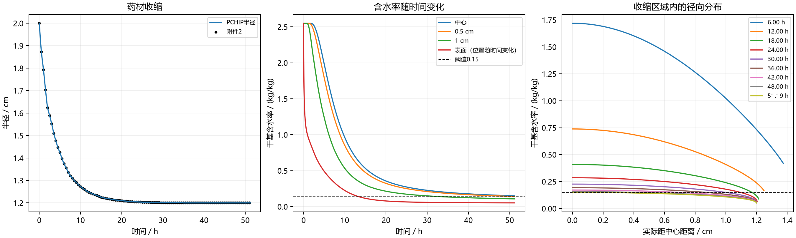

# A题问题4：考虑收缩的药材烘干时长与水分分布模型

## 摘要

针对药材烘干过程中半径随时间变化的问题，本文在前三问径向热湿传递框架的基础上，引入附件2给出的半径变化数据，并采用附录4规定的含水率相关物性。假设药材轴对称、长度不变且发生均匀径向收缩，使用材料坐标
\(\xi=r/R(t)\) 将移动区域映射到固定区间 \([0,1]\)。环境温度和环境水分沿用第一问的拉伸指数拟合与稳定阶段延拓，半径采用保形分段三次插值（PCHIP）。在固定材料坐标上，将热传导和水分扩散方程写成守恒通量形式，采用有限体积空间离散和带稀疏解析 Jacobian 的隐式 BDF 方法联立求解，并以全域最大干基含水率首次低于 0.15 kg/kg 作为烘干结束判据。

主方案得到未舍入达标时刻

\[
t_* = 184271.879660\ \mathrm{s}=51.1866332388\ \mathrm{h}.
\]

按题目要求向上保留四位小数，烘干时长为 **51.1867 h**。在继续积分到该报告时刻后，药材半径为 1.2000 cm，全域最大含水率为 0.149999876864 kg/kg，严格满足低于 0.15 的判据。完整的每 60 s、每 0.1 cm 结果见 [result4.xlsx](result4.xlsx)。

**关键词：** 移动边界；径向收缩；热湿耦合；有限体积法；隐式 BDF；PCHIP

## 1 问题背景与重述

药材初始为长度 25 cm、半径 2 cm 的圆柱体，初始温度为 28 °C，初始干基含水率为 2.55 kg/kg。问题4要求考虑实际烘干过程中药材因水分流失产生的尺寸变化，根据附件2确定半径随时间的变化，并使用附录4的经验物性公式重新计算烘干过程。

题目要求的交付结果包括：

1. 确定全域水分浓度低于 0.15 kg/kg 的烘干时长；
2. 按每隔 6 h、距中心每隔 0.5 cm 给出水分浓度和药材表面值，形成表6；
3. 按每隔 60 s、实际距中心每隔 0.1 cm 输出完整含水率到 `result4.xlsx`。

由于半径缩小后固定实际位置可能位于药材外部，输出时对越过当前表面的单元格保留空白，并单独设置“药材表面”列，不把药材外部误填为零含水率。

## 2 问题分析

问题4相对于前三问有三处变化。第一，计算区域由固定圆柱域 \(0\le r\le R_0\) 变为 \(0\le r\le R(t)\)。第二，材料物性改用附录4的局部状态函数，温度和含水率通过扩散系数形成热湿耦合。第三，题目要求的输出位置是实际距离，而不是材料坐标中的等间隔位置。因此，求解过程需要同时处理移动区域、材料运动、局部物性、全域达标事件和实际位置插值。

本文的求解链条为：

\[
\text{附件数据拟合与插值}
\longrightarrow
\text{移动坐标热湿模型}
\longrightarrow
\text{有限体积离散}
\longrightarrow
\text{BDF 联立积分}
\longrightarrow
\text{全域事件定位与实际位置输出}.
\]

环境边界的处理与 `p1` 保持一致，采用“初值固定拉伸指数拟合 + 稳定阶段常值延拓”；附件2的半径曲线则从多种插值方法中选择不产生反向收缩的 PCHIP。这样既保持了前三问的建模接口，又避免了高阶插值在半径数据上产生不符合物理的局部增大。

## 3 模型假设

1. 药材轴对称，忽略周向变化和端部、轴向传递，仅建立中部截面的一维径向模型。
2. 药材长度保持 25 cm，半径变化由附件2给出；内部各材料点作均匀径向收缩，材料的相对坐标 \(\xi=r/R(t)\) 保持不变。
3. 附录4中的 \(\rho(C)\)、\(c_p(C)\)、\(k(C)\)、\(D(T,C)\) 在每个控制体内按局部温度和含水率更新。
4. 换热系数 \(h=25\ \mathrm{W/(m^2\cdot K)}\) 和传质系数 \(h_m=8\times10^{-7}\ \mathrm{m/s}\) 沿用第一问。环境水分与固体干基含水率之间没有给出吸附平衡换算，因此表面传质边界解释为有效 Robin 边界，而不是严格的气固平衡关系。
5. 不显式加入蒸发潜热、水分迁移携热、内部热源和变形做功。相应影响属于模型形式误差，在模型评价中单独说明。
6. 附件2覆盖的 0--72 h 数据范围足以覆盖本方案的达标时刻；主方案不使用半径外推。若积分超过数据末端，程序才将半径保持为末值。
7. 干基含水率定义为水质量与干物质质量之比。体积收缩不直接把 \(C\) 乘以压缩倍数；干物质守恒单独用于总量收支检查。

## 4 符号说明

| 符号 | 含义 | 单位 |
|---|---|---|
| \(t\) | 时间 | s |
| \(r\) | 实际径向坐标 | m |
| \(R(t)\) | 时刻 \(t\) 的实际半径 | m |
| \(\xi=r/R(t)\) | 材料坐标 | 1 |
| \(T(r,t)\) | 药材温度 | °C |
| \(C(r,t)\) | 干基含水率 | kg/kg |
| \(\Theta(\xi,t)\) | 材料坐标下的温度 | °C |
| \(U(\xi,t)\) | 材料坐标下的干基含水率 | kg/kg |
| \(\rho,c_p,k,D\) | 密度、比热、导热系数、水分扩散系数 | 见附录4 |
| \(h,h_m\) | 换热系数、有效传质系数 | \(\mathrm{W/(m^2\cdot K)}\)、m/s |
| \(T_a,C_a\) | 环境温度、环境水分参考量 | °C、kg/kg |

## 5 模型建立与求解

### 5.1 环境边界输入

第一问对附件1的 60 s 记录采用初值固定的拉伸指数函数

\[
y(t)=y_0+A\left\{1-\exp\left[-\left(\frac{t}{\tau}\right)^p\right]\right\}.
\]

本问沿用同一输入处理。以秒为单位，拟合曲线为

\[
\widetilde T_a(t)=28+22.0164003
\left\{1-\exp\left[-\left(\frac{t}{1884.0646}\right)^{1.1502893}\right]\right\},
\]

\[
\widetilde C_a(t)=0.01963+0.03045648
\left\{1-\exp\left[-\left(\frac{t}{2702.9245}\right)^{1.2713644}\right]\right\}.
\]

根据附件1的稳定阶段检测，温度和环境水分的稳定窗口起点分别为 5280 s 和 6780 s，取共同阶段点

\[
t_s=6030\ \mathrm{s}.
\]

在 \(t_s-300<t<t_s+300\) 内将拟合值线性过渡到尾段均值，在 \(t\ge 6330\ \mathrm{s}\) 后采用

\[
T_a=49.93422143\ ^\circ\mathrm C,
\qquad
C_a=0.0497155714\ \mathrm{kg/kg}.
\]

该处理使问题4与 `p1` 的边界约定保持一致，同时避免将附件1的短期波动直接外推到整个烘干过程。

### 5.2 半径函数与插值方法

附件2包含 145 个半径记录，时间范围为 0--259200 s，记录间隔为 1800 s，半径由 2.000 cm 逐渐减小到 1.198 cm。将半径统一换算为米后构造

\[
R=R(t).
\]

候选插值方法使用留段交叉验证，并检查半径曲线是否出现增大或超出观测范围。结果如下，交叉验证表来自 `output/A题深化分析/radius_method_comparison.csv`，图形见 [半径插值比较图](figures/03_radius_methods.png)。

| 方法 | CV RMSE / cm | 增大段数 | 最大越界 / cm | 选择 |
|---|---:|---:|---:|---|
| 分段线性 | 0.004505 | 0 | 0 | 否 |
| PCHIP | 0.003829 | 0 | 0 | 是 |
| Akima | 0.003987 | 41 | 0 | 否 |
| 自然三次样条 | 0.003942 | 687 | 0.000114 | 否 |
| 平滑样条 | 0.003455 | 870 | 0.000105 | 否 |

平滑样条虽然交叉验证误差较低，但产生半径局部增大；主模型选择 PCHIP，在拟合误差、保形性和物理可解释性之间取得平衡。最终半径曲线不需要外推到事件时刻之外。

### 5.3 附录4物性公式

附录4规定的物性关系为

\[
\rho(C)=760+90C,
\]

\[
c_p(C)=1850+2150\frac{C}{C+1},
\qquad
k(C)=0.12+0.20\frac{C}{C+1},
\]

\[
D(T,C)=4.2\times10^{-4}
\exp\left(-\frac{0.30}{C}\right)
\exp\left(-\frac{3850}{T+273.15}\right).
\]

程序中温度场以摄氏度存储，但 Arrhenius 指数中的绝对温度使用 \(T+273.15\) K。由于 \(\rho\)、\(c_p\)、\(k\) 和 \(D\) 依赖局部状态，不能用全域平均含水率只计算一次物性。

### 5.4 移动区域中的热湿控制方程

均匀径向收缩时材料点的速度为

\[
v(r,t)=\frac{\dot R(t)}{R(t)}r.
\]

在有效材料导数和守恒通量假设下，实际坐标中的方程写为

\[
\rho(C)c_p(C)\left(T_t+vT_r\right)
=\frac1r\frac{\partial}{\partial r}
\left(rk(C)T_r\right),
\]

\[
C_t+vC_r
=\frac1r\frac{\partial}{\partial r}
\left(rD(T,C)C_r\right).
\]

令

\[
\xi=\frac r{R(t)},
\qquad
\Theta(\xi,t)=T(\xi R(t),t),
\qquad
U(\xi,t)=C(\xi R(t),t),
\]

则链式法则给出

\[
\left.C_t\right|_r
=U_t-\frac{\xi\dot R}{R}U_\xi,
\qquad
vC_r=\frac{\xi\dot R}{R}U_\xi.
\]

温度方程同理。两项正好抵消，得到固定计算区间上的方程

\[
\boxed{
\rho(U)c_p(U)\Theta_t
=\frac1{R(t)^2\xi}
\frac{\partial}{\partial\xi}
\left[\xi k(U)\Theta_\xi\right]
},
\]

\[
\boxed{
U_t
=\frac1{R(t)^2\xi}
\frac{\partial}{\partial\xi}
\left[\xi D(\Theta,U)U_\xi\right]
}.
\]

式中没有显式的 \(\dot R\) 项不是忽略收缩速度，而是材料运动项与材料坐标的运动项在均匀收缩假设下抵消。

### 5.5 初始条件和边界条件

初始条件为

\[
\Theta(\xi,0)=28,
\qquad
U(\xi,0)=2.55.
\]

中心对称条件为

\[
\Theta_\xi(0,t)=0,
\qquad
U_\xi(0,t)=0.
\]

表面 \(\xi=1\) 采用有限速率交换条件

\[
-\frac{k(U_s)}{R(t)}\Theta_\xi(1,t)
=h\left[\Theta_s-T_a(t)\right],
\]

\[
-\frac{D(\Theta_s,U_s)}{R(t)}U_\xi(1,t)
=h_m\left[U_s-C_a(t)\right].
\]

半径变化同时影响内部扩散项中的 \(1/R^2\) 和表面边界中的 \(1/R\)，两者必须同步更新。

### 5.6 含水率守恒关系

由于 \(C\) 是干基含水率，均匀收缩并不会自动改变材料点的 \(C\)。长度保持不变、干物质空间均匀分布时，干物质密度可表示为

\[
\rho_d(t)=\rho_{d0}\frac{R_0^2}{R(t)^2}.
\]

材料坐标下的面积加权平均含水率为

\[
\overline U(t)=2\int_0^1U(\xi,t)\xi\,\mathrm d\xi.
\]

在表面有效传质通量下，守恒关系为

\[
\boxed{
\frac{\mathrm d\overline U}{\mathrm dt}
=\frac{2h_m}{R(t)}\left[C_a(t)-U_s(t)\right]
}.
\]

数值程序增加一个表面交换累计量，并用上式检查域内平均含水率的变化。这样检查的是干基含水率对应的干物质基准，而不是把 \(\int C\,\mathrm dV\) 直接当成水质量。

### 5.7 有限体积离散与时间积分

固定材料坐标上采用表面加密网格

\[
\xi_i=\frac{1-\exp(-4i/N)}{1-\exp(-4)},
\qquad i=0,1,\ldots,N,
\]

主方案取 \(N=300\)。令相邻节点中点为控制体界面，控制体权重为

\[
w_i=\frac{b_i^2-a_i^2}{2}.
\]

内部温度和水分通量分别取

\[
F^T_{i+1/2}
=\xi_{i+1/2}\frac{k_i+k_{i+1}}2
\frac{\Theta_{i+1}-\Theta_i}{\xi_{i+1}-\xi_i},
\]

\[
F^C_{i+1/2}
=\xi_{i+1/2}\frac{D_i+D_{i+1}}2
\frac{U_{i+1}-U_i}{\xi_{i+1}-\xi_i}.
\]

中心界面通量取 0，表面界面通量取

\[
F^T_s=R(t)h\left[T_a-\Theta_N\right],
\qquad
F^C_s=R(t)h_m\left[C_a-U_N\right].
\]

因此半离散方程为

\[
\dot\Theta_i
=\frac{F^T_{i+1/2}-F^T_{i-1/2}}
{R(t)^2w_i\rho_i c_{p,i}},
\]

\[
\dot U_i
=\frac{F^C_{i+1/2}-F^C_{i-1/2}}
{R(t)^2w_i}.
\]

离散后得到刚性、非线性的热湿联立常微分方程组。时间方向采用隐式 BDF，局部物性及热湿交叉导数写入稀疏解析 Jacobian。环境记录点、半径记录点和每 6 h 检查点作为积分分段点；环境变化阶段最大步长为 5 s，稳定阶段最大步长为 300 s，主方案相对容差为 \(2\times10^{-10}\)，绝对容差为 \(2\times10^{-12}\)。

### 5.8 全域达标判据与实际位置输出

题目要求药材各处低于 0.15 kg/kg，因此定义

\[
M(t)=\max_{0\le i\le N}U_i(t),
\qquad
t_* = \inf\{t:M(t)<0.15\}.
\]

事件函数为 \(g(t)=M(t)-0.15\)，由 BDF 求解器定位首次向下穿越。报告时间向上取到四位小数，并继续积分至该时间，使报告状态严格低于阈值。

对于题目要求的固定实际位置 \(r_j=0,0.1,\ldots,1.9\ \mathrm{cm}\)，每个输出时刻先计算

\[
\xi_j=\frac{r_j}{R(t)}.
\]

当 \(\xi_j\le1\) 时，在材料坐标网格上用 PCHIP 插值得到 \(U(\xi_j,t)\)；当 \(\xi_j>1\) 时将该单元格置为空。另设“药材表面”列，始终输出 \(U(1,t)\)。

## 6 结果与分析

### 6.1 烘干时长和终态

主方案的关键结果为：

| 指标 | 数值 |
|---|---:|
| 未舍入事件时刻 | 184271.879660 s |
| 未舍入事件时刻 | 51.1866332388 h |
| 报告烘干时长 | **51.1867 h** |
| 报告时刻对应的半径 | 1.2000 cm |
| 报告时刻全域最大含水率 | 0.149999876864 kg/kg |
| 报告时刻平均含水率 | 0.1183912673 kg/kg |
| 输出时间行数 | 3072 |
| 药材外空白单元格数 | 20143 |

事件判据检查的是未四舍五入的最大含水率。虽然表格按四位小数显示中心值为 0.1500，但报告时刻的未舍入值已经小于 0.15。

### 6.2 表6：每隔 6 h 的水分浓度

| 时间 / h | 0 cm | 0.5 cm | 1 cm | 药材表面 |
|---:|---:|---:|---:|---:|
| 6 | 1.7200 | 1.5380 | 1.0225 | 0.4198 |
| 12 | 0.7386 | 0.6554 | 0.4086 | 0.1666 |
| 18 | 0.4094 | 0.3692 | 0.2400 | 0.0889 |
| 24 | 0.2856 | 0.2615 | 0.1792 | 0.0671 |
| 30 | 0.2267 | 0.2097 | 0.1494 | 0.0592 |
| 36 | 0.1931 | 0.1799 | 0.1318 | 0.0557 |
| 42 | 0.1715 | 0.1606 | 0.1201 | 0.0538 |
| 48 | 0.1563 | 0.1470 | 0.1117 | 0.0527 |
| 51.1867 | 0.1500 | 0.1413 | 0.1081 | 0.0523 |

表面列对应的实际半径为：

| 时间 / h | 半径 / cm |
|---:|---:|
| 6 | 1.3740 |
| 12 | 1.2480 |
| 18 | 1.2140 |
| 24 | 1.2040 |
| 30 | 1.2010 |
| 36 | 1.2000 |
| 42 | 1.2000 |
| 48 | 1.2000 |
| 51.1867 | 1.2000 |

从表6可以看出，表面失水和升温均早于中心，中心是最终满足全域阈值的控制位置。到 30 h 时，表面含水率已降到 0.0592 kg/kg，而中心仍为 0.2267 kg/kg；因此不能用表面或平均含水率作为结束条件。

### 6.3 收缩与径向分布



图中左图显示半径由 2.000 cm 快速下降后逐渐稳定到约 1.200 cm；中图显示表面、1 cm、0.5 cm 和中心的失水顺序；右图将材料坐标结果转换回实际距离，展示了收缩区域内的径向含水率分布。

### 6.4 对照与敏感性

在相同阶段化环境边界下进行控制变量计算，结果如下。对照情景用于解释几何和物性变化的影响，不替代主方案。

| 对照情景 | 达标时间 / h |
|---|---:|
| 附录4物性 + 固定半径 2 cm | 130.131907 |
| 附录3物性 + 附件2收缩半径 | 25.278897 |
| 附录4物性 + 线性半径插值 | 51.190199 |
| 附录4物性 + 稳定边界固定为 50 °C、0.05 kg/kg | 51.087504 |
| 主方案：附录4 + PCHIP + 阶段化环境 | **51.186633** |

主方案与第三问文件中的 57.5866 h 不能简单解释为“收缩使时间减少了多少”，因为问题4同时替换了附录4物性关系。单独比较半径插值时，线性插值相对 PCHIP 只改变约 0.003566 h；长期环境边界的改变约为 0.099130 h，说明输入延拓和物性假设的影响不能用网格误差代替。

## 7 误差、收敛与模型检验

### 7.1 空间网格收敛

| 区间数 \(N\) | 原始事件时刻 / h | 与上一网格相差 / s | 质量收支残差 |
|---:|---:|---:|---:|
| 200 | 51.186549228 | - | \(1.15\times10^{-14}\) |
| 300 | 51.186633239 | 0.302440 | \(7.99\times10^{-15}\) |

主方案选择 \(N=300\)。网格加密后原始事件时刻相差 0.302440 s，四位小数的可提交时间在主方案和加密方案间只差一个显示单位边界，因而报告保留向上取整后的 51.1867 h，并不把更多小数位解释为同等的物理精度。

### 7.2 时间精度与方程检查

收紧相对、绝对容差并将后期最大步长由 300 s 改为 120 s，事件时刻变化为 0.013232 s，公共输出位置上的最大含水率差为 \(1.75\times10^{-8}\) kg/kg。其余检查为：

| 检查项目 | 最大误差或结果 |
|---|---:|
| 解析 Jacobian 复步长检查 | \(3.02\times10^{-16}\) |
| 固定半径退化到第二问右端 | \(3.00\times10^{-15}\) |
| 无外部驱动的均匀状态导数 | 0 |
| 干基含水率收支残差 | \(7.99\times10^{-15}\) |
| 接受状态最小含水率 | 大于 0 |
| 径向含水率最大反向增量 | \(4.44\times10^{-16}\) |
| 半径外推是否使用 | 否 |

这些检查验证了离散方程、事件判据和结果导出的内部一致性；它们不等同于真实实验误差或完整物理模型的验证。

### 7.3 工作簿导出检查

`result4.xlsx` 保留题目模板的单工作表布局：A 列为时间，B--U 列为 0.0--1.9 cm 的固定实际位置，V 列为药材表面。数据区采用四位小数格式，越过实际表面的单元格为空。使用 `verify_result4.py` 重新读取工作簿后，逐单元核对时间、含水率、空白掩码、表面列和终态阈值，结果记录在 [validation_export.json](validation_export.json)。

## 8 模型评价与适用边界

### 8.1 模型优点

1. 通过材料坐标处理移动边界，避免在每个时间步重建不规则空间网格。
2. 变系数热湿方程保持守恒通量形式，能够在同一个有限体积框架中更新局部物性。
3. 事件函数检查全域最大含水率，并在报告前继续积分到严格低于阈值，避免平均值和四舍五入造成提前结束。
4. 实际位置输出保留药材表面列和越界空白，避免把收缩后的药材外部误认为低含水率区域。

### 8.2 局限性

1. 环境水分直接用于有效传质驱动力，未建立空气水分与固体干基含水率之间的吸附平衡关系。
2. 均匀径向收缩和长度不变是由数据可识别性决定的简化，附件2只给出外半径，不能唯一确定内部非均匀变形。
3. 未显式考虑蒸发潜热、孔隙率变化和水分迁移携热；因此灵敏度分析只反映当前模型下的参数和输入变化。
4. 附件1和附件2的采样间隔以及稳定阶段延拓是输入不确定性来源，数值网格和 BDF 容差检查不能覆盖这些来源。

## 9 复现材料

在工作区根目录执行：

```powershell
conda run --no-capture-output -n 2026modeling python questions/p4/solve_q4.py --root questions/A题 --out questions/p4 --grids 200 300 --check-time --comparisons --boundary-mode staged --radius-method pchip
conda run --no-capture-output -n 2026modeling python questions/p4/build_workbook.py --root questions/A题
conda run --no-capture-output -n 2026modeling python questions/p4/verify_result4.py --root questions/A题
```

文件说明：

| 文件 | 用途 |
|---|---|
| `p4.md` | 本问论文式正文、公式、表6、结果和验证 |
| `result4.xlsx` | 题目要求的每 60 s、每 0.1 cm 完整含水率结果 |
| `solve_q4.py` | 附录4热湿模型、移动半径、BDF求解、事件和敏感性计算 |
| `build_workbook.py` | 使用题目模板从 `result4_data.json` 重建结果工作簿 |
| `verify_result4.py` | 逐项检查工作簿、终态阈值、越界空白和数据一致性 |
| `boundary_stage.py` | 与第一问一致的边界拟合和稳定阶段检测 |
| `validation.json` | 主计算的模型检查、网格/时间收敛和控制变量结果 |
| `validation_export.json` | 结果工作簿导出后的逐单元检查摘要 |
| `result4_data.json` | 按题目格式舍入后的完整数据 |
| `result4_full_precision.npz` | 未舍入状态、半径、平均含水率和径向剖面 |
| `第四问结果图.png` | 收缩、含水率时间变化和实际径向分布图 |
| `radius_method_comparison.csv` | 附件2半径插值方法比较 |
| `figures/03_radius_methods.png` | 半径观测与候选插值曲线 |

主计算的输入附件仍保存在 `questions/A题/附件/`，没有复制或修改原始题面和附件。
